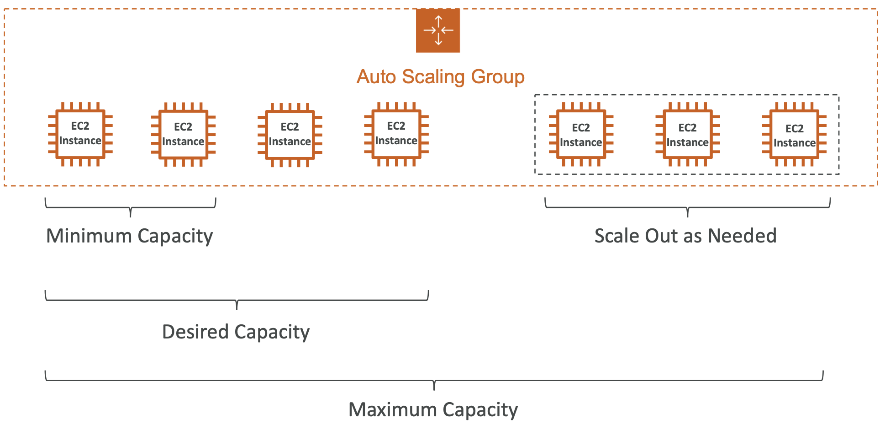
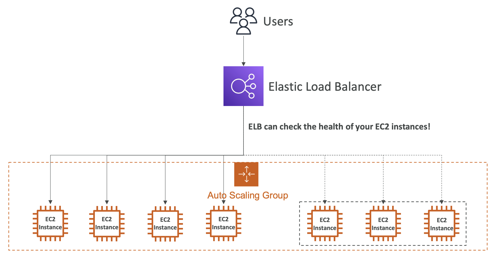
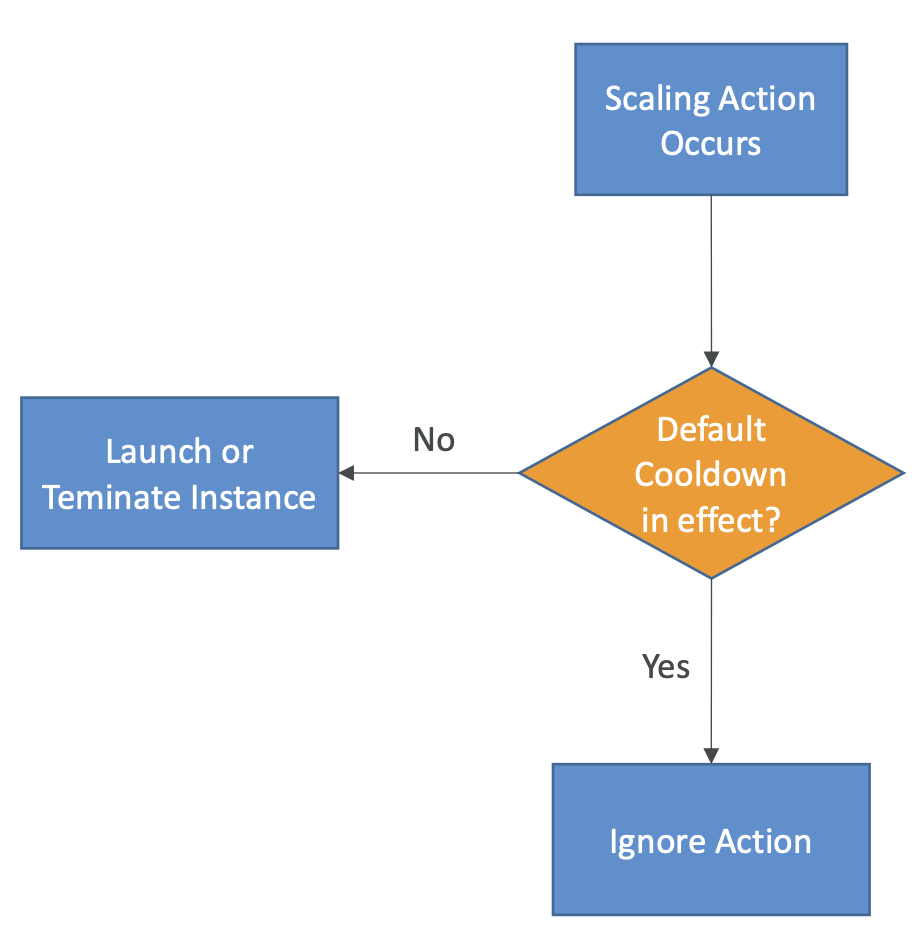

## Scalability & High Availability
- **확장성**은 애플리케이션 시스템이 조정을 통해 더 많은 양을 처리할 수 있다는 의미
  - Vertical Scalability; 수직 확장성
  - Horizontal Scalability (= elasticity); 수평 확장성, 탄력성
- **Scalability is linked but different to High Availability**

### Vertical Scalability 
- 인스턴스의 크기를 확장하는 것을 의미
- 데이터베이스와 같이 분산되지 않은 시스템에서 흔히 사용 (RDS, ElastiCache)
- 일반적으로 확장할 수 있는 정도에는 한계가 있음 (hardware limit)

### Horizontal Scalability
- 애플리케이션에서 인스턴스나 시스템의 수를 늘리는 방법
- 수평 확장을 했다 == 분산 시스템

### High Availability
- 보통 수평 확장과 함께 사용 
- 애플리케이션 또는 시스템을 적어도 둘 이상의 AWS의 AZ나 데이터 센터에서 가동 중인 것을 의미
- 고가용성의 목표는 데이터 센터에서의 손실에서 살아남는 것 

> ### High Availability & Scalability For EC2
> - **Vertical Scaling**: Increase instance size (= scale up / down)
>   - From: t2.nano (가장 작은 거)
>   - To: u-12tb1.metal (가장 큰 거)
> - **Horizontal Scaling**: Increase number of instances (= scale out / in)
>   - Auto Scaling group
>   - Load Balancer
> - **High Availability**: Run instances for the same application across multi AZ
>   - Auto Scaling Group multi AZ
>   - Load Balancer multi AZ

## Load balancing
- 로드 밸런서는 서버 혹은 서버셋으로 트래픽을 백엔드나 다운스트림 EC2 인스턴스 또는 서버들로 전달하는 역할을 함
- 사용 목적
  - 부하를 다수의 다운스트림 인스턴스로 분산하기 위해서   
    > Downstream: 네트워크 흐름 상 뒤쪽에 있는 시스템
  - 애플리케이션에 단일 액세스 지점(DNS)을 노출
  - 다운스트림 인스턴스의 장애를 원활히 처리 가능 (Health Check 매커니즘으로 확인)
  - regular health check
  - SSL 종료(HTTPS)도 할 수 있으므로 웹 사이트에 암호화된 HTTPS 트래픽을 가질 수 있음 (SSL = HTTPS = 보안  통신)     
    > 🧐 '로드 밸런서가 SSL 종료(HTTPS Termination)을 할 수 있다' == **웹 사이트의 HTTPS 암호화 처리를 로드 밸런서가 대신 해준다**는 의미   
    > > ### 웹사이트가 HTTPS를 쓰려면?
    > > - HTTPS는 암호화된 통신을 위해 SSL 인증서가 필요함
    > > - 보통 웹 서버(EC2..)에 SSL 인증서를 설치해서 HTTPS 요청을 처리
    > > ### ✅ 로드 밸런서를 사용하면?
    > > - SSL 인증서를 EC2가 아니라 로드 밸런서에 설치해서 암호화를 처리할 수 있음 == SSL Termination   
    > >    
    > > (👍🏻) EC2에 SSL 설정 불필요; 인증서 설치, 갱신 작업을 로드 밸런서 하나만 하면 됨   
    > > (👍🏻) SSL 복호화는 리소스를 많이 쓰는데, 이걸 EC2 대신 로드 밸런서가 해줌    

  - high availability across zones
  - 클라우드 내에서 개인 트래픽과 공공 트래픽을 분리할 수 있음

### Elastic Load Balancer
- Elastic Load Balancer는 **관리형 로드 밸런서**
  - AWS가 관리하며 어떤 경우에도 작동할 것을 보장
  - AWS가 업그레이드, 유지 관리 및 고가용성을 책임짐
  - 로드 밸런서의 작동 방식을 수정할 수 있게끔 일부 configuration knobs(구성 놉) 제공
- **Elastic Load Balancer는 무조건 쓰는 게 좋음**
- 로드 밸런서는 다수의 AWS 서비스들과 통합되어 있음

### Types of load balancer on AWS
- 4 kinds of managed Load Balancers
- ~~Classic Load Balancer~~ (v1 - old generation) - 2009; ~~CLB~~
  - HTTP, HTTPS, TCP, SSL (secure TCP)
- **Application Load Balancer** (v2 - new generation) - 2016; **ALB**
  - HTTP, HTTPS, WebSocket
- **Network Load Balancer** (v2 - new generation) - 2017; **NLB**
  - TCP, TLS, (secure TCP), UDP
- **Gateway Load Balancer** - 2020; **GWLB**
  - Operates at layer 3 (Network layer) - IP Protocol
- 결론적으로, 더 많은 기능을 가지고 있는 신형 로드 밸런서 사용이 권장됨
- 일부 로드 밸런서들은 내부에 설정될 수 있어 네트워크에 **private** 접근이 가능하고, 웹사이트와 공공 애플리케이션 모두에 사용 가능한 **external** 로드 밸런서가 있음   
    

## Auto Scaling Group
   
> 🧐 **Load**: 웹사이트나 애플리케이션이 처리해야 하는 작업의 양 ( 트래픽 + 서버가 처리해야 하는 모든 리소스 소모량)
- **Auto Scaling Group (ASG)** 목표:
  - Scale out(add EC2 instance); 증가한 로드에 맞춰 EC2 인스턴스 증가
  - Scale in(remove EC2 instance): 감소한 로드에 맞춰 EC2 인스턴스 제거   
    👉🏻 ASG 크기는 시간이 지나면서 변함
  - ASG에서 실행되는 EC2 인스턴스의 최소 및 최대 개수를 보장하기 위해 매개변수를 전반적으로 정의할 수 있음
  - **로드밸런서와 페어링하는 경우 ASG에 속한 모든 EC2 인스턴스가 로드 밸런서에 연결됨**   
    **그 중 한 인스턴스가 비정상이면 종료하고 이를 대체할 새 EC2 인스턴스를 생성**
- ASG are free ( you only pay for the underlying EC2 instances )

### Auto Scaling Group in AWS
   
- **Minimum Capacity**: ASG 내 인스턴스의 최소 개수를 설정
- **Desired Capacity**: ASG 내 인스턴스의 희망 개수를 설정
- **Maximum Capacity**: ASG 내 인스턴스의 최대 개수를 설정
- 최대 용량 > 희망 용량: **Scale Out** as Needed
  - EC2 추가
  - ASG가 점점 커짐

### Auto Scaling Group in AWS with Load Balancer
   
- EC2가 추가되면 ELB가 해당 인스턴스로 트래픽을 보내고 로드를 분산시킴
- Load Balancer & Auto Scaling Group is good Combination

### Auto Scaling Group Attributes
- 인스턴스 속성을 기반으로 ASG를 생성하려면 시작 템플릿(**Launch Template**)을 생성해야 함   
> ### Launch Template이란?
> - EC2 인스턴스를 생성할 때 필요한 설정값을 미리 저장해두는 템플릿
> - Launch Template은 EC2 인스턴스를 반복적으로 자동 생성해야 하는 상황에서 매우 중요한 기능
> - ASG에서는 launch template이 기본
- **Launch Template**에는 ASG 내에서 EC2 인스턴스를 시작하는 방법에 대한 정보가 포함되어 있음
  - AMI + Instance Type
  - EC2 User Data
  - EBS Volumes
  - Security Groups
  - SSH Key Pair
  - EC2 인스턴스의 IAM Roles
  - Network + Subnets 정보
  - Load Balancer 정보 
- **Min Size / Max Size / Initial Capacity**
- **Scaling Policies**를 정의해야 함

### Auto Scaling - CloudWatch Alarms & Scaling
- CloudWatch 경보를 기반으로 **ASG를 scale in/out**할 수 있음 
- An alarm monitors a metric (such as **Average CPU**, or a **custom metric**)
- <u>ASG 전체의 평균 CPU가 너무 높으면 지표에 따라 경보가 울리고 ASG의 스케일링 활동을 유발</u>
- auto scaling 👉🏻 경보에 의해 내부에서 자동적인 스케일링이 이루어짐
- 경보를 기반으로:
  - scale out 정책을 만들어 인스턴스 수를 늘릴 수 있음
  - scale in 정책을 만들어 인스턴스 수를 줄일 수 있음

### Auto Scaling Groups - Scaling Policies
- **Dynamic Scaling**
  - **Target Tracking Scaling** (목표 추적)
    - 설정이 간단한 스케일링
    - ex. CPU 사용률과 같은 ASG에 대한 메트릭을 정의하고 40%와 같은 목표 값을 정의하는 것    
        자동으로 ASG가 확장되거나 축소되어 이 메트릭을 약 40%로 유지할 수 있음
  - **Simple / Step Scaling** 
    - CloudWatch 알람을 정의하여 auto scaling group에 용량 단위를 추가하거나 제거하고자 할 때 알람이 발생할 수 있도록 하는 것
    - ex. alarm is triggered (CPU > 70%), then add 2 units

- **Scheduled Scaling**
  - 알려진 사용 패턴을 기반으로 스케일링을 예상
  - ex. 금요일 오후 5시에 매번 새로운 사용자가 발생하므로 최소 용량을 10으로 늘림

- **Predictive Scaling**
  - 지속적으로 부하를 예측한 다음 미리 예약을 시작하는 경우
  - 반복되는 패턴이 있을 때 매우 좋음
  - ASG는 자동으로 과거 부하를 분석한 다음 예측치를 기반으로 스케일링 작업을 예약; 주기적인 데이터가 있는 경우 매우 유용
  - Analyze historical load > Generate forecast > Schedule scaling actions

### Good metrics to scale on
> 어떤 좋은 메트릭을 활용해서 스케일링 해야 하는가
- **CPUUtilization** (CPU 활용도) 
  - Average CPU utilization across your instances
- **RequestCountPerTarget**
  - (애플리케이션마다 다름) 테스트를 기반으로 하는 타깃당 요청 수
- **Average Network In / Out** 
  - (애플리케이션이 네트워크에 의존적인 경우)
  - ex. 만약, 업로드와 다운로드가 너무 많아 네트워크가 EC2 인스턴스의 병목 현상이 될 것이라고 예상된다면, 평균 네트워크 사용량을 기준으로 스케일링을 설정하는 것이 좋음   
  - -> 특정 임계값에 도달했을 때 자동으로 스케일링이 이루어지게
- Any custom metric
  - CloudWatch에 설정한 사용자 정의 메트릭 기반

### Auto Scaling Groups -  Scaling Cooldowns
- **중복된 스케일링을 막기 위한 장치**   
- 스케일링 작업이 있은 후에 인스턴스를 추가하거나 제거할 때마다 기본적으로 5분 쿨다운 시간에 들어감 (default 300 seconds)
- 그리고 그 쿨다운 시간 동안 ASG는 추가 인스턴스를 개시하거나 종료하지 않음
  - -> 메트릭이 안정화되도록 하고 
  - -> 새로운 인스턴스가 적용되어 새로운 메트릭이 어떻게 변할지를 지켜보는 시간을 가지기 위해서       
> 💥 갑자기 부하가 올라서 인스턴스 1개 추가했는데 아직 인스턴스가 제대로 붙기도 전에 또 스케일링 조건을 만족하면 EC2를 또 추가하게 됨 -> 불필요한 중복 스케일링 발생!   

      
- 따라서 스케일링 작업이 발생할 때 물어볼 점은:
  - <u>기본 쿨다운이 효과가 있는가?</u>
    - Yes (아직 지난 작업의 효과가 반영 중이므로 새로운 스케일링은 보류): 해당 작업을 무시
    - No (끝남): 인스턴스를 시작하거나 종료하는 스케일링 작업을 진행
> Advice:    
> 준비된 도구를 사용하여 **EC2 인스턴스의 설정 시간을 줄여** <u>요청을 더 빠르게 처리</u>할 수 있도록 하는 것이 좋음   
  EC2 인스턴스를 설정하는 데 시간을 소비하지 않으면, 훨씬 더 빠르게 활성화될 수 있기 때문에 <u>쿨다운 시간을 줄일 수 있고 ASG를 더욱 동적으로 확장 / 축소할 수 있음</u>