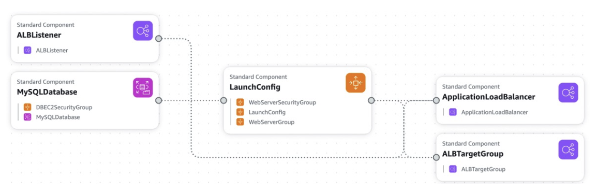

# Deploying and Managing Infrastructure at Scale Section
## CloudFormation
- **AWS 인프라를 코드로 정의하고 자동으로 생성/관리할 수 있게 해주는 서비스**
- AWS 자원들(EC2, S3, RDS 등)을 일일이 콘솔에서 클릭해서 만드는 게 아니라, 하나의 코드 파일로 작성해서 자동으로 만들고 관리할 수 있게 해주는 서비스
- 리소스에 대해 인프라의 윤곽을 구분짓는 선언적 방법 (declarative way)
  > #### 선언적 방법 (Declarative Way)
  > - **선언적 (declaratice)**
  >     - 무엇이 필요한지를 '선언'만 함
  >     - *"EC2 인스턴스가 필요해"*
  > - **명령형 (imperative)**
  >     - 어떻게 만들지를 하나하나 명령
  >     - *"EC2 생성 -> 보안 그룹 추가 -> .."*
- 거의 대부분의 리소스가 지원됨
- ex. within a CloudFormation template
  - 보안 그룹이 필요하고
  - 보안 그룹을 사용할 EC2 인스턴스 두 개가 필요하며
  - S3 버킷도 필요함
  - 이 모든 머신에 로드 밸런서가 필요한 경우   
     👉🏻 **CloudFormation은 이 모든 것을 자동으로 생성함 (사용자가 정한 순서와 구성 그대로)**   

> #### CloudFormation에서의 Stack
> - Stack은 CloudFormation에서 하나의 템플릿을 통해 만들어진 모든 리소스를 하나로 묶은 단위   
> ```
> Resources:
> MyEC2:
>   Type: AWS::EC2::Instance
> MyS3:
>   Type: AWS::S3::Bucket
> ```
> 위의 템플릿으로 EC2와 S3를 만들면 이 둘은 하나의 스택으로 관리됨
> - EC2, S3, 보안 그룹 등 여러 리소스를 하나의 묶음으로 배포/삭제 가능

<br>   


### Benefits of AWS CloudFormation
- **모든 인프라가 코드** **(Infrastructure as code)**   
  - 수동으로 리소스를 만들 필요가 없다는 뜻 (컨트롤하기에 좋음)   
  - AWS 클라우드의 작동 방식을 변경할 때마다 코드 리뷰를 통해 검토하며, 이는 클라우드에서 작업하기 매우 좋은 방법   
```
Resources:
  MyEC2Instance:
    Type: AWS::EC2::Instance
    Properties:
      AvailabilityZone: us-east-1a
      InstanceType: t2.micro
      ImageId: ami-0abcdef1234567890     -> AMI ID

👉🏻 이 yaml 파일을 적용하면 AWS에 적용하면 EC2 인스턴스가 자동으로 만들어짐
```   
> AMI = Amazon Machinne Image   
> -> EC2 인스턴스를 만들기 위한 운영체제 + 설정 정보가 담긴 템플릿 ( EC2 인스턴스의 복사본(이미지) 같은 거 )

<br>

- **Cost**
  - 스택 내의 각 리소스는 스택 내에서 만들어진 다른 리소스들과 비슷하게 태그되기 때문
    - 🤨 스택 내 리소스들이 자동으로 공통 태그를 공유 -> 비용 추적이 쉬움 (비용 추적, 팀별 청구, 환경별 비용 분석에 매우 유리)
  - CloudFormation 템플릿을 사용하여 리소스 비용을 쉽게 예측할 수도 있음
  - 절약 전략을 세울 수도 있음   
    *(ex. 어떤 환경에서 오후 5시에 자동으로 모든 템플릿을 삭제하도록 할 수 있음)*   
  - CloudFormation을 사용하면 리소스 생성 및 삭제가 매우 쉬워짐
<br>

- **생산성 (productivity)**
  - 인프라를 그때그때 파괴하고 다시 만들 수 있음
  - 템플릿을 위한 다이어그램도 만들 수 있음
  - 선언적 프로그래밍 
<br>

- **Don't re-invent the wheel**
  - 하나하나 다 만들지 않아도 되고 웹에 존재하는 기존 템플릿을 활용할 수 있음
  - 문서 활용 가능
<br>

- **Supports (almost) all AWS resources:** 
  - 지원되지 않는 리소스에 대해서는 사용자 지정 리소스(custom resources)를 사용할 수 있음   
<br>   


### CloudFormation + Application Composer
- **Application Composer**를 이용해 CloudFormation 템플릿을 시각화할 수 있음   
- ex. WordPress CloudFormation Stack
  -    
  - CloudFormation 템플릿의 모든 리소스를 볼 수 있음
  - 또한, 모든 **구성 요소 간의 관계**와 서로 어떻게 **연결**되어 있는지 확인할 수 있어 아키텍처 다이어그램을 이해할 때 매우 편리

> ⭐️ **CloudFormation은 인프라를 코드로 사용하거나 다른 환경, 다른 지역 또는 다른 AWS 계정에서 아키텍처를 반복해야 할 때 사용할 수 있음**