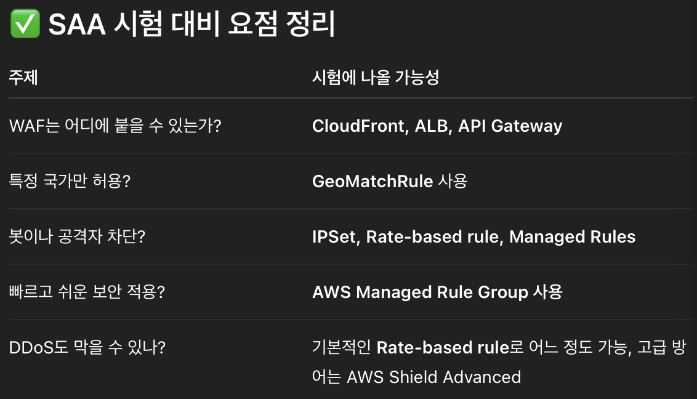
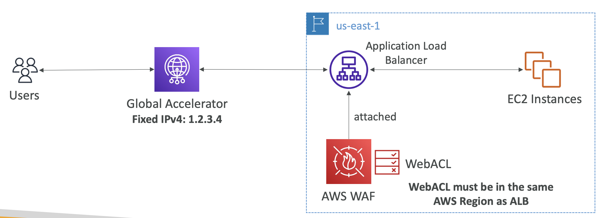

# Encryption
## 🔐 Encryption in flight (TLS/SSL)
> **전송 중 암호화**
- 데이터가 전송되기 전에 암호화가 되고 받은 후에 해독되는 것
- TLS는 SSL의 가장 최근 버전
- no MITM (man in the middle attack; 중간자 공격)
- 오직 타겟 서버만 패키지를 해독할 수 있음 (중간 서버 불가)

## 🔐 Encryption at-rest
> 저장 중 암호화
### Server-side encryption at rest (SSE)
> **서버 측 저장 중 암호화**
- **서버 측에서 저장 전에 암호화하고, 꺼낼 때 복호화**
- 데이터가 암호화되는 과정이 서버가 받은 후에 일어남
- 데이터의 해독은 client에게 되돌려 보내기 전에 진행
- 암호화 된 상태로 저장 (주로 data key 이용)
- **server-side 암호화는 모든 암호화와 해독이 서버에서 일어남**

### Client-side encryption (CSE)
> **클라이언트 측 암호화**
- **클라이언트가 데이터를 직접 암호화한 뒤, 암호화된 데이터를 서버에 저장**
- 데이터가 클라이언트 측에서 암호화와 해독
- 서버는 이 데이터를 해독할 수 없어야 함   
 

## AWS WAF - Web Application Firewall
> **웹 애플리케이션 방화벽**
- **웹 애플리케이션을 악의적인 공격(ex. SQL Injection, XSS)로부터 보호하기 위한 웹 방화벽 서비스**   
  *(웹 트래픽을 감시하고 위험한 요청을 차단하거나 허용하는 역할을 함)*   
- AWS WAF는 계층 7에서 일어나는 일반적인 웹 취약점 공격으로부터 웹 애플리케이션을 보호
- **Layer 7 is HTTP** (vs Layer 4 is TCP/UDP) -> HTTP 취약점 공격을 막아주는 것
- ⭐️ WAF 배포
  - Application Load Balancer
  - API Gateway
  - CloudFront
  - AppSync GraphQL API
  - Cognito User Pool
  - *(NLB에는 배포 불가)*

- **Web ACL** (Web Access Control List); **웹 액세스 제어 목록 규칙**을 정해야 함 (WAF 설정의 컨테이너 역할)   
  - **IP Set**: up to 10,000 IP addresses - use multiple Rules for more IPs
  - HTTP Headers, HTTP body에 기반해 필터링 가능
  - **String Match**: URL 문자열을 조건으로 두어 **SQL 주입**, **Cross-Site Scripting(XSS)** 등의 일반적인 공격도 차단할 수 있음
  - **GeoMatch**: 용량에 제약을 걸어 요청이 최대 2MB를 넘지 않게 하거나, 지역 일치(**Geo-match**) 조건을 두어 특정 국가를 허용/차단 할 수 있음
  - **Rate-based rules**(속도 기반 규칙)을 설정하면 IP당 요청 수를 측정하여 **DDoS 공격을 막을 수 있음**

- Web ACL은 리전에만 적용되며 CloudFront는 글로벌로 정의됨
- **Rule Group**
  - 여러 개의 룰을 그룹으로 묶어 재사용 가능
- <u>WAF는 트래픽이 도착하기 전에 작동해서, 공격 트래픽은 백엔드 서버에 도달하기도 전에 차단됨</u>   

### WAF - Fixed IP while using WAF with a Load Balancer
> 예를 들어, 애플리케이션에 고정 IP를 사용하면서 로드 밸런서와 함께 WAF를 사용하고 싶은 경우    
> *(목표 상황: 고정 IP 주소로 접근하면서 WAF를 통해 웹 공격도 막고 싶음)*   
> - ✅ IP는 항상 고정이어야 하고
> - ✅ 보안(WAF)도 적용되어야 함
> - ✅ 뒤에는 로드 밸런서도 사용해야 함 (트래픽 분산)
- WAF는 Network Load Balancer를 지원하지 않음
  - NLB는 4계층, WAF는 7계층에서만 작동하니까
- 따라서 WAF를 제공하려면 **Application Load Balancer**가 있어야 함 -> *WAF를 쓰고 싶다면 무조건 ALB를 써야 함*
  - but, ALB는 고정 IP가 없음
- 이런 문제는 **AWS Global Accelerator**로 <u>고정 IP</u>를 할당받은 다음 ALB에서 WAF를 활성화하면 해결     
   
> **"고정 IP + WAF + 로드 밸런서" 조합이 나오면 -> Global Accelerator + ALB + WAF**    
> *(Global Accelerator는 고정 IP 제공 + 성능 최적화 용도로 자주 언급됨)*

## AWS Shield: protect from DDoS attack
> AWS Shield는 **디도스 공격으로부터 스스로를 보호하기 위한 서비스**
- **DDoS**: Distributed Denial of Services (분산 서비스 거부 공격)
  - 인프라에 동시에 엄청난 양의 요청이 세계 곳곳의 여러 컴퓨터에서 유입되는 공격
  - 목적은 인프라에 과부하를 일으키는 것으로 실제 사용자에게 서비스를 제공할 수 없게 만듦
- **AWS Shield Standard:**
  - 모든 AWS 고객에게 무료로 활성화되어 있는 서비스
  - SYN/UDP Floods, 반사 공격 및 L3/L4 공격으로부터 고객을 보호해 줌
- **AWS Shield Advanced:**
  - 선택적으로 제공되는 디도스 완화 서비스
  - 조직당 월 3,000달러
  - 어드밴스드에서는 더욱 정교한 디도스 공격을 막아주며 *Amazon EC2, ELB, Amazon CloudFront, AWS Global Accelerator, Route 53*을 보호
  - AWS 디도스 대응 팀이 항시 대기하고 있어 공격을 받았을 때 지원받을 수 있음
  - 디도스 공격으로 인한 요금 상승을 방지할 수 있음
  - 자동 애플리케이션 계층 디도스 완화도 제공하여 자동으로 WAF 규칙을 생성, 평가, 배포함으로써 7계층 공격을 완화할 수 있음

## AWS Firewall Manager
> **AWS Organizations에 있는 모든 계정의 방화벽 규칙을 관리하는 서비스 (중앙집중식 관리)**
- 기업이나 팀에서 AWS 계정을 여러 개 사용할 때, 보안 정책을 중앙에서 일괄적으로 관리할 수 있게 해주는 서비스
- 여러 계정의 규칙을 동시에 관리할 수 있음
- **Security Policy**: 보안 규칙의 집합
  - WAF rules (ALB, API Gateway, CloudFront) 자동 배포
  - AWS Shield Advanced (ALB, CLB, NLB, Elastic IP, CloudFront) 관리
  - EC2, ALB, VPC의 ENI 리소스를 위한 보안 그룹을 표준화하는 보안 정책
  - AWS Network Firewall (VPC level) 정책 관리; 각 VPC 수준의 네트워크 방화벽 설정 일괄 적용
  - Amazon Route 53 Resolver DNS Firewall이 포함됨
  - 정책은 리전 수준에서 생성되며 조직에 등록된 모든 계정에 적용

- 예를 들어, 조직에서 애플리케이션 로드 밸런서에 대한 WAF 규칙을 생성한 다음 새 ALB를 생성하는 경우 **AWS Firewall Manager에서 자동으로 새 ALB에도 같은 규칙을 적용해 줌**

### WAF vs Firewall Manager vs Shield
- 모두 포괄적인 계정 보호를 위한 서비스
- WAF에서는 웹 ACL 규칙을 정의하는데 **리소스별 보호를 구성하는 데에는 WAF가 적절**
- 여러 계정에서 WAF를 사용하고, WAF 구성을 가속하고 새 리소스 보호를 자동화하려면 Firewall Manager로 WAF 규칙을 관리하면 됨
- Firewall Manager는 모든 계정에 Shield 어드밴스드를 배포하는 데에도 활용