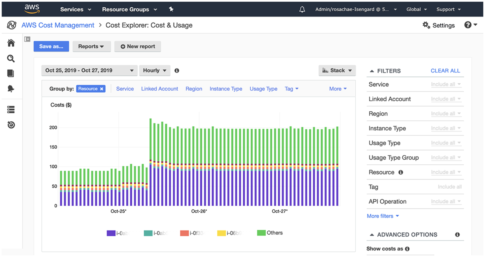

## Cost Explorer   
    
- AWS 비용 및 시간에 따른 사용량을 시각화하고 이해하며 관리하는 데 사용됨
- 사용자 정의 보고서를 생성해서 비용과 사용량 데이터를 분석할 수 있음
- 전체적인 데이터 분석 (data at high level): 전체 계정 간 총 비용 및 사용량 ..
- monthly, hourly, resource level의 세부 단위로 볼 수 있음
- optimal **Savings Plan**을 선택할 수 있음 (비용 절약)
- **이전 사용량을 기반으로 향후 12개월까지의 사용량을 예측할 수 있음**

### Cost Explorer - Monthly Cost by AWS Service
    
- 인스턴스 유형에 따라 가격이 다른 걸 확인할 수 있음

### Cost Explorer - Hourly & Resource Level
    
- EC2 인스턴스의 리소스 레벨 정보를 **시간별**로 확인할 수 있음  

### Cost Explorer - Savings Plan Alternative to Reserved Instances  
 
- **절감형 플랜**
- 사용량에 따라 어떤 절감형 플랜을 선택할 수 있는지와 추천 플랜을 알려줌
- 사용량 예측 가능

### Cost Explorer - Forecast Usage   
    
- **과거**에 지출했던 비용을 기반으로 청구서 비용을 **예측**할 수 있음  

## AWS Cost Anomaly Detection
> AWS 비용 이상 탐지 서비스
- **비용 및 사용량 데이터를 지속적으로 모니터링**
- **기계 학습**을 사용하여 비정상적인 범위를 감지
  - 1. unique, historic spend pattern을 학습
  - 2. 일회성 비용 급증, 지속적인 비용 증가를 감지    
        (사용자가 임계값을 정의할 필요 없음)
- AWS 서비스, 회원 계정, 비용 할당 태그 및 비용 범주를 모니터링
- 계정에서 발생하는 문제에 대한 근본 원인 분석이 포함된 **이상 탐지 보고서**를 보내줌
- 개별 알림이나 SNS를 활용한 일간 또는 주간 요약을 통해 **알림**을 받을 수 있음