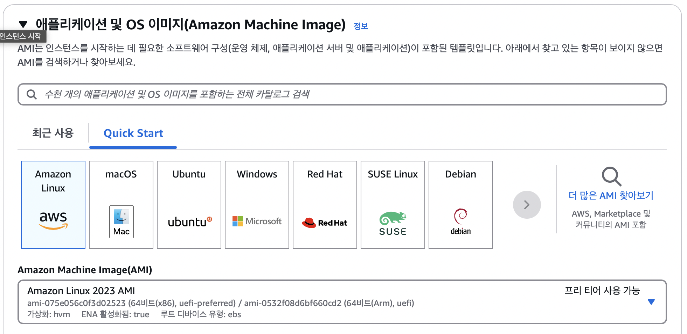
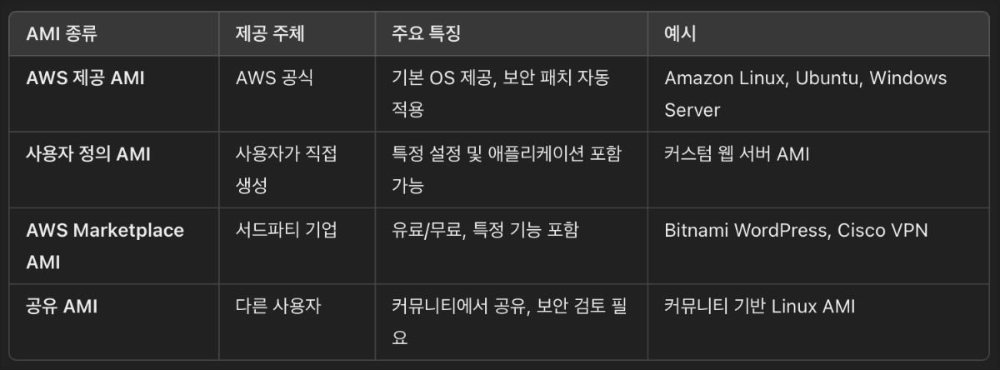
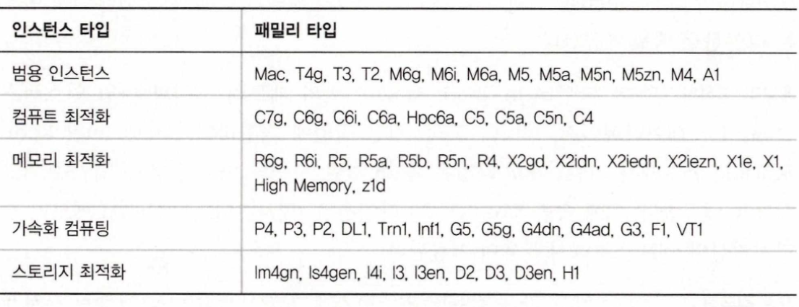
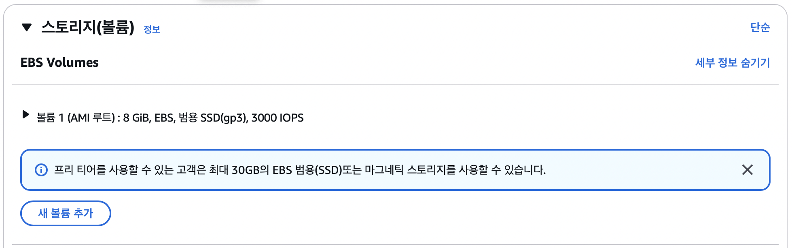

> **목차**
> - [인스턴스 프로비저닝](###인스턴스-프로비저닝)
> - [인스턴스 동작 환경설정](###인스턴스-동작-환경설정)
> - 
> - 플레이스먼트 그룹
> - 인스턴스 가격 모델
> - 인스턴스 생애주기
> - 리소스 태그
> - 서비스 제한 사항
> - EBS 볼륨
> - 인스턴스 스토어 볼륨   

   

# EC2 인스턴스의 개요
*EC2 (Elastic Compute Cloud) = Infrastructure as a Service*
> - Renting virtual machines (**EC2**)
> - Storing data on virtual drives (**EBS**)
> - Distributing load across machines (**ELB**)
> - Scaling the services using an auto-scaling group (**ASG**)

### 인스턴스 프로비저닝
*: AWS에서 EC2 인스텀스를 생성하고 설정하는 과정*   
 

**EC2 아마존 머신 이미지**: EC2 인스턴스를 생성하는데 플요한 OS와 소프트웨어 설정이 포함된 템플릿   
 
> **AMI**: 론칭할 인스턴스의 루트 데이터 볼륨에 어떤 OS와 어떤 애플리케이션 소프트웨어가 포함돼야 하는지 설명하는 정보가 담긴 템플릿 문서   
> (운영 목적에 따라 적절한 AMI를 선택하면 됨)

   
   
 

### 인스턴스 타입
   

- **범용 타입 (General Purpose)**
  - Great for a diversity of workloads such as web servers or code repositories
  - 컴퓨팅, 메모리, 네트워킹 간의 균형도 잘 맞음
  
- **컴퓨트 최적화 (Compute Optimized)**
  - Great for compute-intensive tasks that require high performance porcessors
  - Batch processing worloads, 고성능 컴퓨팅 HPC 작업, 머신러닝에 사용

- **메모리 최적화 (Memory Optimized)**
  - Fast performance for workloads that process large data sets in memory
  - 메모리는 RAM을 의미
  - High performance, relational/non-relational db
  - Distributed web scale cache stores
  - Applications performing real-time processing of big unstructured data

- **스토리지 최적화 (storage Optimized)**
  - Great for storage-intensive tasks that require high, sequential read and write access to large data sets on local storage
  - 관계형 DB, NoSQL DB에 사용
  - Cache for in-memory DB (ex. redis)

- 가속 컴퓨팅   
  - 고성능의 범용 그래픽 프로세싱 유닛 탑재
  - 주로 고성능 컴퓨팅, 금융 분석, 엔지니어링   

   

> **m5.2xlarge**
> - m: insatnce class
> - 5: generation (AWS improves them over time)
>   - m4 -> m5 -> m6 ...
> - 2xlarge: size within the instance class
>   - small -> large -> 2xlarge -> 4xlarge  
>   - 사이즈가 클수록 더 많은 메모리와 CPU를 가지게 됨   

 

### 인스턴스 환경설정
- AWS 리전
- VPC (Virtual Private Cloud)
  - 네트워크 생성 및 관리도구, 클라우드 인프라 관리 도구
- 테넌시
  - EC2 인스턴스가 AWS의 물리적인 하드웨어에서 어떻게 배치되는지를 결정하는 방식을 의미   
    *-> 내 인스턴스가 다른 AWS 고객과 물리적인 서버를 공유할지, 아니면 독립된 서버에서 실행될지를 결정하는 설정*   
  
  - 공유 테넌시 (Shared Tenancy)
    - 기본 옵션
    - 다수의 고객이 동일한 물리적 서버를 공유해서 사용
    - AWS에서 자동으로 인스턴스를 배치하여 최적화
  - 전용 인스턴스 (Dedicated Instance)
    - 인스턴스는 전용 물리 서버에서 실행되지만, 같은 계정 내에서는 여러 인스턴스가 함께 배치될 수 있음
    - 물리적인 하드웨어를 다른 AWS 고객과 공유하지 않아서 보안성이 높음
    - 보안이 중요한 시스템에서 사용
  - 전용 호스트 (Dedicated Host)
    - 한 계정에서 특정 물리 서버의 모든 리소스를 할당받음
    - 인스턴스가 실행되는 물리적 서버를 완전히 제어할 수 있음
    - 엄격한 보안 규정 및 라이센스 요구 사항을 준수해야 하는 경우에 적합
    - 가장 비용이 비싸지만, 보안성과 규정 준수 측면에서 최상의 선택     
  
  

 

### 인스턴스 동작 환경설정
EC2 사용자 데이터 스크립트를 사용하여 인스턴스를 부트스트래핑 할 수 있음   
> **bootstraping**: 머신이 작동될 때 명령을 시작하는 것을 말함   
> (부팅 작업을 자동화하기 때문에 '부트스트래핑')
> - EC2 user data to automate boot tasks
>   - Installing updates
>   - Installing software
>   - Downloading common files from the internet

스크립트는 처음 시작할 때 한 번만 실행되고 다시 실행되지 않음   
*(EC2 사용자 데이터 스크립트는 루트 계정에서 실행됨; so, 모든 명령문은 sudo로 실행)*

 

### 플레이스먼트 그룹
> EC2 플레이스먼트 그룹은 사용자의 니즈를 반영한 서버 프로필을 정의할 수 있는 도구   

   
- 클러스터 플레이스먼트 그룹
  - 근거리에 위치한 단일 AZ에 연관된 인스턴스를 런칭, 고성능 컴퓨팅 애플리케이션에 적합
- 스프레드 플레이스먼트 그룹
  - 데이터 소실 및 서비스 실패와 같은 위험을 감소시키기 위해 다수의 AZ를 사용
  - 서로 다른 하드웨어 랙에 인스턴스를 분산 배치
- 파티션 플레이스먼트 그룹
  - 연관 인스턴스를 하나의 파티션으로 묶어서 사용
  - 파티션 별로 물리적으로 분리해서 배치할 수 있음

 

### 인스턴스 가격 모델
- 온디맨드 모델
  - 필요에 따라 인스턴스 실행 시간당 비용을 지불할 수 있음
  - 시간당 비용은 가장 비싼 모델
  - like 소매
- 예약 모델
  - like 도매
- 스팟 모델
  - 고성능의 인스턴스가 필요한 경우   
  - like 입찰, 경매   

> *하나의 애플리케이션 인프라 구현에 다수의 가격 모델을 결합해서 사용할 수 있음.*   
>     
> ex. 온라인 쇼핑몰 구현 시,    
> 일상적인 고객 요구 사항 -> 예약 인스턴스로 처리   
> 트래픽이 급증할
> 때 -> 온디맨드 인스턴스 기반의 오토스케일링 기능 사용

 

### 인스턴스 생애주기
- 인스턴스를 종료하면 서버 기능이 중지되고 관련 리소스는 AWS 리소스 풀 속에 재할당   
- 인스턴스 중지 후 재시작 시 비지속성 퍼블릭 IP는 다른 새로운 주소로 대체되므로 영구적이며 지속성이 있는 IP 주소가 필요한 경우, Elastic IP 주소를 할당받아 인스턴스에 연결   
- 인스턴스의 security group 정책은 인스턴스 실행 중에도 업데이트 가능   
- 워크로드의 성능 요구 수준에 따라 기존의 인스턴스 타입을 변경해서 컴퓨트, 메모리, 스토리지 용량 업그레이드 가능 (중지 후 변경)
 

### 리소스 태그   
**리소스 관리가 복잡해졌을 때 특정 항복을 기준으로 식별체계를 갖추는 방법**   
-> 일관된 명명 규칙을 지닌 태그를 부여   
'key-value로 작성'
 

### 서비스 제한 사항
- 사용자는 리전 당 5개의 VPC만 생성 가능
- 하나의 계정으로 5,000개의 SSH키 사용 가능

 

# EC2 스토리지 볼륨   
   
### 1. EBS(Elastic Block Store) 볼륨 
**EC2와 분리된 영구적인 블록 스토리지 (원격)**
- EC2와 독립적으로 존재하는 네트워크가 연결된 저장소
- EC2 인스턴스를 중지하거나 종료해도 데이터 유지됨
- 백업 O, 스냅샷 O -> 데이터 보호 용이
- EBS 볼륨을 다른 인스턴스로 연결/분리 가능   
   
특징
- 하나의 인스턴스에 다수의 EBS 부착 가능
- 비휘발성
- 스냅샷 생성 방식으로 복제 가능
- 용량 확장 가능 (동적 조정 가능)   
사용 사례
- 운영체제 루트 볼륨
- 데이터베이스 저장소 (MySQL, PostgreSQL)
- 파일시스템 저장   

EBS 볼륨 타입
- EBS 프로비전 IOPS SSD
- EBS 범용 SSD
- HDD 볼륨
- EBS Volume의 특징   

    

### 2. 인스턴스 스토어 볼륨   
**EC2 인스턴스에 직접 연결된 임시 저장소**
- 물리적인 호스트 서버의 로컬 디스크에 존재하는 스토리지
- EC2 인스턴스가 종료되거나 중지되면 데이터가 **영구적으로 삭제**
- I/O 성능이 뛰어나고 지연 시간이 낮음   

특징
- EC2 인스턴스와 함께 생성됨 (따로 분리 X)
- Stop, Terminate하면 데이터가 사라짐 == 비지속형 스토리지 == 휘발성
- 백업 X, 스냅샷 X
- EBS 보다 속도 빠름 (로컬 디스크니까)
- 고성능 임시 저장 공간으로 적합  
     
사용 사례
- 캐싱
- 임시 데이터 처리: 빅데이터, 로그 처리, 데이터 분석
- 고성능 애플리케이션: 데이터베이스의 고속 임시 테이블 저장
