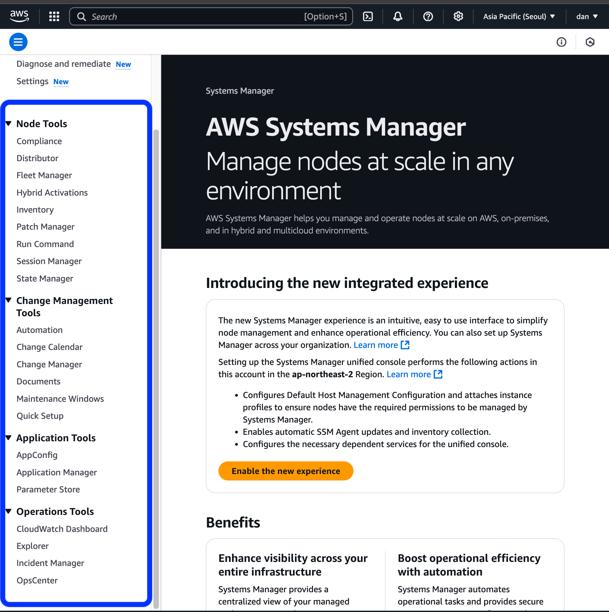

# AWS Systems Manager
해당 서비스는 과거에 EC2 Systems Manager 또는 Simple Systems Manager로 알려졌다. 그렇기에 현재도 SSM이라는 약어가 아래와 같은 AWS 리소스에서 사용된다.
- SSM Agent
- SSM parameters
- AmazonSSMReadOnlyAccess : IAM 관리형 정책 이름

SSM은 AWS 리소스, On-premise 및 멀티 클라우드 환경에서 노드들을 중앙에서 조회, 관리 및 운영할 수 있도록 지원한다. SSM Agent를 설치하해 SSM과 연결한 뒤, 통합된 콘솔과 여러 도구를 통하여 SSM은 AWS 계정과 리전을 넘나들며 노드 작업을 완료하는데 도움을 준다.

**SSM 이용 시의 이점**
1. 노드를 중앙에서 관리해 인프라 가시성이 좋음
2. 효율적인 운영 가능
	- 일반적인 작업을 자동화하여 관리 비용 절감
	- Bastion Host, SSH, 원격 PowerShell 없이 원격으로 대규모 노드를 관리
3. 모든 환경에서 단순하게 노드를 관리할 수 있음

## Tools
[AWS SSM Tools](https://docs.aws.amazon.com/systems-manager/latest/userguide/systems-manager-tools.html)

### Node Tools
1. Compliance
- 관리하는 노드의 패치 준수 상태 및 구성 불일치 확인
- 여러 AWS 계정, 리전에서 데이터를 수집하고 집계
- 기본적으로 Patch Manger 패치 적용 상태와 State Manger 연관 데이터 표시해주고 커스텀할 수 있음

2. Distributor
- 관리하는 노드에 패키지를 생성하거나 배포할 수 있음
- 자신의 소프트웨어 패키지나 `AmazonCloudWatchAgent`와 같은 AWS 제공 에이전트도 설치 가능
- 설치한 뒤 제거나 재설치도 가능함

3. Fleet Manager
Fleet은 함대라는 뜻.
- 관리하는 모든 노드의 상태 및 성능을 한 번에 조회할 수 있음
- 개별 장치나 인스턴스의 데이터를 수집해 작업할 수도 있음
- 디렉터리 및 파일 탐색, Window registry 관리, OS User 관리 등 가능

4. Hybrid Activations
- Hybrid 또는 Multi cloud 환경의 non-EC2 machine들을 관리할 수 있는 노드로 설정
- Hybrid Activation을 생성한 뒤 `activation code`와 `ID`를 받아 EC2 처럼 SSM에서 관리 가능
- 엣지 디바이스도 Activation 생성할 수 있음

5. Inventory
- 관리하는 노드에서 Software inventory 를 자동으로 수집
- 애플리케이선, 파일, 컴포넌트, 패치 등의 메타데이터를 수집할 수 있음
	- Inventory 관련해서 Insights 라는 단어가 많이 나옴, [Insights](https://docs.aws.amazon.com/systems-manager/latest/userguide/review-node-insights.html)

6. Patch Manager
- 관리하는 노드들의 패치 작업을 자동화할 수 있음
- 누락된 패치를 확인하고, 개별적으로나 태그를 사용하여 노드 그룹에 누락된 패치를 적용 가능. 
- patch baselines 사용해 자동 승인 규칙 적용 가능
	- 패치 출시 후 일정 기간 내에 자동 승인할 패치에 대한 규칙과 승인 또는 거부 목록
- S3에 패치 보고서 저장할 수 있음

7. Run Command
- 노드의 구성을 원격으로 안전하게 관리할 수 있음
- 애플리케이션 업데이트, Linux 셸 스크립트 실행, Windows PowerShell 명령 실행과 같은 작업을 온디맨드(즉시 실행) 방식으로 수행

8. Session Manager
- AWS CLI 또는 웹 브라우저를 통해 EC2 및 엣지 디바이스에 보안 접속 및 관리
- SSH 키 관리, 인바운드 포트 개방, Bastion host 없이 안전하게 사용
- 로그 저장 및 보안 정책 준수 기능 제공

9. State Manager
- 관리하는 노드를 정한 상태로 자동적으로 유지할 수 있게 함
- 특정 소프트웨어를 bootstrap 되게하거나, 소프트웨어 업데이트 패치, 윈도우 도메인 가입 등을 관리할 수 있음

### Change Management
1. Automation
- 공통된 유지보수나 배포 작업을 자동화 할 수 있음
- AMI 생성 및 업데이트, 패스워드 재설정, OS 패치 적용, 애플리케이션 업데이트 가능

2. Change Calendar
- AWS 계정에서 특정 작업이 가능하거나 불가능한 날짜 및 시간을 설정하는 도구입니다.

3. Change Manager
- 애플리케이션 구성과 Infrastructure 에 대해 변경 요청, 승인, 적용, 보고 기능을 제공
- AWS Organizations를 사용하여 단일 관리자 계정에서 여러 AWS 계정 및 리전에 걸쳐 변경 사항을 관리 가능.

4. Documents
- Systems Manager가 수행할 작업을 정의하는 문서, 명령과 자동화 실행 등에 대한 문서 포함됩니다
- JSON 또는 YAML 형식으로 작성 가능

5. Maintenance Windows
- 관리되는 인스턴스의 패치 및 업데이트 설치와 같은 정기적인 작업 일정 설정 가능.
- 비즈니스에 중요한 운영을 방해하지 않고 유지보수 작업을 수행.

6. Quick Setup
- AWS 서비스 및 기능을 Best practice를 적용하여 간편하게 설정  
- AWS Organizations와 통합하여 여러 AWS 계정 및 리전에서 동시에 구성 가능

### Application Tools
1. AppConfig
- 애플리케이션 구성과 Feature flag를 생성, 관리, 배포하는 것을 도와줌
	- [Feature flag란?](https://www.devcycle.com/blog/what-are-feature-flags-in-devops)
- EC2, Lambda, 모바일 애플리케이션이나 엣지 다바이스의 배포 관리
- 유효성 검사, 모니터링, 배포 오류 발생 시 롤백 가능

2. Application Manager
- DevOps 엔지니어가 애플리케이션 단위나 클러스터 단위로 AWS 리소스 관리할 수 있게 함
- EKS, ECS 지원

3. Parameter Store
- Configuration 데이터 및 Secret 관리를 안전하게 할 수 있음
- Parameter Value로 비밀번호, EC2 ID, AMI ID 등을 관리할 수 있음

### Operation Tools
1. CloudWatch Dashboards
- AWS 리소스 상태를 한눈에 모니터링할 수 있는 대시보드 제공
- 리전 상관 없이 모니터링이 가능하고 대쉬보드를 커스텀할 수 있음

2. Explorer
- AWS에 대한 운영 현황을 한 곳에서 볼 수 있음
- 운영 데이터에는 EC2에 대한 메타데이터, Patch Compliance Details, Operational work items 등을 볼 수 있음
	- [OpsItem docs](https://docs.aws.amazon.com/systems-manager/latest/APIReference/API_OpsItem.html)

3. Incident Manager
- AWS 애플리케이션에서 발생한 인시던트를 관리하고 복구를 지원하는 콘솔.
	- 인시던트 : 시스템 장애, 보안 침해, 성능 저하 등 서비스에 영향을 미치는 긴급한 문제

4. OpsCenter
- AWS 리소스와 관련된 OpsItems을 중앙에서 조회, 조사, 해결.
- OpsItems를 표준화하여 집계하고, 관련 리소스 및 데이터를 제공.
- 문제 해결을 위한 Runbook 제공

- - - -

## Container
[Containers](https://docs.aws.amazon.com/decision-guides/latest/containers-on-aws-how-to-choose/choosing-aws-container-service.html?icmpid=docs_homepage_containers)
AWS는 **ECS**, **EKS** 등 두 가지의 상용화된 컨테이너 서비스 제공. **ECR** 이라는 컨테이너 이미지 저장소(레지스트리 서비스) 제공

컨테이너 기반의 컴퓨트 모델은 자체 커널이 아닌, 호스트의 커널을 공유 → 기존의 인스턴스 방식보다 높은 효율성

컨테이너에서는 바이너리 이미지 생성을 위한 텍스트 파일만 관리하면 된다. (ex. Dockerfile)
장점 중 하나는 컴퓨트 리소스 실행을 스크립트화하여 효율적으로 처리 가능

### ECS
컨테이너 수가 많아지면 적절한 자원 할당 및 네트워크 설정 등의 작업이 복잡해짐 → ECS와 같은 오케스트레이션의 중요성이 대두.
애플리케이션 정의, 적절한 컨테이너 이미지 선택, 리소스 환경 구성, 제반 요소를 관리 가능
대규모 컨테이너 클러스터 실행을 위한 서비스이며 인스턴스, 스토리지, 네트워크 리소스의 프로비저닝을 관리하며 컨테이너 생애 주기동안 컨테이너의 모니터링 및 관리작업을 지원

* Amazon ECS Anywhere : ECS 플랫폼을 **온프레미스 인프라로 확장할 수 있도록 지원**. 동일한 API와 도구를 이용해 사용. → 하이브리드 클라우드 환경에 적합. 온프레미스에만 사용해도 비용 청구된다.
	* 컨테이너를 호스팅하려는 로컬 서버에 활성화 키를 이용해 ECS 및 SSM 에이전트의 설치 및 실행이 필요함

### EKS
ECS와 대체로 비슷하지만 특정 컨테이너 플랫폼에 구애받지 않고 사용할 수 있음.

- Amazon EKS Anywhere 존재
- Amazon EKS Distro : **EKS 호환 환경설정을 무료로 다운로드 가능**, 이를 통해 긴밀하게 버전 컨트롤 및 환경구성과 관련된 의존성 요소 관리 가능 → 복잡해질 수 있는 쿠버네티스 운영 환경을 좀 더 체계적이고 표준화된 방식으로 업데이트 및 관리 가능

### 기타
- AWS Fargate : ECS, EKS플랫폼이 **안전하게 격리된 환경에서 실행될 수 있도록 도움**.
	
- ECR : 관리형 도커 컨테이너 레지스트리 서비스. 도커 컨테이너 이미지의 저장, 관리, 배포 등 각종 업무를 간소화

IAM과 컨테이너 서비스를 통합하여 각 컨테이너 저장소에 대한 리소스 수준 관리가 가능해짐.
