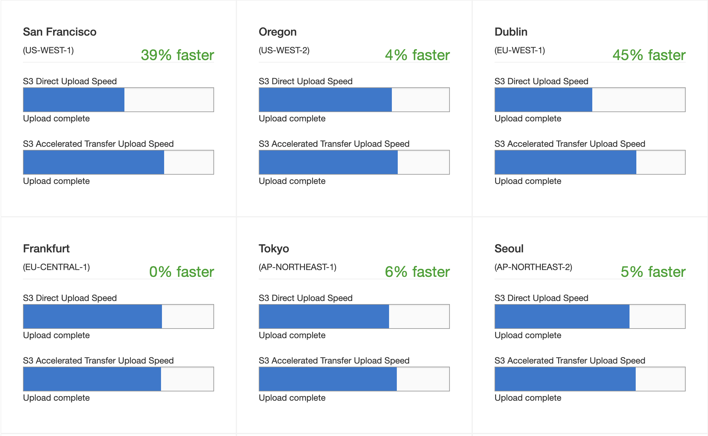
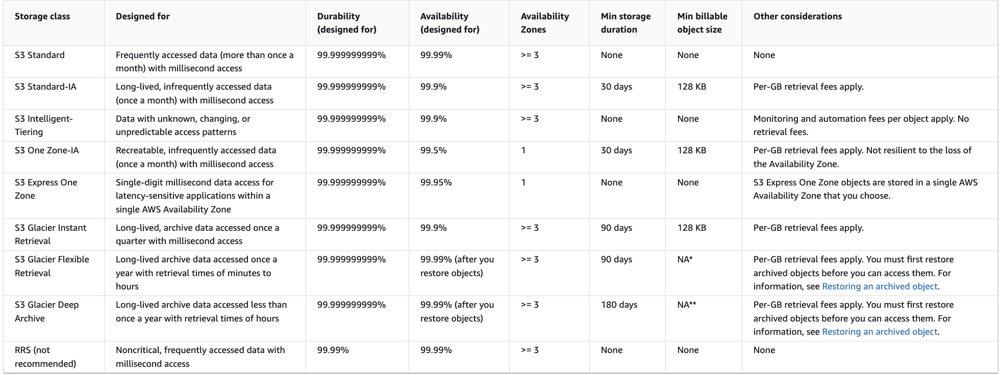

# 3. AWS 스토리지

- [객체 스토리지와 블록 스토리지의 차이점](##객체-스토리지-VS-블록-스토리지)
- [S3](##S3)
	- [용도](###S3의-용도)
	- [특징](###S3의-특징)
	- [객체 저장 구조](###객체-저장-구조)

## 객체 스토리지 VS 블록 스토리지
### 객체 스토리지
키-값 기반으로 파일을 저장하며, 데이터를 객체 단위로 관리하는 스토리지 방식
확장성이 좋다는 장점이 있으며, 대규모 비정형 데이터를 관리하는 것에 용이

아래의 블록 스토리지는 특정 블록만 수정 가능하지만, 객체 스토리지는 파일 전체를 다시 저장해야 한다.(Append/Update가 불가능하고 Overwrite를 해야 함.)

### 블록 스토리지
전통적인 파일 시스템을 사용하며, 데이터를 고정된 크기의 블록 단위로 저장하는 스토리지 방식.
빠른 랜덤 엑세스가 가능해 높은 I/O 성능을 가지고 있다.

## S3

### S3의 용도
1. 아카이브, 로그 파일, 재난 복구 이미지 등을 이용한 백업 관리
	- 아카이브 : 오래된 데이터를 장기 보관하는 용도
	- 시스템 장애나 재해 발생 시 복구할 수 있도록 저장된 백업 이미지
2. 빅데이터
3. 정적 웹사이트 호스팅

### S3의 특징
- 하나의 계정에서 최대 100개의 버킷을 생성할 수 잇고, 다른 AWS 서비스와 같이 요청을 통하여 가용 버킷 수를 증가시킬 수 있다.
- 버킷 내 콘텐츠는 리전 내에서만 존재할 수 있으며, 버킷의 이름은 글로벌 기준으로 유일해야한다.

### 객체 저장 구조
S3의 버킷 내 객체는 계층 구조로 객체를 저장하지 않는다. `/images/profile/profile1.jpeg`와 같은 형태를 많이 보았을 테지만 이는 사실 폴더나 하위 디렉토리같은 계층 구조로 저장한 것이 아닌 평면 구조로 저장되었다.
하지만 사용자가 체계적으로 저장 객체를 관리하기 위하여 위와 같이 버킷에 접두사(`profile`, `image` 등) 또는 구분문자(`/`)를 추가해 사용할 수 있다.

객체는 키-값 형태로 저장되며, 키에는 객체를 고유하게 식별하기 위한 고유 식별자(Object ID)와 값에는 실제 데이터가 들어간다.
또한 객체에 대한 퍼미션, 콘텐츠 타입 등의 정보가 있는 2KB의 메타데이터를 키 형식으로 제공한다.

### 대용량 객체 저장하기
이론적으로 버킷에 저장할 수 있는 데이터의 총 용량에는 제한이 없다. 하지만 객체 하나의 용량은 5TB를 초과할 수 없으며, 한 번의 업로드 작업은 5TB를 초과할 수 없다. 그렇기에 용량이 큰 객체에 대해서는 Multipart Upload를 사용해야한다.(AWS는 100MB 초과 객체의 경우 해당 기능을 사용할 것을 권장한다.)

[AWS S3 Multipart Upload](https://docs.aws.amazon.com/AmazonS3/latest/userguide/mpuoverview.html)

**멀티파트 업로드의 장점**
1. 파트 병렬 전송에 따른 처리량 향상
2. 파트의 크기가 작아짐에 따라 실패한 업로드에 대해 양향이 적으므로 네트워크 이슈에 빠른 대처 가능
3. 객체 전송에 대해 일시정지 및 재시작 가능
4. 객체의 최종 용량을 몰라도 생성 시점에 업로드 가능

AWS SDK나 CLI에서 제공하는 고수준 API의 경우 파일 크기에 따라 자동으로 멀티파트 업로드를 수행하지만, S3의 `CreateMultipartUpload`, `UploadPart`, `CompleteMultipartUpload` API를 호출하여 개발자가 직접 객체를 여러 부분으로 분할 할 수 있다.

**S3 Transfer Acceleration**
S3 버킷에 대용량 파일을 전송해야 하는 경우 해당 환경설정을 통해 전송 속도를 높일 수 있다.
공용 네트워크를 통하여 S3버킷으로 파일을 전송하는 것과 달리 이 기능을 사용하면 사용자의 업로드 요청은 가장 가까운 AWS 엣지 로케이션에 전달되고, AWS의 내부 네트워크를 통하여 더욱 빠르고 안정적으로 데이터를 전송할 수 있다.

이 때 `bucketname.s3-accelerate.amazonaws.com`와 같이 특수한 엔드포인트 도메인 네임으로 전송 경로를 설정한다.

[Acceleration 비교](https://s3-accelerate-speedtest.s3-accelerate.amazonaws.com/en/accelerate-speed-comparsion.html)

### 암호화
외부에 공개하는 정보가 아니라면 S3에 저장하는 데이터는 암호화가 필요하다. 데이터를 전송할 때 HTTPS로 암호화한 뒤 전송하지만, S3 버킷 안에서 대기하고 있는 데이터 또한 암호화된 상태로 보호해야한다.

서버측 암호화와 클라이언트측 암호화가 있으며 서버측 암호화가 보다 복잡성이 낮고 대다수 사용자들이 선호하는 방법이다. 하지만 기업 및 기관에 따라 암호화 키를 직접 생성 및 관리하려는 경우가 있으면 이 경우 클라이언트측 암호화를 사용할 수 있다.

**서버측 암호화**

사용자가 S3에 데이터를 업로드 할 때, S3 플랫폼 내에서 디스크에 저장될 때 암호화하고 권한 증빙 이후 데이터 인출을 요청할 때 복호화해 전송한다.
1. SSE-S3 : 자체적으로 관리하는 암호화 키를 사용하며, S3가 자동으로 처리하여 사용자는 키를 직접 관리할 필요가 없다.
2. Envelop key 기법 : 키 사용과 관련된 모든 작업 흐름을 추적해 감사 업무에 활용할 수 있다. 
3. 커스텀 키 : 필요에 따라 AWS KMS(Key Management Service) 서비스를 통해 커스텀 키를 임포트해서 사용할 수 있다.

**클라이언트측 암호화**

AWS KMS - Managed Customer Master Key(CMK)를 이용하면 Amazom S3 암호화 클라이언트를 통해 Client-Side Master Key를 사용해 S3에 전송하기 전에 데이터를 암호화할 수 있다. 해당 기능을 이용하면 데이터 객체 업로드 직접에 데이터 키를 생성한다. 

### S3의 이벤트에 대한 로그 관리
기본적으로 S3 버킷의 작업이 많아 로그를 기록하는 것이 그리 효율적이지 않기에, 객체 수준으로 각종 이벤트를 추적해 로그 파일에 기록으로 남기는 기능은 꺼져있다. (버킷의 생성, 삭제, 권한 변경 등 버킷에 대한 이벤트는 CloudTrail에 자동으로 기록이 된다.)

이 로그 기능을 활성화 하기 위해서는 작업 내용을 추적하는 **소스 버킷**과 로그 파일을 저장하는 **타켓 버킷**을 직접 설정해야한다.
생성일 및 시간을 나타내는 접두사 및 분리기호를 지정해 다수의 소스 버킷에서 생성되는 다양한 로그 기록을 찾기 쉽게 만든 뒤 타켓 버킷에 저장할 수도 있다. 아래는 로그로 기록될 수 있는 작업 세부 내역 정보이다.

- 요청자의 계정 및 IP 주소
- 소스 버킷 이름
- 요청 작업 내역 (GET, PUT, POST, DELETE 등)
- 요청을 한 시간
- 요청에 대한 응답 상태

**더 알면 좋은 것**
- S3 로그 생성에는 시간 지연이 발생한다.
- 다른 AWS 서비스의 로그 및 스냅샷 등의 객체를 저장하기 위해 S3가 사용되기도 한다.

### S3의 내구성 및 가용성
 내구성은 데이터가 손실되지 않고 안전하게 저장될 수 있는 능력을 말하며, 가용성은 사용자가 언제든지 저장된 데이터를 사용할 수 있게 보장하는 능력을 말한다. 즉, 내구성이 좋다는 것은 데이터의 손실이 잘 일어나지 않는 다는 것을 뜻하며, 가용성이 좋다는 것은 거의 모든 시간에 서비스를 이용할 수 있다는 것을 뜻한다.

 S3는 다양한 스토리지 클래스를 제공하며, 사용자는 내구성, 가용성, 비용 효율성을 고려하여 클래스를 선택할 수 있다.
아래 클래스 중 최근에 도입된 S3 Intelligent-Tiering은 성능 저하나 운영 부담 없이 데이터를 가장 비용 효율적인 접근 계층으로 자동으로 이동시켜 저장 비용을 최적화하는 데 설계된 서비스이다. 접근 빈도를 모니터링하여 데이터에 대한 접근이 없는 객체에 대해 낮은 요금체계를 가진 티어로 자동 변경한다.

[S3 스토리지 클래스 정보](https://docs.aws.amazon.com/AmazonS3/latest/userguide/storage-class-intro.html) 

**내구성(Durability)**

 대부분의 S3(RRS 제외)의 내구성은 99.999999999%(11 nines)에 달하며, 저장된 객체의 연간 손실 가능성은 0.000000001%이다. 
 
 예를 들어, S3에 1만 개의 객체를 저장할 경우, 10,000,000년 동안 손실될 가능성은 단 하나의 객체 미만이다.
 S3가 이렇게 높은 내구성을 보장하는 방법은 데이터에 대한 복제이다. 
 
 S3는 데이터를 여러 물리적 시설(가용 영역)에 걸쳐 자동으로 복제한다. 이는 특정 하드웨어 장애, 가용 영역의 장애 등으로 인해 데이터 손실이 발생하는 것을 방지한다. 또한, 데이터 손상이나 손실이 발생할 경우 자동으로 복구할 수 있는 메커니즘을 갖추고 있어, 손상된 데이터를 발견하면, 복제된 데이터를 사용하여 자동으로 복구한다.

 S3 One Zone-IA와 S3 Express One Zone은 `Availability Zone`이 1인 것을 볼 수 있는데 이 때에도 단일 가용 영역 내에서 데이터를 복제하여 내구성을 보장한다. 하지만 가용 영역이 하나이기에 가용성은 99.5%로 다른 클래스들보다 떨어지는 것을 알 수 있다.

**가용성(Availability)**

 Amazon S3 Standard 클래스의 경우 연간 99.99%의 응답 가능성을 보증한다. 이는 1년 동안 S3 서비스가 다운되거나 데이터에 접근할 수 없는 시간은 52.56분(1년 * 0.01% = 0.876시간) 이하라는 뜻이다. 그 시간을 초과해 발생하는 다운타임에 대해서는 서비스 크레딧을 적용할 수 있다.

**데이터에 대한 일관성**

 S3는 데이터를 복제하여 내구성을 높인다는 것을 앞서 이야기했다. 
 단순히 다른 가용영역에서 복제만 되어있는 것이 아닌, 분산 시스템으로 사용자의 요청을 처리하는데 분산 시스템에서는 데이터의 일관성에 대한 문제가 있다. 
 S3와 같은 분산 스토리지 시스템에서 데이터에 접근할 때 아래 두 가지 일관성 모델이 중요한 역할을 한다.

* 쓰기 후 읽기 일관성(Read-after-Write Consistency)
 새 객체를 업로드한 직후에 해당 객체를 읽을 때 항상 최신의 데이터를 반환한다. 즉, 새로 생성된 객체는 업로드가 완료되면 즉시 읽을 수 있으며, 이는 최신 상태를 반영합니다.

* 종국적 일관성(Eventual Consistency)
 기존 객체를 덮어쓰거나 삭제한 경우, 변경된 내용이 모든 가용 영역에 전파되기까지 시간이 걸릴 것이다. 이 기간 동안 일부 요청에서는 여전히 이전 상태의 데이터를 반환할 수 있지만, 시간이 지나면서 결국 모든 요청이 최신 상태를 반영하게 된다. 그렇기에 데이터 상태 변경에 대한 시간 지연(1~2초)을 감안한 뒤 관련 작업 수행의 방식을 설계해야 한다.
 객체에 대한 업데이트 및 삭제 시에는 종국적 일관성 기준이 적용되지만, 새 객체 생성에는 이 기준이 적용되지 않을 것이다. 새 객체 생성에는 쓰기 후 읽기 일관성 기준이 적용된다.
