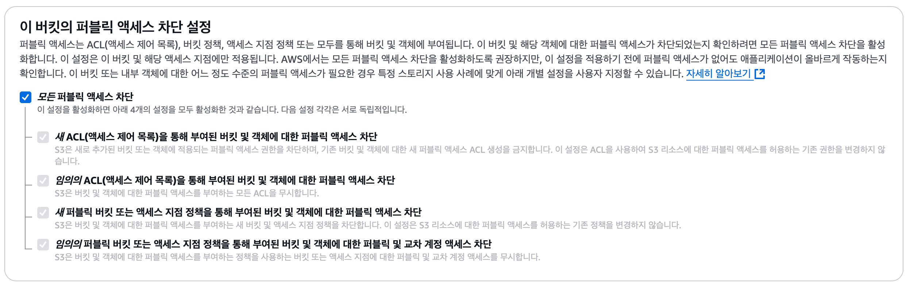
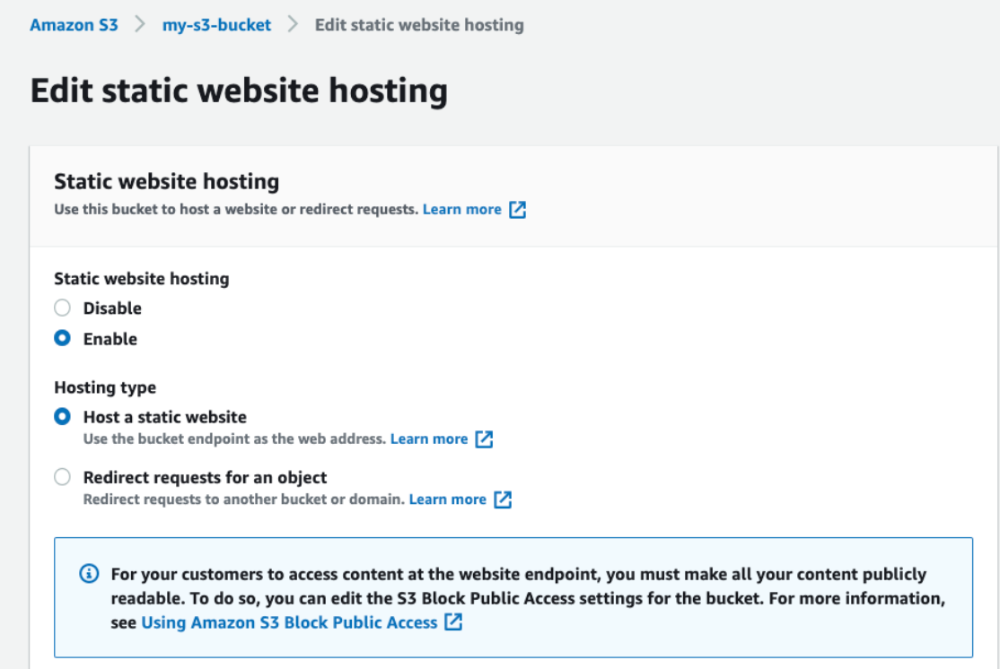
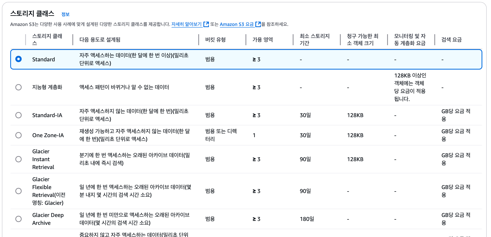
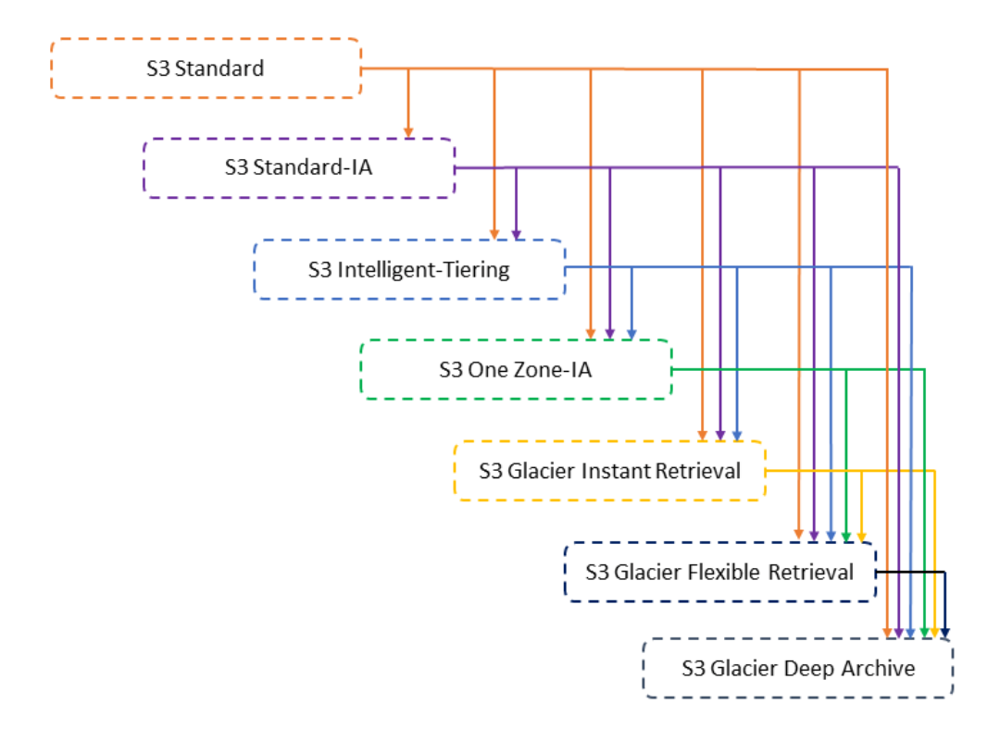

# Amazon S3
> **"infinitely scaling" storage**
> 
> ### Use cases
> - Backup and storage
> - Disaster Recovery
> - Archive
> - Hybrid Cloud storage
> - Application hosting
> - Media hosting
> - Data lakes & big data analytics
> - Software delivery
> - Static website   
> <br>
>
> ## Buckets
> - Amazon S3  allows people to store objects in "buckets"
> - globally unique name
> - defined at the region level   
>   (S3는 전역 서비스처럼 보이지만 버킷은 리전에서 생성됨)
> - Naming convention
>   - uppercase X, underscore X   
> <br>
>
> ## Objects
> - objects(files) have a key
> - The **key** is the FULL path:
>   - s3://my-bucket/**my_foler1/another_folder/my_file.txt**
> - key = prefix + object name
>   - 접두사: my_folder1/another_folder
>   - 객체 이름: my_file.txt
> - **key는 슬래시를 포함하며 접두사, 객체 이름으로 만들어짐**  
>   <br>
> - Object values are content of the body:
>   - max size 5TB
>   - 5GB를 넘으면 'multi-part upload'
>   - 파일 크기가 100MB가 넘는 경우에는 멀티파트 업로드가 권장됨
> - object에는 Metadata(list of text key / value pairs)도 포함
>   - Tag (Unicode key / value pair) - useful for security / lifecycle
>   - Version ID   
> <br>
>
## Security
- User-Based
  - IAM Policies - which API calls should be allowed for a specific user from IAM
- Reource-Baesd
  - **Bucket Policies**
      - bucket wide rules from the S3 console (allows cross account)
      - 버킷에 저장된 모든 객체에 대한 권한을 한 번에 관리 가능
  - Object Access Control List (ACL)
      - finer grain (disabled O)
      - 개별 객체(파일)마다 세밀한 권한 설정이 가능
      - 같은 버킷 안에서도 파일별로 다른 권한 부여 가능
  - Bucket Access Control List (ACL) 
      - less common (disabled O)
      - 버킷 자체에 대한 권한을 ACL로 관리
      - 버킷 정책이 더 강력해서 사용 X

> an IAM principal can access an S3 object if 
> - The user IAM permissions ALLOW it OR the resource policy ALLOWS it
> - AND there's no explicit DENY

- Encrytion
  - encrypt objects in Amazon S3 using encrytion keys   
<br>

## S3 Bucket Policies (⭐️)
```   
{
      "Version": "2012-10-17",
      "Statement": [
          {
              "Sid": "PublicRead",
              "Principal": "*",
              "Effect": "Allow",
              "Action": [ 
                   "s3:GetObject"
              ],
              "Resource": [
                   "arn:aws:s3:::examplebucket/*"
              ]
          }
      ]
}
```
- JSON based policies
  - **Resources**: buckets and objects (정책이 적용되는 버킷과 객체를 정책에 알려줌)
    > "arn:aws:s3:::examplebucket<u>/*</u>" -> examplebucket 내에서 <u>모든 객체에 적용</u>
  - **Effect**: Allow / Deny (Action에 대한)
  - **Actions**: Set of API to Allow or Deny
      > "s3: GetObject"
  - **Principal**: The account or user to apply the policy to
      > "*": 모든 사용자 허용

- Use S3 bucket for policy to:
  - Grant public access to the bucket
  - Force objects to be encryted at upload
  - Grant access to another account (cross account)   
<br>

## Bucket settings for Block Public Access

- created to prevent company data leaks    
   (기업 데이터 유출 방지를 위한 추가 보안 계층)
- **S3 버킷 정책을 설정하여 공개로 만들어도 이 설정이 활성화되어 있으면 버킷은 public으로 공개될 수 없음**
- Can be set at the account level

### Bucket에 접근할 수 있는 상황
1. Public Access - Use Bucket Policy
      > www에 있는 익명의 사용자 ➡️ S3 Bucket **(+ S3 Bucket Policy + Allows Public Access)**   
      > *-> 버킷 정책을 S3 버킷에 첨부해야 하면 그 안에 있는 모든 객체에 엑세스 가능*

2. User Access to S3 - IAM permissions
      > IAM 사용자(계정 내 사용자) **(+ IAM Policy)** ➡️ S3 Bucket   
      > *-> policy를 통해 사용자에게 IAM 권한을 할당하면 엑세스 가능*

3. EC2 instance access - Use IAM Roles
      > EC2 Instance **(+ EC2 Instance Role + IAM permissions)** ➡️ S3 Bucket   
      > *-> IAM 권한을 통해 EC2 인스턴스 역할을 생성하면 인스턴스 버킷에 엑세스 가능*

4. Cross-Account Access - Use Bucket Policy
      > IAM User Other AWS account ➡️ S3 Bucket **(+ S3 Bucket Policy Allows Cross-Account)**   

> Q1. S3 버킷 정책을 업데이트해 IAM 사용자들이 S3 버킷 내의 파일을 읽기/쓰기할 수 있도록 허가했으나, **한 명의 사용자가 **PutObject  API** 호출을 수행할 수 없다**며 불만을 토로하고 있습니다. 이 경우, 가능성이 있는 원인은 무엇입니까?    
> 
> A1. 연결된 IAM 정책 내에 이 사용자를 부인하는 사항이 명시되어 있음   
> 🙋🏻 IAM 정책 내의 명시적인 부인(DENY)은 S3 버킷 정책보다 우선적으로 고려됨
<br>

## Static Website Hosting

- S3 can <u>host static websites (HTML, CSS, JS)</u> and have them <u>accessible on the Internet</u>
- The website URL will be (depending on the region)
  - http://bucket-name.s3-website-awe-region.amazonaws.com   
  OR
  - http://bucket-name.s3-website.awe-region.amazonaws.com
- *If you get a **403 Forbidden** error, make sure that bucket policy allows public reads*   
<br>

## Versioning
- enabled at the **bucket level**
- 의도하지 않은 삭제를 하지 않게 하는 것을 도와줌
  > - if 버전 관리 활성화 상태에서 파일을 삭제 -> delete marker가 추가됨 (복구 가능)
  > - if 버전 관리 비활성화 상태에서 파일 제거 -> permanently delete (복구 불가)
- Version ID로 삭제 -> permanently delete
- 이전 버전으로 쉽게 롤백 가능
- 버전 관리를 활성화 하기 전에 버전 관리가 적용되지 않은 모든 파일은 null 버전을 가짐
- 버전 관리를 중단해도 이전 버전을 삭제하지 않음   
<br>

## Replicaiton (SRR & SRR)
- **Must enable Versioning** in source and destination buckets
- Cross-Region Replication (**CRR**): 버킷의 두 리전이 달라야 함
- Same-Region Replication (**SRR**): 버킷의 리전이 같아야 함
- 버킷은 서로 다른 AWS 계정 간에도 사용할 수 있음   
- 복제 과정은 백그라운드에서 비동기식으로 이루어짐 (asynchronous)
- 복제 기능이 정상적으로 실행되려면 S3에 올바른 IAM 권한 (읽기, 쓰기) 필요
> After enable Replication, **only new objects are replicated**   
> 기존의 객체도 복제하고 싶으면 **S3 Batch Replication** 사용해야 함   
> ➡️ 기존 객체부터 복제에 실패한 객체까지 복제할 수 있는 기능
- use case:
  - CRR - 법규나 내부 체제 관리, 데이터가 다른 리전에 있어 발생할 수 있는 지연 시간을 줄일 경우에 사용, replication across accounts
  - SRR - 다수의 S3 버킷간 log aggregation, 개발 환경이 별도로 있어 운영 환경과 개발 환경 간의 실시간 복제를 필요로 할 때 사용   
<br>

> 대상 버킷 A, 타겟 버킷 A-Replica   
> (S3 Batch Replication 비활성화 상태)
> - replica 설정 후 A에서 새로 생성한 object만 A-Replica에 복제
> - A에 delete marker 추가하면 A-Replica에도 동일하게 추가됨
> - but, A에서 version ID로 영구 삭제해도 A-Replica에서는 삭제되지 않음
<br>   

> Q2. **S3 버킷에 있는 콘텐츠를 다른 AWS 리전에서 완전히 가용할 수 있게 만들려고 합니다.** 이는 팀원들이 적은 대기 시간과 비용으로 데이터 분석을 수행하는 데 도움이 됩니다. 이런 경우에 사용해야 하는 S3 기능은 무엇입니까?   
>
> A2. S3 복제   
> 🙋🏻 S3 복제를 사용하면 S3 버킷에 있는 데이터를 동일한 또는 다른 AWS 리전으로 복제할 수 있음
<br> 

> Q3. S3 버킷이 3개 있습니다. 하나는 원본 버킷 A이고, 나머지 둘은 대상 버킷 B와 C입니다. 버킷 A에 있는 객체를 버킷 B와 C 양쪽 모두에 복제하려고 합니다. 어떻게 구성해야 합니까?   
>
> A2. 버킷 A에서 버킷 B로 복제하고, 버킷 A에서 버킷 C로 복제하도록 설정
<br>
## S3 Durability and Availability
- Durability (내구성) 👍🏻
   - 모든 스토리지의 내구성은 동일
- Availability (가용성)
  - 스토리지 클래스에 따라 다름   
<br>

 
## S3 Storage Classes (⭐️)
> 1. [Amazon S3 Standard - General Purpose](#s3-standard)
> 2. [Amazon S3 Standard-Infrequent Access (IA)](#s3-standard-ia)
> 3. [Amazon S3 One Zone-Infrequent Access](#s3-one-zone-ia)
> 4. [Amazon S3 Glacier Instant Retrieval](#s3-glacier-instant)
> 5. [Amazon S3 Glacier Flexible Retrieval](#s3-glacier-flexible)
> 6. [Amazon S3 Glacier Deep Archive](#s3-glacier-deep)
> 7. [Amazon S3 Intelligent Tiering](#s3-intelligent-tiering)
>
> - S3를 생성할 때 스토리지 클래스를 선택 O
> - 스토리지 클래스 수동 수정 O
> - Amazon S3 수명 주기 구성을 사용해 스토리지 간에 객체를 자동으로 이동 O   

### 📌 [Amazon S3 Standard - General Purpose](#s3-standard)
- 가용성 99.99%
- **자주 엑세스되는 데이터에 사용**
- 기본적으로 사용하는 스토리지 유형
- Low latency and high throughput
- AWS에서 두 개의 기능 장애를 동시에 버틸 수 있음
- use case:
  - Big Data analytics, gaming applications, content distribution

### 📌 Amazon S3 Infrequent Access
- **자주 엑세스되진 않지만 필요한 경우 빠르게 엑세스해야 하는 데이터에 사용**
- Low cost than S3 Standard
- 검색 비용 발생   
  #### 📌 [Amazon S3 Standard-Infrequent Access (IA)](#s3-standard-ia)
  - 가용성 99.9%
  - use case:
     - Disaster Recovery, backups
  #### 📌 [Amazon S3 One Zone-Infrequent Access](#s3-one-zone-ia)
  - High durability in a single AZ; data lost when AZ is dstoryed
  - 가용성 99.5%
  - use case:
     - Storing secondary backup copies of on-premis data, data you can recreate

### 📌 Amazon S3 Glacier Storage Classes

- **아카이빙과 백업을 위한 저비용 객체 스토리지**
  > Archiving?
  > - 데이터를 장기적으로 보관하는 작업을 의미
  > - 주로 사용하지 않거나, 접근 빈도가 낮은 데이터를 안전하게 저장해 두기 위해 사용
  > - 아카이브된 데이터는 즉시 접근할 필요는 없지만, 필요할 때는 다시 복구할 수 있어야 함
- pricing: 스토리지 비용 + 검색비용 (object retrieval cost)   

  #### 📌 [Amazon S3 Glacier Instant Retrieval](#s3-glacier-instant)
    - 밀리초 단위로 검색이 가능
    - 분기에 한 번 엑세스하는 데이터에 아주 적합
    - 최소 보관 기간이 90일이기 때문에 **백업이지만 밀리초 이내에 엑세스해야 하는 경우 적합**
  
  #### 📌 [Amazon S3 Glacier Flexible Retrieval](#s3-glacier-flexible)
    - Expedited (1-5 minutes), standard (3-5 hours), Bulk (5-12 hours)   
      -> (데이터를 받을 수 있는 시간)
    - 최소 보관 기간 90일   

    ➡️ Instant: 즉시 처리   
    ➡️ Flexible: 데이터를 검색하는데 최대 12시간까지 기다려야 함

  #### 📌 [Amazon S3 Glacier Deep Archive](#s3-glacier-deep)
    - for long term storage
    - 2가지 검색 티어: Standard (12hours), Bulk (48 hours)
    - 데이터를 검색하는데 가장 오래걸리지만 비용이 가장 저렴
    - 최소 보관 기간 180일

### 📌 [Amazon S3 Intelligent Tiering](#s3-intelligent-tiering)
- **데이터에 대한 접근 패턴을 알지 못할 때 사용**
- 사용 패턴에 따라 엑세스된 티어 간에 객체를 이동할 수 있게 해줌
- Smally monthly monitoring and auto-tiering fee
- 검색 비용 X

> - Frequent Access tier (automatic): default tier
> - Infrequent Access tier (automatic): objects not accessed for 30 days
> - Archive Instant Access tier (automatic): objects not accessed for 90 days
> - Archive Access tier (optional): configurable from 90-700+ days
> - Deep Archive Access tier (optional): configurage from 180-700+ days    
<br>

## Moving between Storage Classes

-> can transition objects between storage classes

- 실제로 객체에 자주 엑세스하지 않을 걸 알고있다면 Standard IA로 이동
- 객체를 아카이브화 하려는 걸 알고 있다면 Glacier 티어 또는 Deep Archive 티어로 이동   
<br>

## Lifecycle Rules (⭐️)
- **Tansition Actions**
  - configure objects to transition to another storage class
  - 다른 스토리지 클래스로 이전하기 위해 객체를 설정
    - Move objects to Standard IA class 60 days after creation
    - Move to Glacier for archiving after 6 months
- **Expiration actions**
  - configure objects to expire (delete) after some time
  - 일정 시간 뒤에 만료되어서 객체를 삭제하도록 설정
    - Access log files can be set to delete after a 365 days
    - Can be used to delete old version of files   
    *(if versioning is enabled)*
    - 멀티파트 업로드가 2주 이산 된 경우에도 완전히 완료되지 않았으면 그 파일 삭제할 수도 있음
- Rules can be ceated for a certain prefix   
  (s3://mybuket/mp3/*)
- Rules can be created for certain objects Tags   
  (Department:Finance)   

> ### ✅ Scenario 1
> EC2에 애플리케이션이 있고, 그 앱은 프로필 사진이 Amazon S3에 업로드된 후에, 이미지 썸네일을 생성한다. 이때 썸네일들은 원본 사진으로부터 쉽게 재생성할 수 있고 60일 동안만 보관해야 한다.   
> 원본 이미지는 60일 동안은 곧바로 받을 수 있어야 하고 그 후에 사용자는 최장 6시간 동안 기다릴 수 있다. 이 경우에 어떻게 규칙을 설계해야 하는가?   
>
- S3 source images can be on **Standard**, with a lifecycle configuration to trasition them to **Glacier** after 60 days
- S3 Thumbnails can be **One-Zone IA**, with a lifecycle configuration to expire them after 60 days (+ prefix로 source와 thumbnail 구분)
  - One-Zone IA에 있는 이유: 빈번히 액세스하지 않고 쉽게 재생성 할 수 있으니까   
<br>

> ### ✅ Scenario 2
> 회사 규칙에 따라 30일 동안은 삭제된 S3 객체를 즉각적으로 복구 할 수 있어야 한다. 그 기간이 지나면 최장 365일 동안은 삭제된 객체를 48시간 이내에 복구되야 한다.    
<br>

- Enable **S3 Versioning** in order to have object versions, so that 'delete objects' are in fact hidden by a **'delete marker'** and be recovered
- Transition the 'noncurrent versions' of the objects to **Standard IA**  
(최상위 버전이 아닌 객체들을 이전하기 위한 규칙을 만듦)   
-> 현재 버전이 아닌 버전들을 아카이브화하기 위해
- Transition afterwards the 'noncurrent version' to **Glacier Deep Archive**   
<br>

## Amazon S3 Analytics - Storage class Analysis
- Help you decide when to transition objects to the right storage class
- Recommendations for Standard / Standard IA   
  (not work for One-Zone IA / Glacier)
- S3 Analytics가 .csv 보고서를 생성하고 추천사항, 통계를 제공하는 방식으로 분석
- Report is updated daliy
- To make Lifecycle Rules improve