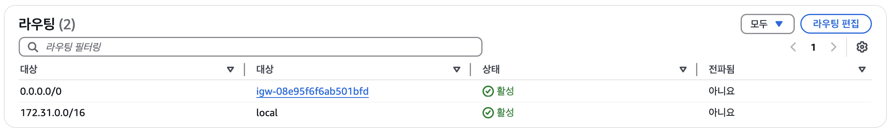
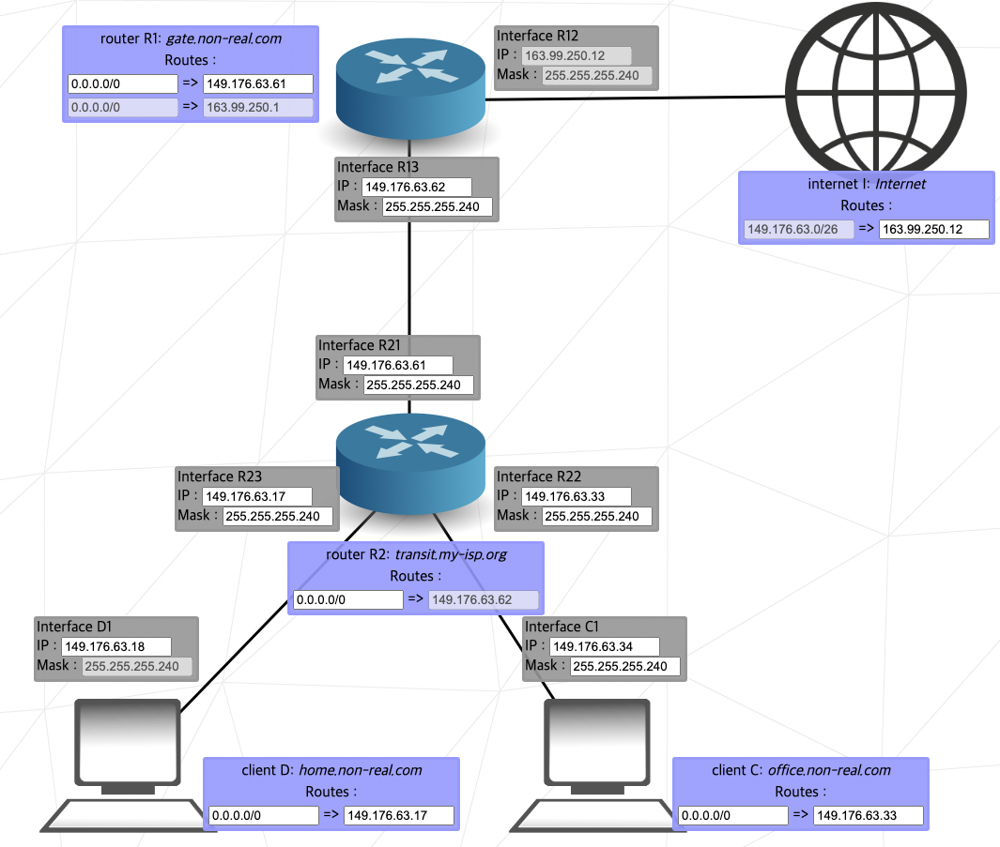
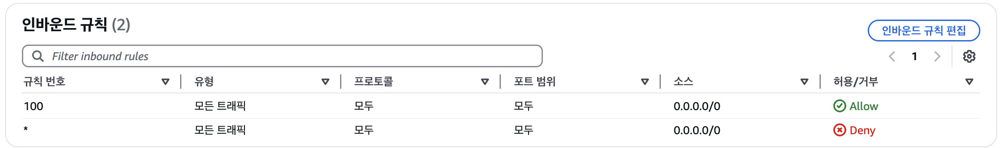
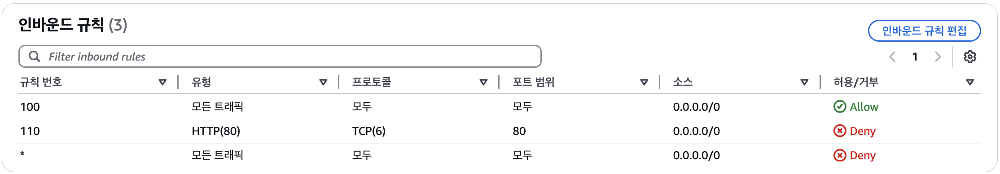
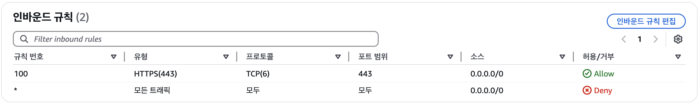

# VPC 라우트 테이블
VPC 내에서 라우트 테이블과 라우트를 이용해 네트워크 트래픽의 유입, 유출, 이동을 제어할 수 있다.
즉, 내부에서 패킷을 보낼 때 경로를 결정하는 역할을 한다.
## VPC 내 라우팅 특징
VPC 아키텍처는 IP 라우팅을 소프트웨어 함수로 구현한 **Implied Router(내재된 라우터)**의 특징을 가진다.
- VPC에는 인터페이스 IP 주소를 설정할 가상의 라우터가 없고, VPC 자체가 라우팅을 처리
- BGP와 같은 동적 라우팅 프로토콜 없음
- 단순히 라우트 테이블만 관리하면 됨

하나의 라우트 테이블에는 하나 이상의 **라우트(Route)**와 최소 하나의 **서브넷(Subnet) 연결**이 필요하다.

- VPC 생성 시 **메인 라우트 테이블**(Main Route Table)이 자동으로 생성되며, 이는 VPC의 모든 서브넷에 기본적으로 연결된다.
- 필요 시 **커스텀 라우트 테이블**을 생성하여 사용 가능하다.
- 서브넷은 반드시 라우트 테이블에 연결되어야 하며, 명시적으로 연결하지 않을 경우 **기본 라우트 테이블**에 자동 연결된다.

## 라우트(Route)
라우트 테이블과 연결된 서브넷 내에서의 트래픽 유입 및 유출을 결정한다.

### 대상 주소 기반 라우팅
AWS에서는 **대상 주소 기반 라우팅(Destination-based Routing)**을 사용한다.

> **대표적인 네트워크 라우팅 방식**  
> 1. 대상 주소 기반 라우팅  
> 	패킷의 목적지 IP 주소에 따라 라우팅을 결정함  
> 2. 소스 기반 라우팅  
> 	패킷이 어디서 왔는지 소스 IP에 따라 경로를 결정함  
> 	일반적인 네트워크에서는 많이 쓰이지 않지만, Software Defined Network(SDN) 환경에서 특정 트래픽을 특정 게이트 웨이로 보내는 경우에 사용  
> 3. 정적 라우팅  
> 	미리 특정 경로를 설정하는 방식  
> 	AWS의 VPC라우팅도 일종의 정적 라우팅 방식  
> 4. 동적 라우팅  
> 	BGP, OSPF 같은 프로토콜을 사용하여 네트워크 장비들이 자동으로 최적의 경로를 학습하는 방식  
> 	AWS에서는 Direct Connect 같은 서비스에서 BGP를 사용하여 온프레미스와 AWS 간 동적 라우팅 설정 가능  


### 라우트 생성 시 필수 요소
라우트를 생성할 때 반드시 다음 두 가지 요소를 설정해야 한다.

1. **대상 주소(Destination) IP Prefix**
   - CIDR 표기법으로 작성된 IPv4 또는 IPv6 주소 프리픽스를 사용한다.

2. **타겟(Target) 리소스**
   - 트래픽이 전달될 AWS 네트워크 리소스를 지정한다.
   - 예: 인터넷 게이트웨이(IGW), NAT 게이트웨이, ENI(Elastic Network Interface) 등
   - **IP Prefix는 타겟으로 설정할 수 없음** (즉, 특정 IP 주소를 직접 타겟으로 지정할 수 없음)



### 로컬 라우트(Local Route)
모든 라우트 테이블에는 **로컬 라우트(Local Route)**가 기본적으로 포함된다.
- 로컬 라우트란 VPC 내부의 모든 서브넷이 서로 통신할 수 있도록 자동으로 설정된 라우트이다.
- VPC 내부 서브넷으로 트래픽을 전달하라는 의미, 그 이후 패킷은 내부 네트워크에서 결정
- 수정은 가능하지만 삭제는 불가능 하다.
- 기본적으로 `Destination: VPC CIDR` -> `Target: local` 형태로 설정된다.

### 기본 라우트(Default route)
VPC를 생성하면 **기본 라우트 테이블**이 생성되고, 그 안에 **로컬 라우트**는 자동 생성이 되지만 내부 끼리의 통신만 가능하다.
인스턴스가 인터넷에 접근하도록 하려면, 기본 라우트를 생성한 뒤 인터넷 게이트웨이로 향하도록 해야 한다.

- 내재된 라우트는 트래픽을 어디로 보낼지 결정할 때 **순서 상관 없이 가장 일치도가 높은 범위**를 선택한다.



# 보안 그룹
방화벽과 같은 기능을 하며, 인스턴스 ENI에 대한 트래픽의 유입 또는 유출 여부를 허용하는 방식으로 인스턴스의 트래픽을 제어한다.
- 보안 그룹 생성 시, 그룹의 이름, 설명, 포함될 VPC를 지정한다.
- Whitelisting이라고도 부르는 Default-deny 방식을 사용해 명시적으로 허용하지 않은 모든 트래픽은 거부된다.

> **보안 그룹과 ENI의 대응**  
> - ENI에는 최소 하나 이상의 보안 그룹이 연결되어야 한다.  
> - 하나의 ENI에 여러 개의 보안 그룹을 연결할 수 있다.  
> - 하나의 보안 그룹을 다수의 ENI에 연결할 수 있다.  
> **인스턴스와 ENI의 대응**  
> - 인스턴스는 여러 개의 ENI를 지닐 수 있다.  
> 대부분 하나의 ENI만 연결해 사용하지만 위와 같은 경우 해당 ENI가 어떤 보안 그룹의 적용을 받는지 확인이 필요하다.  

## 인바운드 규칙
인스턴스에 부착된 ENI에 유입되는 트래픽의 허용 여부를 결정한다.

아래의 세 가지 필수 요소를 지닌다.
1. Source
2. Protocol
3. Port range

## 아웃바운드 규칙
인스턴스에 부착된 ENI에서 유출되는 트래픽의 허용 여부를 결정한다.

아래의 세 가지 필수 요소를 지닌다.
1. Destination (대상 주소)
2. Protocol
3. Port range

- 보안 그룹을 생성하면 아웃바운드 규칙은 자동적으로 모든 주소에, 모든 프로토콜, 모든 포트 범위에 대한 트래픽의 유출을 허용한다.

## 소스 및 대상 주소
- CIDR 블록
- 보안 그룹의 리소스 ID

인바운드 규칙의 소스 또는 아웃바운드 규칙의 대상 주소에는 위 두가지 항목이 올 수 있다.
심지어 보안 그룹 리소스 ID는 내 계정이 아닌 다른 AWS에 있어도 가능하며, 이 때는 명확성을 위해 계정 소유자 ID(Account ID)를 아래와 같이 명시해 지정해야 한다.
```
<Account ID>/<Security Group ID>
```

## Stateful Firewall
Security Group은 Stateful Firewall 기능을 제공한다.
인바운드 트래픽을 받았을 때, 해당 트래픽에 대한 정보를 기억해두었다가 아웃바운드는 자동으로 허용해줄 수 있는 지능적인 방화벽

> Q. 인바운드 트래픽을 받았을 때 아웃바운드를 자동으로 허용한다면 왜 아웃바운드 규칙이 필요할까?  
>   
> A. 수신한 요청에 대한 응답 트래픽은 Stateful firewall 덕분에 별도 아웃바운드 규칙 없이 자동으로 허용된다.  
> 하지만, 외부 API 호출 등 서버가 먼저 시작하는 아웃바운드 트래픽은 명시적으로 허용할 필요가 있다.  


보안 그룹은 개별 패킷의 흐름 정보인 flow information을 추적하여 응답 트래픽이 동일 플로우에서 나온 것인지 식별할 수 있다.
플로우 정보에는 다음 내용이 포함된다.
- Protocol
- Source 및 Destination IP 주소
- Source 및 Destination port 번호

## 기본 보안 그룹
모든 VPC에는 삭제 불가능한 기본 보안 그룹이 포함되어 있다. 이를 수정해서 사용할 수 있으며, 기본 보안 그룹 대신 직접 커스텀 보안그룹을 만들어 사용할 수 있다.

> Q. 보안 그룹은 인스턴스의 ENI에 대한 트래픽을 관리한다고 하였다. 그러면 인스턴스가 아닌 VPC에는 왜 기본 보안 그룹이 자동 생성될까?  
>   
> A. VPC 자체가 ENI를 가지진 않는다.  
> 대신, VPC 내부에 생성되는 모든 ENI에 보안 그룹을 명시하지 않은 ENI가 존재한다면 기본 보안 그룹을 적용하게 된다.  


# 네트워크 접속 제어 목록 (Network Access Control List, NACL)
보안 그룹이 인스턴스 ENI에 대한 유입과 유출 트래픽을 관리한다면, NACL은 서브넷에 대한 유입과 유출 트래픽을 제어한다.

> **간단한 NACL의 특징**  
> - 서브내 내의 인스턴스 간 트래픽을 제어해야하는 경우 NACL이 아닌 보안그룹을 사용해야한다.  
> - 서브넷에는 하나의 NACL만 연결할 수 있다.  
> - 서브넷 생성 시 VPC의 기본 NACL이 서브넷에 연결된다.  
> - 서브넷과 NACL이 같은 VPC에 있다면, 하나의 NACL을 여러 서브넷에 연결할 수 있다.  
> - NACL은 Stateless다.  

## 인바운드 규칙
- 규칙 번호
- Protocol
- Port range
- Source CIDR
- 동작
NACL의 각 인바운드 규칙에는 위 내용이 포함된다.

NACL의 규칙은 규칙 번호의 오름차순으로 처리된다. 트래픽이 특정 규칙과 매칭되면 더 아래 규칙을 확인하지 않고 즉시 적용된다.

위는 기본 NACL이다. 규칙 번호가 100이 가장 작으므로 먼저 처리되고, 규칙 번호가 `*`인 기본 규칙은 항상 마지막에 적용된다. 기본 규칙은 삭제하거나 변경이 불가능하다.

> Q. 아래와 같은 규칙은 어떻게 적용될까?  
> 
> Q1.
>     
>   
> Q2.
> 
>     
>   

## 아웃바운드 규칙
- 규칙 번호
- Protocol
- Port range
- Destination
- 동작
아웃바운드 규칙 또한 인바운드 규칙의 `Source`가 `Destination`으로 바뀐 것을 제외하면 같다.

아웃바운드 규칙을 수정할 때, 보안 그룹과 달리 NACL은 Stateless이므로 나가는 규칙에 대해 주의를 기울여야한다.

> Q. 왜 주의를 기울여야할까?  
>   
> A. 한 클라이언트가 요청을 보낼 때, 응답 트래픽을 받기 위해 대기하는 임시 포트(Ephemeral ports)를 할당받는다. 
> 
> 클라이언트의 OS에 따라 다르지만 최신 OS의 경우 `49152 ~ 65535` 범위에서 랜덤한 임시 포트 가 지정된다. 하지만 NACL의 아웃바운드 규칙에서 해당 범위를 열어놓지 않는다면 응답 트래픽이 차단된다.  


# Public IP 주소
Public IP 주소는 퍼플릭 인터넷으로 접속 가능한 주소이다. 다른 사용자가 인터넷을 통해 인스턴스에 직접 접속할 수 있도록 하려면 Public IP 주소가 필요하다.
이를 위해서는 해당 인스턴스가 포함된 VPC에 인터넷 게이트웨이를 연결해야한다.

Public IP 주소는 인스턴스 중지 또는 종료 시 삭제되고, 재시작 시 새로운 Public IP 주소가 할당된다.
직접 중지시킬 계획이 없더라도, AWS의 자체적인 성능 유지보수 이벤트에 의해 인스턴스가 재시작될 가능성이 있으니 동일한 주소를 유지해야할 경우 Elastic IP를 사용하는 것이 좋다.


# Elastic IP (EIP)
Elastic IP를 생성하면 AWS 계정에 할당되어 사용자가 직접 해제하지 않는 한 해당 주소를 독점적으로 사용할 수 있다.

- EIP를 처음 생성하면 인스턴스와 연결되지 않은 상태로 만들어지므로 직접 ENI와 연결을 해야한다. 다른 ENI에 옮겨서 사용할 수 있지만, 한 번에 하나의 ENI만 연결할 수 있다.
- 이미 Public IP가 ENI에 할당이 된 상태에서 EIP를 연결하면 Public IP 주소는 EIP로 변경된다.
- EIP는 리전 단위로 제공 된다.
- BYOIP(Bring Your Own IP)를 지원한다.
	- 사용자가 소유한 IPv4 주소를 AWS로 가져와 사용할 수 있다.
	- 리전 당 최대 5개의 주소 블록을 가져올 수 있다.

# AWS 글로벌 엑셀러레이터
최적화된 글로벌 네트워크이다.
어디에든 연결할 수 있는 두개의 정적 IPv4 주소를 제공하며, 어떤 리전에 있는 리소스라도 서로 연결할 수 있다.

- POP (Point of Presence) 활용
	- **30여 개국의 AWS 접속 지점(POP, Point of Presence)과 연결**
	- 가장 가까운 POP를 통해 최적의 경로로 트래픽 전달
- 자동 장애 조치(Failover) 지원
	- 특정 POP가 작동하지 않을 경우, 자동으로 다른 POP로 라우팅
	- 서비스 장애 없이 트래픽을 유지할 수 있음
- ELB, EIP, EC2 등 다양한 엔드포인트 지원

# 네트워크 주소 변환 (Network Address Translation, NAT)
NAT는 Public IP 주소를 Private IP로 Private IP 주소를 Public IP로 변환하는 기능이다.

만약 인스턴스에 Public IP가 있는 경우에도, 인스턴스의 ENI는 Private IP 만 관리한다. Public IP는 ENI가 아닌 IGW에서 관리하게 된다.

> Q. 123.123.123.123 이라는 Public IP를 가지고 있고, 172.31.7.7의 Private IP를 가진 인스턴스가 존재한다고 가정하자.   
> 해당 인스턴스가 122.122.122.122 IP주소를 가진 클라이언트와 소통을 할 때 인스턴스의 ENI가 Public IP의 주소를 모르면 어떻게 소통할까?  
>   
> A.   
> 1. 인스턴스에서 `Src. IP : 172.31.7.7, Dest. IP : 122.122.122.122`인 패킷 전송  
> 2. IGW는 `Src. IP : 123.123.123.123, Dest. IP : 122.122.122.122`으로 변환  
> 3. 클라이언트에서 `Src. IP : 122.122.122.122, Dest. IP : 123.123.123.123`인 패킷 전송  
> 4. IGW는 `Src. IP : 172.31.7.7, Dest. IP : 122.122.122.122`으로 변환  

