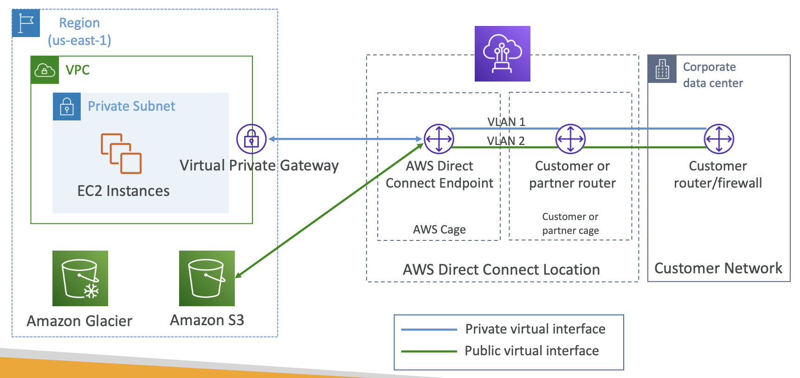

### CIDR
- Classless Inter-Domain Routing (클래스 없는 도메인 간 라우팅)
- IP 주소를 효율적으로 나누고 관리하는 방법
- IP 주소 범위를 나타내는 표기법으로 IP 개수를 정하는 역할을 함   
#### CIDR 블록 표기법
- A.B.C.D/숫자
- '/숫자'는 네트워크 부분의 비트 개수를 의미
- 남은 비트는 호스트(사용 가능한 IP) 개수를 결정    

⚠️ AWS에서는 예약된 5개의 IP 주소가 있기 때문에 **실제 사용 가능한 IP는 "총 IP 개수 - 5"**   
> CIDR 블록을 **"서브넷 마스크"**로 생각하면 쉬움
> CIDR의 "/숫자" 부분은 네트워크와 호스트를 구분하는 비트 개수를 의미
> > e.g. /24는 앞 24비트가 네트워크 주소, 나머지 8비트가 호스트 주소
> > 즉, 남은 8비트로 2^8 = 256개의 IP를 만들 수 잇음
> > > **Network**: IP 주소를 묶는 그룹 (ex. 10.0.0.0/24 -> 10.0.0까지 같은 네트워크), 같은 그룹으로 묶이는 IP 대역   
> > > **Host**: 각 네트워크 안에서 개별적으로 사용되는 장치(서버, PC, 라우터)의 IP    
> 
> 💡 네트워크 비트가 크면 호스트 개수가 줄어들고, 호스트 비트가 크면 하나의 네트워크에서 사용할 수 있는 IP 개수가 많아짐   
> 💡 네트워크가 크면 더 많은 작은 서브넷을 만들 수 있고, 호스트가 크면 한 네트워크 안에서 더 많은 기기를 사용할 수 있음   
<br>

## VPC (Virtual Private Cloud)
- 모든 새로운 AWS 계정에는 default VPC가 있음
- 새로운 EC2 인스턴스는 서브넷을 지정하지 않으면 기본 VPC에 실행됨
- 기본 VPC는 처음부터 인터넷에 연결되어 있어서 인스턴스가 인터넷에 엑세스하고 내부의 EC2 인스턴스는 공용 IPv4 주소를 얻음 -> EC2 인스턴스를 생성하자마자 연결할 수 있는 이유   
<br>

- 단일 AWS 리전에 여러 VPC를 둘 수 있음
- VPC마다 할당된 CIDR는 최대 5개
  - Min.size is /28 (16 IP addresses)
  - Max.size is /16 (65536 IP addresses)
- VPC가 사설 리소스이기 때문에 사설 IPv4만 허용됨 
  - 10.0.0.0 - 10.255.255.255 (10.0.0.0/8)
  - 172.16.0.0 - 172.31.255.255 (172.16.0.0/12)
  - 192.168.0.0 - 192.168.255.255 (192.168.0.0/16)    
⚠️ Your VPC CIDR should NOT overlap with your other networks (e.g. corporate)   

### VPC - Subnet (IPv4)
- VPC 내부에 있는 IPv4 주소의 부분 범위 
- AWS가 각 서브넷마다 IP 주소 5개를 예약 (first 4 & last 1)
- 5 IP 주소는 사용 X, EC2 인스턴스에 할당 X
- e.g. CIDR block 10.0.0.0/24
  - 10.0.0.0 - Network Address (서브넷을 식별)
  - 10.0.0.1 - reserved by AWS for the VPC router (서브넷의 기본 게이트웨이)
  - 10.0.0.2 - reserved by AWS for mapping to Amazon-provided DNS
  - 10.0.0.3 - reserved by AWS for future use
  - 10.0.0.255 - Network Broadcast Address 
    - (AWS는 VPC에서 브로드캐스트를 지원하지 않기에 예약은 되지만 사용하는 건 안됨)   
> 🧐 Exam Tip, if you need 29 IP addresses for EC2 instances:
> - /27 서브넷은 사용할 수 없음 (/27 IP 주소는 32개인데, 32 - 5(예약) = 27 < 29)
> - 따라서 서브넷 사이즈는 /26이어야 함 (64 IP 주소, 64 - 5 = 59 > 29)   
<br>

## Internet Gateway (IGW)
- VPC와 인터넷을 연결하는 역할을 함. 즉, 인터넷과 VPC 간의 트래픽 흐름을 제어
- **public subnet에 있는 EC2 인스턴스와 인터넷 간의 연결을 제공**  
  *(라우팅 테이블을 통해 설정해주어야 EC2 인스턴스가 인터넷과 연결됨)*    
  > ### Route Table
  > - 라우팅 테이블의 각 라우트(항목)은 **목적지(Destination)**와 **대상(Target)**을 지정   
  > - 라우팅 테이블에 여러 개의 라우트가 있을 경우, **트래픽과 가장 구체적으로 일치하는(가장 세부적인) 경로가 선택**되어 해당 트래픽을 어떻게 라우팅할 지 결정
- 인터넷 게이트웨이의 역할
  1. VPC 내에서 public subnet에 있는 EC2 인스턴스가 인터넷에 접근할 수 있도록 해줌
  2. VPC의 public subnet에 있는 EC2 인스턴스가 퍼블릭 IP를 가지면, 인터넷 게이트웨이를 통해 인터넷과 연결됨   
  
- 인터넷 게이트웨이 연결 과정
  1. 인터넷 게이트웨이는 VPC와 연결된다.
  2. public subnet에 있는 EC2 인스턴스는 라우팅 테이블에 인터넷 게이트웨이를 경우하는 경로가 설정되어 있어야 인터넷에 접근할 수 있음. 이를 위해 public subnet의 라우팅 테이블에 인터넷 게이트웨이로 가는 경로를 추가해야 함.   
  *(VPC > Route tables > rtb-0000 > Edit routes: 0.0.0.0/0 igw-0000000)*
  3. EC2 인스턴스가 인터넷과 연결될 수 있도록 public IP를 할당해야 하며, 라우팅 테이블을 통해 인터넷 게이트웨이로 트래픽을 전달할 수 있게 된다. 

- private subnet에 인터넷 연결
  - private subnet은 직접적으로 인터넷과 연결되지 않으며, **NAT 게이트웨이**나 **NAT 인스턴스**를 통해서만 인터넷과 연결된다. 이때, private subnet의 라우팅 테이블은 NAT 게이트웨이로 트래픽을 보내게 설정됨
<br>


## Bastion Hosts
   
- **Bastion Host를 이용해 private EC2 인스턴스에 SSH로 액세스할 수 있음**
- user는 퍼블릭 인터넷에 있고 private subnet에 위치한 ec2 인스턴스에 접근하는 경우에 Bastion host를 사용할 수 있음   
- Bastion host == **public subnet에 있는** EC2 인스턴스
- 특징
  - Bastion host는 반드시 **public subnet**에 있어야 함
  - BastionHost Security Group이라는 자체 보안 그룹이 있음
  - 퍼블릭 서브넷에 있는 bastion host로 프라이빗 서브넷에 있는 EC2 인스턴스에 액세스 할 수 있음   
- 엑세스 방법   
  1. SSH를 Bastion Host에 연결
  2. 해당 Bastion Host가 다시 SSH를 private subnet의 EC2 인스턴스에 연결   

⚠️ **Bastion host를 위해서는 보안 그룹이 반드시 인터넷 액세스를 허용해야 함** (모든 인터넷을 허용하는 것이 아닌 기업의 퍼블릭 CIDR 액세스만 허용하거나 사용자의 인터넷 액세스만 허용하는 등 제한해야 함)   
-> bastion host의 EC2 보안 그룹을 최대한 제한하여 특정 IP만 액세스가 가능하도록 설정할 수 있음   

⚠️ **private subnet의 EC2 인스턴스 보안 그룹에서는 반드시 SSH 액세스를 허용해야 함**   

> Bastion host vs NAT Gateway
> 1. Bastion Host를 사용해서 private EC2에 접근
>   - bastion host는 프라이빗 서브넷에 있는 EC2 인스턴스에 SSH나 RDP로 접속할 수 있게 해주는 보안 중개 서버   
>   - 보안을 강화하기 위한 방법으로, 프라이빗 서브넷의 EC2를 직접 노출시키지 않고도 관리할 수 있게 해줌
>
> 2. NAT 게이트웨이를 사용하여 private EC2가 인터넷에 접근
>   - NAT 게이트웨이는 프라이빗 서브넷에 배치된 EC2 인스턴스가 인터넷과 통신할 수 있도록 도와주는 게이트웨이   
>   - 프라이빗 EC2는 아웃바운드 연결만 허용되고, 인터넷으로부터 인바운드 연결은 불가능   
>
> > 💡 Bastion Host는 SSH/RDP를 통해 EC2 관리를 위한 접근을 제공하고, NAT 게이트웨이는 인터넷 연결을 위한 네트워크 경로를 제공   
<br>

## NAT Instance (outdated)
- NAT = Network Address Translation (네트워크 주소 변환)
  > private ip를 public ip로 변환하는 기술
- Allows EC2 instances in private subnets to connect to the Internet
- 반드시 public subnet에서 실행되어야 함
- Must disable EC2 setting: Source/destination Check
- NAT 인스턴스에는 고정된 Elastic IP가 연결되어 있어야 함   
   
-> 일부의 IP가 재작성되기 때문에 NAT 인스턴스를 위해 Source/destination Check 설정을 비활성화해야 되는 이유   

#### NAT Instance - Comments
- Pre-configured Amazon Linux AMI is available -> 표준 지원 종료
- 가용성이 좋지 않고 초기화 설정으로 복원할 수 없어서 여러 AZ에 ASG를 생성해야 하고 복원되는 사용자 데이터 스크립트가 필요함 -> 복잡
- 보안 그룹을 관리해야 함   
> 시험에는 NAT Instance와 NAT Gateway를 고르는 문제가 나옴
<br>

## NAT Gateway
- AWS의 관리형 NAT 인스턴스이며 높은 대역폭을  가지고 있음
- 사용량 및 NAT Gateway의 대역폭에 따라 청구됨
- 특정 AZ에서 생성되고 탄력적 IP를 사용
- EC2 인스턴스와 같은 서브넷에서 사용할 수 없어서 다른 서브넷에서 액세스할 때만 NAT Gateway가 도움 됨
- 경로: Private subnet > NAT GW > IGW
- 대역폭으느 초당 5GB, 자동으로 초당 45GB까지 확장할 수 있음
- 보안 그룹을 관리할 필요 X   

### NAT Gateway with High Availability
- NAT Gateway는 단일 AZ에서 복원 가능
- Mush create multiple NAT Gateways in multiple AZs for fault-tolerance
- **고가용성으로 구성하고 싶다면 다중 NAT Gateway를 만들어 전체 AZ에 영향을 주는 재난을 방지할 수 있음**
  
- 라우팅 테이블을 통해 AZ를 서로 연결하지 않음 -> 하나에 장애가 생기면 다 멈추니까     
- "고가용성으로 구성하고 싶다면 다중 NAT Gateway를 만들어 전체 AZ에 영향을 주는 재난을 방지할 수 있다"   
  ```
  [AZ A]
  ├── PublicSubnetA
  │   └── NAT Gateway A
  ├── PrivateSubnetA
  │   └── EC2 A (Route → NAT Gateway A)

  [AZ B]
  ├── PublicSubnetB
  │   └── NAT Gateway B
  ├── PrivateSubnetB
  │   └── EC2 B (Route → NAT Gateway B)

  [AZ C]
  ├── PublicSubnetC
  │   └── NAT Gateway C
  ├── PrivateSubnetC
  │   └── EC2 C (Route → NAT Gateway C)

  ```
> ⭐️ https://docs.aws.amazon.com/vpc/latest/userguide/vpc-network-acls.html
> NAT Instance, NAT Gateway 구분
<br>

## Security Groups & NACLs
- Security Group은 Stateful (상태 유지)
- NACL은 stateless (무상태)   
   

### Network Access Control List (NACL)
- NACL은 **서브넷**을 오가는 트래픽을 제어하는 **방화벽**과 비슷
- 서브넷마다 하나의 NACL이 있고, 새로운 서브넷에는 **기본 NACL**이 할당됨
- NACL Rules:
  - Rules have a number (1-32766), higher percedence with a lower number
  - 첫 번째 규칙 비교로 결정됨 (First rule match will drive the decision)
  - 보통 100 단위로 규칙 설정하는 것을 권장
  - 마지막 규칙은 *, 일치하는 규칙이 없으면 모든 요청을 거부
- 새로 만들어진 NACL은 기본적으로 모두를 거부
- **NACL은 서브넷 수준에서 특정한 IP 주소를 차단하는데 적합**   
   

### ⭐️ Default NACL
- **인바운드와 아웃바운드의 모든 요청을 허용하는 특수성을 가짐**
  
    - 모든 것이 나가고 모든 것이 들어옴   
- Do NOT modify the Default NACL, instead create custom NACLs
> 시험에서 기본 NACL이 서브넷과 연결되어 있다고 하면, 모든 것이 드나들도록 허용된다는 뜻

### ⭐️ Ephemeral Ports (임시 포트)
- 클라이언트와 서버가 연결되면 포트를 사용해야 함   
  (For any two endpoints to establish a connection, they must use ports; IP 주소, 포트)
- Clients connect to a **defined port**, and expect a response on an **ephemeral port**
- 클라이언트는 기본적으로 개방된 포트가 없어서 클라이언트가 서버에 연결할 때 자체적으로 특정한 포트를 열게 됨
  - 이 포트는 임시라서 클라이언트와 서버 간 연결이 유지되는 동안만 열려 있음
- 운영체제에 따라 포트 범위가 다름:
  - Windows 10 -> 49152 - 65535
  - Many Linux Kernels -> 32768 - 60999   

### Create NACL rules for each target subnets CIDR
- 다중 NACL 및 서브넷이 있다면 각 NACL 조합이 NACL 내에서 허용되어야 함
- NACL에 서브넷을 추가하면 NACL 규칙도 업데이트해서 연결 조합이 가능한지 확인해야 함   
> 네트워크 문제가 생기면 보안 그룹 뿐만 아니라 NACL의 인바운드, 아웃바운드 규칙을 확인해야 함

### Security Groups vs NACLs
   
<br>


## VPC Peering
- 여러 VPC를 생성하고 AWS 네트워크를 사용하여 함께 연결하고 싶은 상황, 같은 네트워크에 있는 것처럼 작동하게 만들고 싶을 때 사용
- **Must not have overlapping CIDRs** 
  - 라우팅의 충돌과 혼란을 방지하기 위해서 서로 다른 CIDR 대역을 사용하는 VPC끼리만 피어링이 가능함
- VPC peering은 두 VPC 간에 발생할 수 있으며 **전이되지 않음**
  - e.g. A-B, B-C가 피어링 되어도 A-C가 통신하도록 하려면 반드시 VPC 피어링 연결을 해야함
- **VPC가 서로 쌍을 이루고 있더라도 서로 다른 VPC의 EC2 인스턴스가 서로 통신할 수 있도록 각 VPC 서브넷의 모든 라우팅 테이블을 업데이트 해야 함**   
  - 피어링만 한다고 통신이 바로 되는 것이 아님
  - **양쪽 VPC의 라우트 테이블에 서로의 CIDR 범위를 등록해줘야 함**
- You can create VPC Peering connection between VPCs in **different AWS accounts/regions** 💪🏻
- You can reference a security group in a peered VPC (works cross accounts - same region)   
> 언제 사용?
> - 팀별/기능별로 VPC를 나눠서 관리하되, 내부 통신은 가능하게 하고 싶을 때
> - 다른 계정이나 리전의 자원과 직접적인 연결이 필요할 때
> - 마이크로서비스 간 **프라이빗 통신**이 필요할 때
> - NAT Gateway 비용을 줄이고 싶을 때 (VPC Peering은 추가 요금 X; cross-region peering 제외)    
<br>


## VPC Endpoints
- VPC 엔드포인트를 사용하면 퍼블릭 인터넷을 거치지 않고도 인스턴스에 액세스할 수 있음   
  프라이빗 AWS 네트워크만 거쳐서 바로 해당 서비스에 액세스할 수 있음

### VPC Endpoints (AWS PrivateLink)
   
- Option 1
  - 먼저 EC2 인스턴스에서 NAT Gateway를 거쳐 Internet Gateway로 향함
  - 그리고 Amazon SNS에 퍼블릭으로 액세스
  - ➡️ 비용이 드는 방법, 허브가 여러 개 있어 비효율적
- Option 2
  - VPC 엔드포인트를 사용
  - VPC 엔드포인트는 VPC 내에 배포됨
  - 네트워크를 구성해서 프라이빗 서브넷에 있는 EC2 인스턴스를 VPC 엔드포인트를 거쳐 직접 Amazon SNS 서비스에 연결
  - ➡️ 네트워크가 AWS 내에서만 이루어진다는 장점
<br>

- 모든 AWS 서비스는 퍼블릭에 노출되어 있고 퍼블릭 URL을 가짐
- VPC 엔드포인트를 사용하면 AWS PrivateLink를 통해 프라이빗으로 액세스하므로 AWS에 있는 모든 서비스에 액세스할 때 퍼블릭 인터넷을 거치지 않고도 프라이빗 네트워크를 사용할 수 있음
- 중복과 수평 확장 가능
- IGW와 NATGW 없이도 AWS 서비스에 액세스할 수 있게 해주므로 네트워크 인프라를 간단하게 만들 수 있음
- In case of issues:
  - Check DNS setting Resolution in your VPC
  - Check Route Tables

### Types of Endpoints
**📍 <u>Interface Endpoints (powered by PrivateLink)</u>**
- 인터페이스 엔드포인트는 ENI를 프로비저닝하는데 사용   
  ENI는 VPC의 프라이빗 IP 주소이자 AWS의 entry point (ENI가 있으므로 반드시 보안 그룹을 연결해야 함)   
  > ### 🤨 ENI
  > - ENI는 단순한 인터페이스가 아니라, **"EC2의 network identity"**를 담고 있는 객체
  > - ENI의 속성
  >   - Private/Public IP 주소, 서브넷, 보안 그룹, MAC 주소, Elastic IP...
  > - EC2 생성 시 기본 ENI가 자동 생성됨
  > - ENI는 EC2의 네트워크 설정을 모두 포함
  > - ENI 없이 EC2는 네트워크 통신 불가


- 대부분의 AWS 서비스를 지원
- 요금은 시간 단위, 처리되는 데이터 GB 단위로 청구됨   
  

**📍 <u>Gateway Endpoints</u>**
- 게이트웨이를 프로비저닝하는데 이때 게이트웨이는 반드시 라우팅 테이블의 대상이 되어야 함   
    IP 주소, 보안 그룹을 사용하지 않고 라우팅 테이블의 대상이 됨   
  > Provisions a gateway and must be used <u>as a target in a route table (does not use security gorups)</u>
- 타겟은 Amazon S3, DynamoDB 두 가지만 존재
- 무료
- 라우팅 테이블 액세스일 뿐이므로 자동으로 확장됨    
     

> ⭐️ Gateway or Interface Endpoint for **S3**?
> - **Gateway** is most likely going to be preferred in exam    
>   (free for Gateway)
>
> - 게이트웨이보다 인터페이스 엔드포인트가 권장되는 경우는 온프레미스에서 액세스해야 할 필요가 있을 때만   
>   (site to site VPN or Direct Connect)   
>   ex. on-premises에 있는 데이터 센터에 프라이빗으로 액세스해야 하는 경우, 다른 VPC에 연결하는 경우   
>
<br>

> 🤨 프로비저닝이란?
> - 서비스나 사전에 자원을 준비하고 할당하는 일
> - **필요한 리소스를 설정하고 준비하는 과정**   
> - 실제 행동: Create(생성), Attach(할당), Config(설정), Connect(연결)
>
> ex1) EC2 인스턴스를 프로비저닝한다.   
>  -> CPU, 메모리, 디스크, 네트워크 구성 등을 포함한 가상 서버를 생성하고 작동을 준비하는 것   
> 
> ex2) VPC 엔드포인트를 만들면서 ENI가 프로비저닝된다   
>  -> AWS가 내부적으로 ENI를 만들어서 서브넷에 배치하고, 트래픽을 보낼 수 있게 구성까지 자동으로 해줌
   
<br>


## VPC Flow Logs
- VPC Flow Logs를 사용하면 인터페이스로 들어오는 IP 트래픽에서 정보를 포착할 수 있음
  - VPC 수준이나 서브넷 수준 또는 ENI(Elastic Network Interface) 수준에서 포착할 수 있음
- Helps to monitor & trobleshoot connectivity issues
- 흐름 로그를 Amazon S3, CloudWatch Logs, Kinesis Data Firehouse에 전송할 수 있음

### VPC Flow Logs Syntax
   
- srcaddr & dstaddr - 문제 있는 IP를 식별하는데 도움을 줌
- srcport & dstport - 문제 있는 포트를 식별하도록 도와줌
- Action - success or failure of the request due to Security Group/NACL 
- 사용 패턴을 분석하거나 악의적인 행동이나 포트 스캔 등을 탐지할 수 있음   
<br>


## Site-to-Site VPN
> "회사 네트워크(온프레미스)와 AWS VPC 간에 암호화된 통신 터널을 만들어주는 기술"   
> AWS에서 '암호화된 터널(VPN)'을 만들어서 두 네트워크를 마치 하나의 내부망처럼 연결하는 것

- 특정 구조가 있는 기업 데이터 센터를 AWS와 비공개로 연결하려면,
  - 기업은 Customer Gateway를
  - VPC는 VPN Gateway를 갖춰야 함
 - 👍🏻 인터넷 위에서 데이터를 암호화해서 보내기 때문에 보안성이 높음
 - 👍🏻 회사 내부망에서 AWS의 리소스를 쓸 수 있음

- **Virtual Private Gateway (VGW)**
  - VPN 연결에서 AWS 측에 있는 VPN concentrator
  - VGW는 생성되면 VPC에 연결됨
  - Possible to customize the ASN (Autonomous System Number)

- **Customer Gateway (CGW)**
  - 온프레미스(회사 쪽)에서 VPN 연결을 담당하는 장비
  - 소프트웨어 또는 물리적 장치로 VPN 연결에서 데이터 센터 측에 속함

### Site-to-Site VPN Connections
> CGW ↔ VGW 간의 암호화된 통신 터널     
📍 **VPN을 하려면 두 지점이 서로 IP를 알고 있어야 연결이 됨**   


- ⭐️ Customer Gateway Device (On-premises)
  - **Case 1: CGW가 public IP를 직접 가지고 있는 경우:**
    ```
    [CGW: 123.123.123.123] ─── VPN Tunnel ─── [AWS Virtual Private Gateway]

    ✔ 이건 문제없음. 서로 Public IP로 직접 연결하면 끝
    ```
    - 인터넷 라우팅이 가능한 IP 주소가 고객 게이트웨이 장치에 있음
    - 그걸로 VGW와 CGW를 연결   
  
  - **Case 2: CGW가 private IP만 가지고 있고 NAT 뒤에 있는 경우:**
    ```
    [CGW: 192.168.0.10] ─── [NAT Device: 203.0.113.1] ─── Internet ─── [AWS VGW]

    이때 AWS는 '192.168.0.10' 같은 Private IP는 알 수가 없음
    ```
    - <u>"use the public IP of the NAT device"</u>
    - NAT 장비의 public IP를 AWS에 등록해야 VPN 연결이 가능하고, 이때 NAT-T 기능이 활성화되어 있어야 통신이 제대로 이루어짐
    > ### NAT-T (NAT Traversal)
    > - NAT이 있는 환경에서 IPsec VPN 터널을 만들 떄 필수적인 기능
    > - UDP 포트 4500을 사용해서 NAT 환경에서도 IPsec 트래픽을 전달할 수 있도록 해줌
    > > 즉, NAT-T는 VPN 데이터를 일반 UDP 데이터처럼 위장해서 보내는 것 (== IPsec을 UDP로 감싸서 우회)     
    > > NAT 장비는 여전히 IP/포트를 바꾸지만 UDP 4500을 사용하고 NAT-T 프로토콜을 따르니까, VPN 서버가 제대로 복원할 수 있음   
    > > ⭐️ **"VPN이 깨지지 않게 설계된 것이 NAT Traversal"**     

- ⭐️ 서브넷의 VPC에서 **라우트 전파를 활성화해야** site-to-site VPN 연결이 실제로 작동함
  > **Important step:** <u>enable **Route Propagation**</u> for the Virtual Private Gateway in the route table that is associated with your sbunets

- ⭐️ 온프레미스에서 AWS로 EC2 인스턴스의 상태를 진단할 때(ping) EC2 인스턴스의 **보안 그룹 인바운드 ICMP 프로토콜이 활성화**됐는지 확인해야 함

### ⭐️ AWS VPN CloudHub
   
- CloudHub는 여러 VPN 연결을 통해 모든 사이트 간 안전한 소통을 보장
- 비용이 적게 드는 hub&spoke 모델로 VPN만을 활용해 서로 다른 지역 사이 기본 및 보조 네트워크 연결성에 사용 (VPN only)
- VPN 연결이므로 모든 트래픽이 공용 인터넷을 통함 (VPN 연결은 암호화된 상태)   
  (사설 네트워크로는 연결되지 않음)
- set up: 
  1. Customer Gateways 생성 (온프레미스 측)
  2. Virtual Private Gateways 생성 (AWS 측)
  3. Site-to-Site VPN Connections 생성 (온프레미스 - AWS)
  - 동적 라우팅을 활성화하고 라우팅 테이블 구성하면 됨    
<br>


## Direct Connect (DX)
- DX는 원격 네트워크로부터 VPC로의 전용 <u>프라이빗 연결</u>을 제공
- 사용할 때는 전용 연결을 생성해야 하고 AWS Direct Connect location을 사용
- VPC에는 Virtual Private Gateway를 설치해야 온프레미스 데이터센터와 AWS 간 연결이 가능
- 그러면 같은 연결상에서 public resources(S3)와 private(EC2)에 퍼블릭 및 프라이빗 VIF를 사용해 액세스할 수 있음   
  > **Virtual Interface (VIF):**   
  > - 트래픽을 보내주는 가상 인터페이스
  > - Public VIF: 퍼블릭 AWS 서비스(S3, DynamoDB...)에 접근
  > - Private VIF: VPC 내 자원에 접근
- use case:
  - 대역폭 처리량이 증가할 때, 큰 데이터 세트를 처리할 때 속도가 빨라짐 (퍼블릭 인터넷을 거치지 않기 때문에)
  - 프라이빗 연결을 사용하므로 비용도 절약됨
  - 퍼블릭 인터넷 연결에 문제가 발생해도 DX를 사용하면 연결 상태를 유지할 수 있음
  - 실시간 데이터 피드를 사용하는 애플리케이션에 유용
  - Hybrid Environments (on prem + cloud)
- IPv4, IPv6 지원   

### Direct Connect Diagram
   
> ### 🤨 AWS Direct Connect Location   
> ➡️ <u>AWS 네트워크가 연결돼 있는 실제 물리 장소(데이터센터)</u>를 의미
> - AWS에서 Direct Connect(전용선)을 쓰려면 어딘가에서 AWS 네트워크에 물리적으로 연결해야 하는데, 그 물리적인 연결지점이 **DX Location**   
> - (AWS가 전용 네트워크 장비를 갖다 놓고 있고 우리가 전용선을 깔아서 그 위치까지 연결해야 AWS와 통신이 가능함)
>
> - DX location 구성 요소:
>   - **AWS Direct Connect Endpoint**
>     - AWS 쪽 엔드포인트
>   - **Customer Router or Partner Router**
>     - 고객이 직접 장비를 놓을 수도 있고 AWS 파트너가 대신 관리하는 DX 파트너 장비일 수도 있음
>     - 이 장비가 AWS DX 엔드포인트와 연결돼서 트래픽을 넘겨줌

- 연결 흐름 정리
  1. **온프레미스 라우터/방화벽**에서 AWS로 트래픽을 보냄 (ex. EC2, RDS 접속)
  2. Direct Connect Location에 있는 **Partner Router/Endpoint**로 연결됨
  3. **AWS Direct Connect Endpoint**로 연결됨
       - 여기서부터는 AWS 내부 네트워크로 진입
       - 내가 Private VIF를 구성해 이 엔드포인트와 VPC 내부를 연결
  4. Private VIF는 AWS 내부에서 **VGW**로 연결
       - 최종적으로 VPC 안 EC2, RDS 등의 프라이빗 리소스로 연결
  
- 위의 모든 과정이 비공개로 처리되니까 수동으로 연결해야 하므로 <u>설치만 한 달이 걸릴 수 있음</u>   

- 만약 Amazon Glacier or Amazon S3와 같은 퍼블릭 리소스에 접근하려면 public VIF를 설치해야 함
  - 같은 경로로 지나가지만 private VIF로 연결되지 않고 AWS로 직접 연결   

### Direct Connect Gateway
- **만약 다른 리전에 있는 하나 이상의 VPC와 연결하고 싶다면 Direct Connect Gateway를 사용해야 함**   
   
-> 온프레미스 데이터 센터를 양쪽 VPC에 연결하고 싶은 상황   
1. Direct Connect Connection을 생성
2. private VIF를 사용해 Direct Connect Gateway(DXGW)에 연결
3. DXGW는 private VIF를 통해 Virtual Private Gateway에 연결되어 있고 첫 번째, 두 번째 리전 모두 동일한 구성으로 되어 있음
- 설정을 통해 여러 VPC와 여러 리전을 연결할 수 있음

### DX - Connection Types
- Dedicated Connections(전용 연결): 초당 1Gbp, 10Gbp, 10Gbp capacity
  - 고객은 물리적 전용 이더넷 포트를 할당받음
  - 먼저 AWS에 요청을 보내면 AWS Direct Connect 파트너가 처리를 완료
- Hosted Connections(호스팅 연결): 초당 50Mbp, 500Mbp, 10Gbp
  - AWS Direct Connect 파트너를 통해 연결을 요청  
  - 필요하면 언제든지 **용량을 추가하거나 제거**하면 되므로 **Dedicated Connections 보다는 유연**
  - 선택한 로케이션에서 초당 1, 2, 5, 10Gbp 이용 가능
- 두 연결 모두 새 연결을 만들려면 lead time이 한 달보다 길어질 수도 있음   
  > 📝 예를 들어 일주일 안에 빠르게 데이터를 전송하고 싶다면 DX는 올바른 선택지가 아님   
  > -> 설치에만 한 달 이상이 소요되기 때문   
  > ⭐️ 시험에서는 DX가 이미 설치되었는지 확인하고,   
  > ⭐️ 데이터 전송 기간이 한 달보다 긴지 짧은지 확인해야 함


### DX - Encryption
- DX에는 암호화 기능이 없어서 데이터가 암호화되지 않지만 <u>프라이빗 연결이므로 보안을 유지할 수 있음</u>
- 암호화를 원한다면, Direct Conect + VPN을 설치해서 IPsec으로 암호화된 프라이빗 연결이 가능함
- 구현 복잡   
   
-> 기업 데이터 센터와 AWS 간 모든 트래픽을 암호화   

### ⭐️ DX - Resiliency (복원력)
> 핵심 워크로드의 복원력을 높이기 위해서는 여러 DX를 설치하는 것이 좋음    

    
- 하나의 연결을 여러 로케이션에 수립한 것이므로 DX 하나가 망가져도 다른 하나가 예비로 남아 있기 때문에 복원력이 강해짐   
<br>   

   
- **Maximum Resiliency**
- 각 DX 로케이션에 독립적인 연결을 두 개씩 수립
- 4개의 연결을 수립해서 AWS에 연결한 모습
- 복원력 최대   
<br>   

## ⭐️ Site-to-Site VPN connection as a backup
   
- 회사의 데이터센터가 Direct Connect를 통해 VPC에 연결한다고 가정
  - 비용이 많이 들고 DX 연결에 문제가 발생할 수도 있음
- backup
  - 또 다른 DX를 보조 연결 -> 비용이 많이 듦
  - <u>**Site-to-Site VPN을 백업 연결로 설정**</u>해서 기본 연결에 문제가 발생했을 때 이걸 사용하면 Site-to-Site VPN을 통해 public 인터넷에 연결할 수 있으므로 안정성이 높아짐   
<br>


## Transit Gateway (환승 게이트웨이)   
   
- transitive(전이적) 피어링 연결이 VPC 수천 개와 온프레미스 데이터센터, Site-to-Site VPN, Direct Connect, hub-and-spoke 간 스타형 연결 사이에 생기는 것   
- Tansit Gateway를 통해 VPC 여러 개를 연결할 수 있음
- 여기서 VPC를 모두 피어링할 필요 X, tansit GW를 통해 전이적으로 연결됨
- Regional resource이며 리전 간 작동
- Transit Gateway를 계정 간에 공유하려면 Resource Access Manager(RAM) 사용
- 리전 간 Transit Gateway를 피어링할 수 있음
- Transit Gateway에 **Route Table**을 생성해서 어느 VPC가 누구와 통신할지, 어떤 연결이 액세스할지 제한함
- <u>**AWS에서 유일하게 IP 멀티캐스트를 지원하는 서비스**</u>
  > 📝 시험에 IP 멀티캐스트가 나오면 Transit Gateway를 사용해야 함


### Transit Gateway: Site-to-Site VPN ECMP
- Site-to-Site VPN 연결 대역폭을 ECMP를 사용해 늘리는 경우   
> ### 🤨 ECMP = Equal-cost multi-path
> - 등가 다중 경로 라우팅
> - 여러 최적 경로를 통해 패킷을 전달하는 라우팅 전략    
> 
> - Use Case: Site-to-Site VPN 연결을 많이 생성해서 AWS로의 연결 대역폭을 늘릴 때 사용    

- <u>기업 데이터 센터를 직접 VPC에 연결한 경우에는 사용할 수 없는 기능</u>

### ⭐️ Transit Gateway: throughput with ECMP
- **virtual private gateway에 VPN 연결**
  - VPC마다 터널 하나, 즉 연결이 하나씩 생성
  - 연결 하나 당 1.25Gbps 제공
  - 이때, VPN 연결은 터널 두 개로 구성됨
- <u>**Transit Gateway로 VPN 연결**</u>
  - Site-to-Site VPN 하나가 여러 VPC에 생성   
    ( 동일한 Transit Gateway에 모두 전이적으로 연결되기 때문 )
  - Site-to-Site VPN 연결 하나는 ECMP 덕에 최대 처리량이 2.5Gbps가 됨   
    ( 2 터널이 사용되므로 )
  - Transit Gateway에 Site-to-Site VPN 연결을 더 추가할 수 있음
    - **두 세개 추가해도 ECMP를 사용하면 처리량이 두 배, 세 배가 됨**
  - 데이터가 Transit Gateway를 통과할 때 1GB마다 요금이 청구됨 (성능 최적화 비용)   

### Tansit Gateway - Share Direct Connect between multiple accounts
- DX 연결을 여러 계정에서 공유할 때도 transit gateway 사용   
<br>


## Egress-only Internet Gateway (송신 전용 인터넷 게이트웨이)
- <u>**Used for IPv6 only**</u>
- (similar to a NAT Gateway but for IPv6)    
<br>


## AWS Networing Costs

### Networking Costs in AWS per GB - Simplified
- Use **Private IP** instead of Public IP for <u>good savings and better network performance</u>
- Use same AZ for mazimum savings 
  - 같은 AZ에 있으면 high availability할 수 없음 (할 수 있는 장애 조치가 없는 거)
  > 📝 RDS가 있는데 읽기 전용 래플리카를 생성하고 여기서 분석을 진행하고 싶은 상황.   
  > 어떻게 하면 읽기 전용 래플리키를 가장 저렴하게 생성할까?   
  > > ➡️ <u>읽기 전용 래플리카를 같은 AZ에 생성</u>한다면 네트워크 측면에서 볼 때 한 db에서 다른 db로 복제하는 데는 비용이 들지 않음.    
  > > ➡️ 하지만 읽기 전용 래플리카를 다른 AZ에 생성한다면 GB당 1센트를 지불해야 함 (두 db 간 데이터를 수송하는 비용)

### Minimizing egress traffic network cost
- Egress traffic (송신 트래픽)
  - outbound traffic (from AWS to outside)
- Ingress traffic (수신 트래픽)
  - inbound traffic (form outside to AWS); typically free
  - 외부에서 AWS로 데이터를 보내는 건 대부분 무료   

- ✅ 인터넷 트래픽을 최대한 AWS 내부에 두고 비용을 최소화해야 됨
- ✅ Direct Connect를 사용할 경우 Direct Connect Location을 동일한 AWS 리전으로 설정해 비용을 아낄 수 있음

### S3 Data Transfer Pricing
- ⭐️ S3 버킷에 요청이 들어오면 비용을 부담해야 하는데 Amazon CloudFront로 들어오면 7배나 저렴함
- 추가로 CloudFront를 사용하면 캐싱 기능을 제공하여 지연 시간을 줄일 수 있음   

### Pricing: NAT Gateway vs Gateway VPC Endpoint
- ⭐️ NAT Gateway보다 VPC Endpoint를 쓰는게 훨씬 저렴함   
<br>   


## Network Protection on AWS
- To protect network on AWS
  - Network Access Control Lists (NACLs)
  - Amazon VPC security groups
  - AWS WAF (HTTP를 통하여 특정 서비스에 유입되는 악성 요청을 막는 방화벽)
  - AWS Shield & AWS Shield Advanced (DDoS 막는)
  - AWS Firewall Manager (to manage them across accounts)
- 전체 VPC를 보호할 수 있는 sophsiticated way: **AWS Network Firewall**

### AWS Network Firewall

- 전체 VPC를 방화벽으로 보호하는 서비스
- 계층 3에서 계층 7까지 보호
- 모든 방향에서 들어오는 모든 트래픽을 검사
  - VPC 간 트래픽
  - Outbound to internet
  - Inbount to internet
  - Direct Connect & Site-to-Site VPN 연결
- 내부적으로 Network Firewall은 AWS Gateway Load Balancer를 사용
- 타사가 아닌 AWS에서 자체 어플라이언스를 통해 트래픽을 관리하므로 자체 규칙을 갖고 있음    
> - Network Firewall은 VPC 수준에서 설정할 수 있다
> - 트래픽 필터링과 플로우 검사를 지원한다
<br>   

<br><br>

## 🙋🏻‍♀️ 예상문제
𝙌. 한 웹 애플리케이션이 오토 스케일링 그룹으로 관리하는 EC2 인스턴스 세트에 호스팅되어 있습니다. 애플리케이션은 애플리케이션 로드 밸런서(ALB)를 통해 배포되고 있습니다. EC2 인스턴스와 ALB는 모두 CIDR이 192.168.0.0/18인 VPC에 배포됩니다. ALB만 80번 포트에서 액세스할 수 있도록 EC2 인스턴스의 보안 그룹을 구성하려면 어떻게 해야 합니까?

𝘼. **소스를 ALB 보안 그룹으로 지정하고 80 포트에 대한 인바운드 규칙을 추가한다.**
> 이것이 ALB에게만 EC2 인스턴스 접속을 허용하는 가장 안전한 방법입니다.    
> 규칙에서 보안 그룹이 참조하는 것은 아주 강력한 규칙이며 이를 활용한 시험 문제가 다수 출제됩니다. 따라서 이와 관련된 개념을 완벽히 숙지하시기 바랍니다.
<br> 

<br><br>

𝙌. IPv4를 가진 사설 서브넷에 있는 EC2 인스턴스에 인터넷 액세스를 제공하려 합니다. 이 솔루션을 사용하면 필요한 관리의 양은 최소가 되어야 하며, 원활하게 스케일링이 되어야 합니다. 무엇을 사용해야 할까요?   

𝘼. NAT Gateway    
<br><br>

𝙌. 기업 데이터 센터와 AWS 계정 내 VPC A 사이에 Direct Connect 연결을 설정했습니다. 기업의 데이터센터가 다른 AWS 리전에 있는 VPC B로도 액세스할 수 있어야 합니다. 어떻게 해야 할까요?   

𝘼. Direct Connect Gateway 사용하기   
> 이는 Direct Connect Gateway의 주요 사용 사례입니다.
<br>   

<br><br>

𝙌. 기업의 온프레미스 데이터 센터와 AWS Cloud 내 VPC 사이에서 AWS 사이트 대 사이트 VPN 연결을 설정할 경우, 이 연결을 구성하는 데에 있어서 가장 중요한 두 구성 요소가 되는 것은 무엇인가요?   

𝘼. 가상 프라이빗 게이트웨이와 고객 게이트웨이   
<br><br>

𝙌. 한 웹 애플리케이션의 백엔드는 퍼블릭 서브넷의 애플리케이션 로드 밸런서 뒤에 있는 프라이빗 서브넷의 EC2 인스턴스에서 호스팅되고 있습니다. 백엔드 EC2 인스턴스를 인터넷에 노출하지 않고 일부 개발자에게 백엔드 EC2 인스턴스에 대한 액세스 권한을 부여해야 합니다. 퍼블릭 서브넷에 배스천 호스트(Bastion Host) EC2 인스턴스를 생성하고 백엔드 EC2 인스턴스 보안 그룹이 배스천 호스트로부터 트래픽을 받을 수 있도록 설정했습니다. 다음 중 배스천 호스트 보안 그룹의 보안 설정으로 가장 적절한 것은 무엇입니까?   

𝘼. 회사의 퍼블릭 CIDR에서 22번 포트로 들어오는 트래픽만 허용한다.   
> 사용 가능한 방법이지만, 스케일링이 잘 이루어지지 않으며 VPC 피어링 연결 때문에 광역 네트워크가 노출될 겁니다.
<br>   

<br><br>

𝙌. 여러분의 기업은 미국 전역에 몇 개의 온프레미스 사이트를 갖고 있습니다. 이 사이트들은 현재 프라이빗 연결을 사용해 연결되어 있으나, 최근에는 프라이빗 연결 제공자가 상당히 불안정해져 IT 아키텍처의 일부가 오프라인 상태가 되었습니다. 여러분은 온프레미스 사이트들을 연결하기 위해 공용 인터넷을 사용하는 백업 연결을 생성하여, 제공 업체에 문제가 발생한 경우 장애 조치로 사용을 하려 합니다. 어떤 방법을 추천할 수 있을까요?   

𝘼. AWS VPN 클라우드허브   
> AWS VPN CloudHub는 AWS VPN을 통한 다수 사이트 간의 안전한 통신을 가능하게 해줍니다.    
> 이는 VPC와 함께, 또는 VPC 없이 사용할 수 있는 단순한 허브 및 스포크 모델로 운용됩니다.
<br>   

<br><br>

𝙌. 기업 네트워크의 크기는 10.0.0.0/8이고, 위성 사무실의 크기가 192.168.0.0/16입니다. 추후 두 네트워크를 연결할 계획이라면, AWS VPC에 적합한 CIDR은 다음 중 무엇인가요?   

𝘼. 172.16.0.0/16   
> CIDR이 겹쳐서는 안 되며, AWS 내 최대 CIDR의 크기는 /16
<br>

<br><br>

𝙌. VPC의 IP 트래픽에 대한 정보는 어떻게 포착할 수 있을까요?   

𝘼. **VPC Flow 로그 활성화**  
> VPC Flow Logs는 VPC 기능으로, VPC에서 네트워크 인터페이스로 드나드는 IP 트래픽에 대한 정보를 포착할 수 있게 해줍니다.   
> - VPC 트래픽 미러링 활성화 X
> - CloudWatch 트래픽 로그 활성화 X