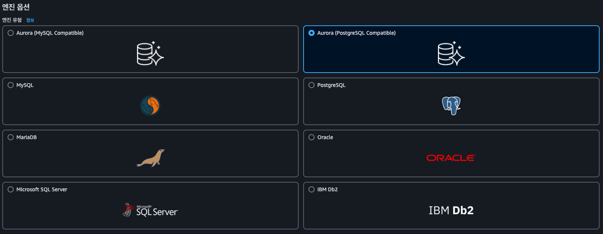

# 데이터베이스 서비스 - 1

# 관계형 데이터베이스

- **테이블 구조**: 행(Row, 튜플), 열(Column, 속성)으로 구성됨
- **칼럼**: 이름과 데이터 타입을 사전에 정의해야 하며, 순서는 고정
- **레코드**: 각 행은 하나의 데이터 단위 (예: 한 직원 정보)
- **데이터 무결성**: 칼럼 타입에 맞는 값만 저장 가능 (예: 숫자 칼럼에 문자는 안 됨)
- **유연한 조회**: 조건에 따라 쉽게 쿼리 가능 (예: 이름이 Charlotte인 직원의 생일)
- **구조 확장성**: 칼럼은 나중에 추가 가능, 삭제 시 데이터도 함께 삭제됨

⇒ **관계형 DB는 구조적이고, 일관된 데이터 저장과 유연한 쿼리에 매우 적합한 시스템입니다.**

### **여러 개의 테이블 활용**

- 하나의 테이블에 모든 데이터 저장 시 **중복** 발생 → 비효율적
- 테이블을 분리하고 기본 키와 외래 키로 연결
- 데이터 정합성 유지 및 저장 최적화

### OLTP, OLAP

| **항목** | **OLTP (Online Transaction Processing)** | **OLAP (Online Analytical Processing)** |
| --- | --- | --- |
| 목적 | 실시간 트랜잭션 | 분석, 집계 |
| 예시 | 주문, 입출금 | 판매 분석, 리포트 |
| 쿼리 | 짧고 자주 발생 | 복잡하고 무거움 |
| 구조 | 정규화 | 비정규화, 다차원 |
| AWS 서비스 | RDS, Aurora | Redshift, Athena |

OLTP

- 데이터의 빈번한 읽기 및 쓰기 작업이 요구될 때 적합

OLAP

- 대규모 데이터에 대한 복잡한 쿼리 작업에 적합 → 높은 수준의 compute, storage 성능 요구
- OLAP 데이터베이스는 이렇게 흩어진 테이블을 하나의 테이블에 집약해 빈번하지는 않지만 정기적으로 데이터에 접근함

# RDS

: 클라우드 기반 관리형 데이터베이스 서비스

**RDS 인스턴스 배포**

- **RDS는 격리된 VPC 내에 생성되는 AWS 관리형 DB 서비스**
- 사용자가 직접 EC2처럼 설치하지 않아도 되고, **AWS가 자동으로 구성과 관리**
- **SSH 접속 불가**, 보안상 **직접 접근은 차단됨**
- EC2에서 접근하려면 **VPC 보안 그룹 설정을 통해 연결 허용**해야 함
- 최대 40개의 Amazon RDS DB 인스턴스를 보유 가능

### 장점

1. **완전관리형 DB 서비스**
    - AWS가 **백업, 복구, 패치, 모니터링 등 모든 관리 업무를 대신 수행**
    - 사용자는 DB 설치나 운영 걱정 없이 **앱 개발에만 집중**
2. **다양한 DB 엔진 지원**
    - MySQL, PostgreSQL, Oracle, SQL Server 등 **익숙한 상용/오픈소스 엔진 사용 가능**
3. **자동 백업 및 복원**
    - **백업 자동화**, 복구도 클릭 몇 번으로 간편
    - 스냅샷(수동 백업)도 가능
4. **고가용성 지원 (Multi-AZ)**
    - 장애 발생 시 **자동 장애조치(Failover)**
    - 읽기 전용 복제본(Read Replica)으로 읽기 부하 분산도 가능
5. **보안 강화**
    - IAM으로 **사용자 접근 제어**
    - VPC 안에서 DB 운영 가능 → **네트워크 차원 보안 강화**
    - SSL 암호화, 암호화 저장도 설정 가능

> 💡즉, Amazon RDS는 설치부터 백업·보안·복구까지 모두 AWS가 관리해주는 안정적이고 편리한 데이터베이스 서비스

## **DB 엔진**

: 데이터베이스에 데이터를 저장, 조직화, 인출하는 소프트웨어

→ 각 데이터베이스 인스턴스는 오직 하나의 데이터베이스 엔진만 실행

- MySQL
- MariaDB
- Oracle
- PostgreSQL
- Amazon Aurora : Amazon이 제공하는 MySQL 및 PostgreSQL의 대체품
    - MySQL : InnoDB 스토리지 엔진만 지원
        - Aurora Backtrack을 이용하면 불과 수 초 내에 지난 72시간 중 어떤 시점으로도 데이터베이스를 복구 가능

### 라이선스 계약

1. **오픈소스 엔진 (무료)**
- **MySQL, PostgreSQL, MariaDB**
    
    → **라이선스 비용 없음**, 자유롭게 사용 가능
    
    → 단, 일부 상용 기능이나 지원은 유료일 수 있음
    
1. **상용 엔진 (유료)**
- **Oracle, SQL Server**
    
    → 사용 시 **라이선스 비용 발생**
    
    → AWS에서는 아래 2가지 방식 중 선택
    
    - **License Included** → AWS 요금에 **라이선스 비용 포함됨** (비쌈)
    - **BYOL** → 기존 Oracle 라이선스를 **직접 가져와 사용**

## 데이터베이스 인스턴스 클래스의 종류

:RDS의 성능 사양을 고르는 것

1. 스탠다드 클래스 (m 클래스 포함)
    
    균형있게 설계되어 CPU, 메모리, 그리고 디스크 I/O를 제공. 이들은 일반적인 워크로드에 적합하며, 광범위한 데이터베이스 작업을 수행할 수 있음
    
    - 워크로드 = 시스템이 맡은 작업의 종류와 성격
    - 평균적인 성능이 고르게 잘 갖춰진 중간형 컴퓨터
2. 메모리 최적화 클래스 (Z, X, R 클래스)
    
    높은 수준의 성능을 요구하는 데이터베이스에 적합하며, 메모리에 훨씬 많은 데이터를 저장할 수 있도록 충분한 메모리를 제공해 쿼리 속도를 높임
    
    - 높은 메모리와 높은 I/O 성능을 제공
3. 버스터블 클래스(t 클래스)
    
    일시적으로 높은 성능을 제공할 수 있는 CPU 크레딧을 가지고 있으며, 저렴한 비용으로 소규모 워크로드를 처리하는 데 이상적
    
    - 소규모 및 개발/테스트 워크로드에 적합

## 스토리지

 
 :RDS 인스턴스가 데이터를 저장하는 **디스크 유형**

- **운영용** : io1
- **학습/개발용** : gp2/gp3(권장)
- 마그네틱은 사라지는 중이라 웬만하면 안 씀

### 🌟 IOPS 🌟
:1초에 스토리지가 처리할 수 있는 IO **작업 횟수**

IOPS = 1 / (평균 접근 시간 + 데이터 전송 시간)

- AWS는 스토리지 성능을 IOPS로 측정
- 수치가 높을수록 DB 성능도 높아짐
- **RDS는 스토리지 타입에 따라 IOPS가 결정**
- **DB 엔진마다 페이지 크기(page size)가 다름**
    - 페이지 크기만큼의 데이터를 기록하거나 가져오면 하나의 IO작업으로 간주
    - 페이지 크기가 클수록 하나의 I/O 작업에서 전송할 수 있는 데이터의 양이 많음
        
        ⇒ **페이지 크기 ↑ → IOPS 소비 ↓**
        
- DB 성능 = **스토리지 IOPS + 페이지 크기** 조합에 따라 결정되며,
    
    **DB가 얼마나 많은 데이터를 얼마나 빠르게 읽고 쓰느냐**를 이해하려면 IOPS 개념이 매우 중요

### 스토리지 유형

| **스토리지 타입** | **설명** | **추천 용도** |
| --- | --- | --- |
| **프로비저닝된 IOPS SSD (io1/io2)** | 빠르고 일정한 속도, I/O 집중 작업에 최적 | **운영 환경(프로덕션)**, 고속 DB |
| **범용 SSD (gp2/gp3)** | 저렴하고 무난한 성능 | **개발·테스트**, 중간 규모 DB |
| **마그네틱 (HDD)** | 구형, 느림, 거의 사용 안 함 | 과거 시스템 호환용(권장 안 함) |

### 범용 SSD 스토리지

- **기본 IOPS**: 볼륨 GB당 3 IOPS 제공
    - 1GB 용량을 할당하면, 초당 3건의 I/O를 수행할 수 있는 성능이 주어진다
- **최대 IOPS**: 최대 16,000 IOPS
- **최대 용량**: 64TB
- **최소 볼륨**: 20GB (→ 최소 60 IOPS 제공)
    - 볼륨 크기가 커질수록 성능이 좋음
- **처리속도(Throughput)** : IOPS**(작업 수)** * 페이지 크기(작업 량) = 작업 속도
- **IOPS 가속(버스트) 기능 :** 평소엔 적은 IOPS를 쓰다가, **잠깐 동안 높은 IOPS가 필요할 때**→**크레딧 최대 3,000 IOPS까지 순간적으로 사용 가능**
- **IOPS 크레딧**
    - **IOPS 크레딧 = 초과 성능을 쓰기 위한 점수**
    - 처음 생성 시: **5,400,000 크레딧 보유**
    - 사용 중: **초당 기본 IOPS만큼 충전됨**

| **항목** | **gp2** | **gp3** |
| --- | --- | --- |
| **기본 IOPS** | GB당 3 IOPS (최대 16,000 IOPS) | 기본 3,000 IOPS (최대 16,000 IOPS) |
| **IOPS/스루풋 조절** | 스토리지 크기에 따라 자동 조절 | **IOPS와 스루풋을 독립적으로 설정 가능** |
| **비용 효율성** | 상대적으로 낮음 | **더 저렴하고 성능 대비 효율적** |

### 프로비전 IOPS SSD(io1) 스토리지

- 원하는 수준의 IOPS를 직접 할당 가능
    - 성능 가속 개념이 없고, 할당한 IOPS만큼의 비용만 지불
    
    ⇒ 일관된 높은 수준의 성능이 필요한 경우 매우 유용한 옵션임
    
- 스탠다드 또는 메모리 최적화 인스턴스 클래스를 사용하는 경우, RDS는 연간 99.9%의 기간동안 프로비전 IOPS의 10%에 해당하는 성능을 보장
- 볼륨 당 64000 IOPS까지 프로비전 가능, 최대 IOPS 수준 및 할당 가능한 스토리지의 양은 DB엔진에 따라 다름
    - 우리가 흔히 쓰는 MySQL, PostgreSql는 4GB ~ 16TB까지 스토리지 선택 가능, 64000 IOPS 할당이 가능하며, GB당 IOPS 비율은 최소 50:1
        
        ⇒ 32000 IOPS의 성능이 필요할 경우 최소 640GB의 스토리지 프로비전해야 함
        

| **항목** | **io1** | **io2** |
| --- | --- | --- |
| **최대 IOPS** | 64,000 IOPS | **256,000 IOPS (Nitro 기반 인스턴스 기준)** |
| **최대 처리량** | 1,000 MiB/s (Nitro 기반 인스턴스 기준) | **4,000 MiB/s** |
| **IOPS/GB 비율** | 최대 50:1 | **최대 500:1 → 같은 용량에 더 높은 IOPS 가능** |
| **지연시간** | <1ms (마이크로초 수준) | **더 낮은 지연시간, 일관된 성능 제공** |
| **내구성** | 99.8% | **99.999% (20배 더 높은 내구성)** |
| **비용** | 높음 | **io1 대비 동등하거나 낮음** |

## **읽기 전용 복제본**

데이터베이스 인스턴스가 요구 성능 수준에 미치지 못한 경우, 수직적 확장(scale up) 또는 수평적 확장(scale out) 옵션으로 성능 수준을 높일 수 있다

### 수직적 확장

데이터베이스 성능 문제 시, 애플리케이션은 그대로 두고 인스턴스의 **CPU, 메모리, 네트워크, 디스크 성능**만 높이는 방식이다

### 수평적 확장

데이터베이스 인스턴스(읽기 전용 복제본)를 추가하는 방법

- 읽기 전용 복제본은 쓰기 작업은 못하고 읽기 쿼리만 처리하는 DB 인스턴스
- 읽기 부하를 분산시켜 성능을 높임
    - 마스터 데이터베이스가 쓰기에만 집중할 수 있도록 도와줌
- 대부분의 DB 엔진이 지원하며, Aurora는 최대 15개, 그 외 RDS는 최대 5개 생성 가능
- 마스터 DB와 비동기 복제되므로 약간의 지연이 생길 수 있음
- 복제본은 재해 복구용으론 부적합 (데이터 유실 가능성)
- RDS는 read-only 엔드포인트하는 도메인 네임을 제공해 접속할 수 있게 함
- 읽기 복제본은 리포트, 분석, 조회에 적합
- 마스터 장애 시, 복제본을 승격(Promotion)해 마스터로 전환 가능
    - 마스터와 복제본은 다른 AZ에 있어도 상관없음

## **고가용성 구현 (멀티 AZ)**

- **멀티 AZ 배포**는 장애 발생 시 빠른 복구를 위한 고가용성 구성
- **프라이머리 인스턴스**는 읽기/쓰기 담당, **스탠바이 인스턴스**는 대기 상태
    - 프라이머리 중단 시, **2분 이내 자동 장애 조치(Failover)** 수행

>💡데이터베이스 인스턴스가 중단되는 상황
>1. AZ 가동 중단
>2. DB 인스턴스 타입 변경
>3. DB 인스턴스의 OS 패치 작업

- **모든 인스턴스는 동일 리전** 내에 있어야 함
- RDS가 **동기 복제**로 스탠바이 인스턴스에 데이터 실시간 반영
- 스탠바이는 **읽기 처리 불가** (읽기 복제본과 다름)
- 장애 발생 시, DNS가 자동으로 스탠바이 인스턴스로 전환됨
- **EBS 최적화 인스턴스 + 프로비전 IOPS SSD** 권장
- MySQL/MariaDB만 **리전 간 멀티 AZ** 지원, 나머지는 동일 리전 내 구성만 가능

### **Aurora 멀티 AZ 구성**

- **싱글 마스터**
    - 클러스터 = 프라이머리 인스턴스 + Aurora 레플리카 구성
        - 프라이머리 인스턴스를 가리키는 클러스터 엔드포인트 제공
    - 클러스터 볼륨 공유(자동 확장, 최대 64TB)
    - 장애 시 레플리카 승격 (2분 내 처리)
        - 래플리카가 없는 경우 새 프라이머리 인스턴스를 만듦
- **멀티 마스터**
    - 클러스터 = 모든 인스턴스가 쓰기 가능
    - 장애 시 페일오버 없이 지속 가용성 유지
        - 장애 발생 시 모든 DB 인스턴스가 공유 클러스터 볼륨에 데이터 기록

### **백업 & 복원**

RDS를 사용하면 데이터베이스 인스턴스의 EBS 볼륨 스냅샷을 기록할 수 있음

- **스냅샷**
    - EBS + S3 기반, 여러 AZ에 중복 저장
    - 멀티 AZ 아닌 경우, 스냅샷 시 I/O 일시 중단 → 피크 타임을 피해서 기록하는게 좋음
    - 스냅샷으로 복구하는 경우, RDS는 새 인스턴스를 만들어 데이터를 복구함
- **RTO/RPO 개념**
    - RTO: 복구 최대 허용 시간
    - RPO: 데이터 손실 최대 허용 시간
    
    ⇒ 두 옵션 중 뭐가 더 적절할 지 선택해야 함
    
- **자동 스냅샷**
    - 매일 30분 백업 윈도우 동안 생성
        - 백업 윈도우 : 언제 RDS가 자동 백업을 할지 정하는 30분 타임슬롯
    - 시점 복구 지원 (최대 5분 데이터 손실 허용) → 최대 5분마다 DB 변경 로그를 기록
    - 기본 보관 기간 7일 (1~35일 설정 가능)
- **수동 스냅샷**
    - 직접 삭제하기 전까지 유지

### **유지보수 (Maintenance)**

- AWS가 엔진 업그레이드, 보안 패치 등 관리
- 유지보수 윈도우 직접 지정 가능
- 일부 업그레이드는 수동 조치 필요

### **Amazon RDS Proxy**
:애플리케이션과 RDS 인스턴스 사이에 위치하는 중간 계층(프록시) 서비스

- RDS Proxy가 없으면?
    - 애플리케이션이 직접 DB에 연결해야 하는데, 연결 해제 반복으로 인한 오버헤드 발생
    - DB 재시작/장애 시 기존 연결을 끊기고, 애플리케이션이 새로 연결해야 함
    - 트래픽이 몰리면 DB 리소스가 너무 많이 소모됨
- **DB 연결 관리 프록시**
    - 연결 풀링 및 재활용
    - 장애 시 자동 재연결
    - 애플리케이션의 DB 직접 연결 부담 감소
    - **보안 연결 지원**
        - IAM 기반 인증
        - Secrets Manager 활용으로 보안 강화
