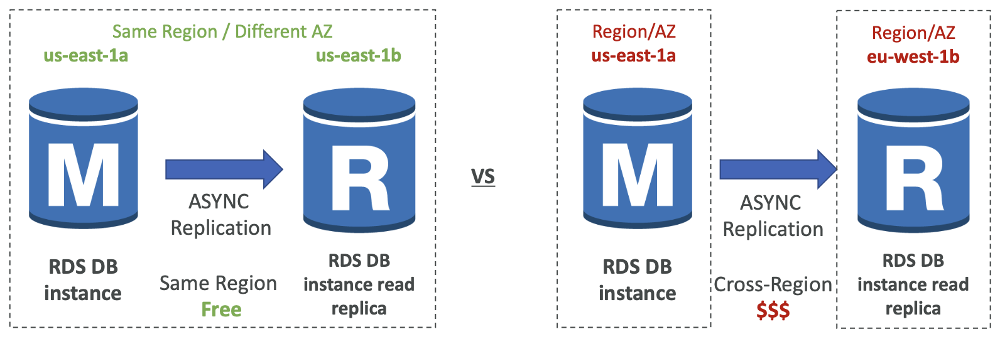
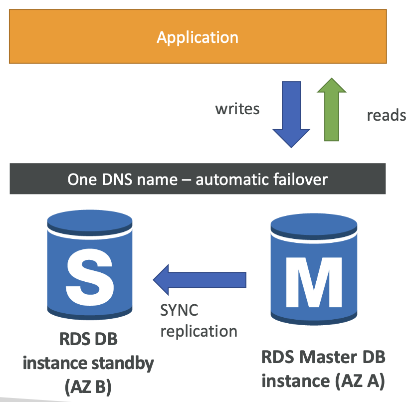
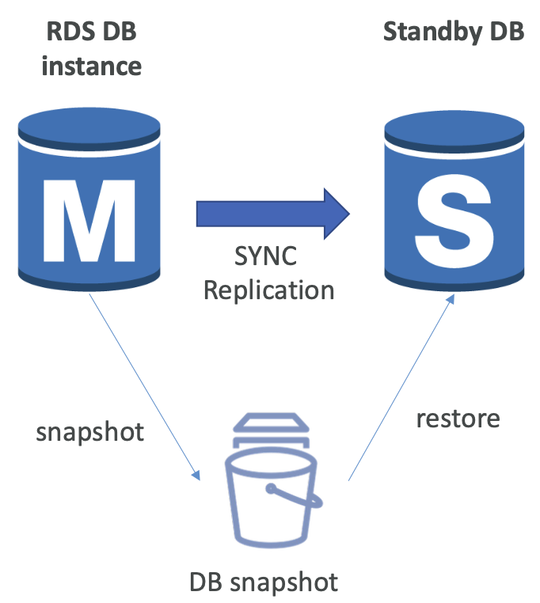
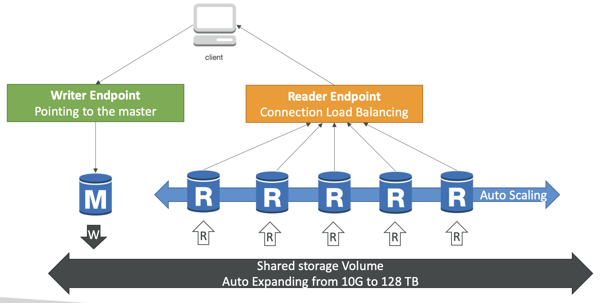
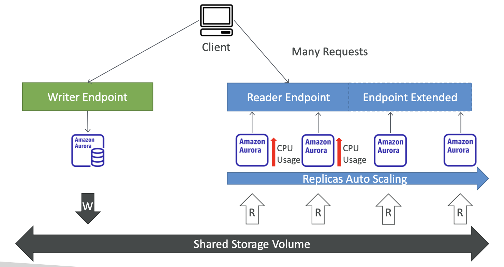
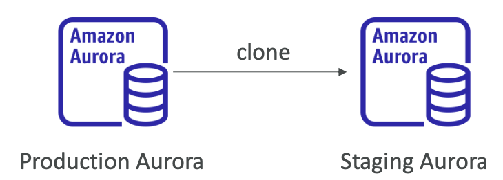
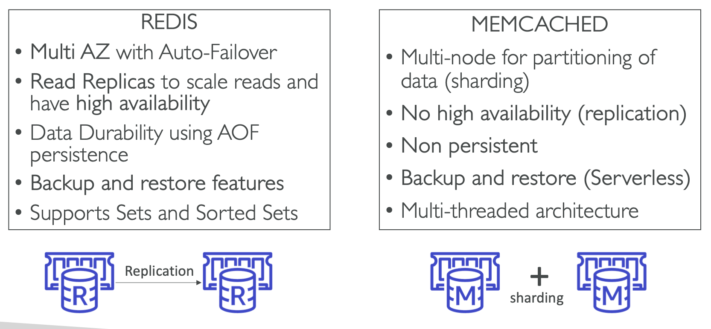

## Amazon RDS
- Relational Database Service
- SQL(Structured Language)을 쿼리 언어로 사용하는 데이터베이스를 위한 서비스
- It allows you to create in the cloud that are <u>managed by AWS</u>
- Amazon RDS가 지원하는 엔진 유형
  - PostgreSQL
  - MySQL
  - MariaDB
  - Oracle
  - Microsoft SQL Server
  - IBM DB2
  - Aurora(AWS 독점 기술 DB; MySQL/PostgreSQL 호환)

### Advantage over using RSD vs deploying DB on EC2
- RDS is a managed service: 
  - DB 프로비저닝(완전 자동화, 기본 운영체제 패치도 자동화)   
    > *데이터베이스 인프라를 자동으로 준비하고 설정하는 과정*
  - 지속적인 백업, restore to specific timestamp (Point in Time Restore)
  - DB 성능 모니터링할 수 있는 대시보드 사용 가능
  - **Read replicas** for improved read performance
  - **Multi AZ** setup for DR (Disaster Recovery)
  - 업그레이드를 위한 Maintenance Windows
  - Scaling capacity (vertical and horizontal)
  - 내부적으로 데이터를 저장할 때, AWS의 **EBS**를 사용
- **SSH로 인스턴스 접속은 불가능** (관리형 서비스이기 때문)

### ⭐️ RDS - Storage Auto Scaling
- Helps you increase storage on your RDS DB instance dynamically
- **저장 용량이 부족하면 RDS가 이를 감지하고 스토리지를 자동으로 확장해줌**   
  -> 스토리지 용량을 늘리기 위해 DB를 중단할 필요 없음
- 애플리케이션이 RDB 데이터베이스에 여러 차례 읽고 쓰기를 하면 자동으로 스토리지가 확장될 수 있음 (RDS 기능)   
  -> 데이터베이스 스토리지를 수동으로 확장하는 작업을 피하기 위함
- 이를 위해 최대 스토리지 임계값(Maximum Storage Threshold)을 설정해야 함   
  -> 스토리지가 무한정 늘어나지 않도록
- Automatically modify storage if:
  - 할당된 용량의 10% 미만으로 남으면
  - 스토리지가 5분 이상 부족한 상태가 지속되고 마지막 수정 후 6시간이 지나면
- <u>**업무량 예측이 어려운 애플리케이션에 매우 유용**</u>
- RDS의 모든 데이터베이스 엔진을 지원

### RDS Read Replicas for read scalability
- 읽기 전용 복제본은 최대 15개까지 생성 가능
- <u>동일한 AZ, Cross AZ, Cross Region에 걸쳐 생성 가능</u>
- 주된 RDS DB 인스턴스와 두 읽기 전용 복제본 사이에 **비동기식 복제(ASYNC replication)**가 발생   
  -> 비동기식이란 결국 읽기가 일관적으로 유지된다는 것을 의미
- Replica를 데이터베이스로 승격시켜 이용할 수 있음   
- 래플리카를 주요 DB로 승격시키려면, 애플리케이션은 반드시 모든 연결을 업데이트해야 하며 이를 통해서 RDS 클러스터 상의 읽기 전용 복제본 전체 목록을 활용할 수 있음
- **⭐️ 읽기 전용 복제본이 있는 경우에는 SELECT(=read) 명령문에만 사용할 수 있음**    
  (not INSERT, UPDATE, DELECT)    
  읽기 전용 복제본은 읽기를 위함일 뿐이니까

### RDS Read Replicas  - Network Cost
   
- 하나의 AZ에서 다른 AZ로 데이터가 이동할 때 비용 발생  
- **For RDS Read Replicas within the same region, you don't pay that fee**   

### RDS Multi AZ (Disaster Recovery)
   
- **동기식  복제**
- <u>하나의 DNS 이름</u> 덕분에 자동 장애 조치가 가능   
  > RDS를 생성하면 "mydb.abcd1234.us-west-2.rds.amazonaws.com" 이런 엔드포인트가 생김    
  > 이 주소는 우리가 DB에 접속할 때 사용하는 DNS 이름   
  > -> 이 DNS는 항상 현재의 Primary 인스턴스를 가리킴   
  > - primary instance가 죽은 경우 (ex. AZ A 장애 발생)
  > 1. AWS가 자동으로 Standby 인스턴스(AZ B)를 새 프라이머리로 승격   
  > 2. DNS 레코드를 업데이터해서, 동일한 주소가 이제 AZ B 인스턴스를 가리키게 됨   
  > 👉🏻 즉, 애플리케이션(클라이언트)은 DNS 이름은 바뀌지 않으므로 재설정 없이도 자동으로 장애 조치된 인스턴스로 연결 가능   

- 이를 통해 **가용성을 높일 수 있음**
- 전체 AZ 또는 네트워크가 손실될 때에 대비한 장애 조치이자 master DB의 인스턴스 또는 스토리지에 장애가 발생할 때 <u>standby DB가 새로운 마스터가 될 수 있도록 하는 것</u>
- 따로 앱에 수동으로 조치 취할 필요 없음
- **스케일링에는 이용되지 않음**
- 스탠바이 데이터베이스는 단지 <u>대기 목적</u>으로만 수행   
  (읽거나 쓸 수 없음)   
> 🙋🏻‍♀️ 재해 복구를 대비해서 읽기 전용 복제본을 다중 AZ로 설정할 수 있을까?   
> A. ㅇㅇ 가능. 원하는 경우에 읽기 전용 복제본을 다중 AZ로 설정할 수 있음

    

### ⭐️ RDS Read Replica vs Multi-AZ
|항목|Read Replica|Multi-AZ 배포|
|-------|-------------|---------|
|복제 방식|비동기식(ASYNC)|동기식(SYNC)
|복제 대상|**하나 이상의 읽기 전용 복제본**|**장애 조치용 스탠바이 인스턴스**|
|용도|읽기 부하 분산|고가용성, 자동 장애 조치(Failover)|
|장애 발생 시|자동 failover X|자동 failover O|
|클라이언트 연결 주소|각 래플리카마다 별도의 엔드포인트|하나의 공용 DNS 주소로 자동 전환|
|쓰기 가능 여부|쓰기 불가능(읽기 전용)|장애 조치 후 쓰기 가능|

### ⭐️ RDS - From Single-AZ to Multi-AZ
> 단일 AZ에서 다중 AZ로 RDS 데이터베이스 전환이 가능할까?
- Zero downtime operation (no need to stop the DB)
- 그냥 'modify' 버튼으로 활성화시키기만 하면 됨
- 이를 통해서 master DB는 동기식 복제본인 스탠바이 데이터베이스를 확보    
      
- ⭐️ The following happens internally:
  - A snapshot is taken
  - A new DB is restored from the snapshot in a new AZ
  - standby DB가 복원되면 두 데이터베이스 간 동기화가 설정됨
  - 👉🏻 스탠바이 데이터베이스가 메인 RDS 데이터베이스 내용을 모두 수용하여 다중 AZ 설정 상태가 됨   

### RDS Custom
- RDS에서는 기저 운영 체제나 사용자 지정 기능에 액세스할 수 없음
- Managed **Oracle** and **Microsoft SQL Server Database** with OS and database customization
- RDS: RDS를 통해 AWS에서의 데이터베이스 자동화 설정, 운영, 스케일링
- Custom: RDS Custom 옵션을 추가하면 underlying database, OS에 액세스할 수 있게 됨
  - 내부 설정 구성, 패치 적용, 네이티브 기능 활성화가 가능
  - SSH 또는 SSM 세션 관리자를 사용해서 RDS 뒤에 있는 기저 EC2 인스턴스에 액세스할 수 있음
    > 🧐 **"RDS 뒤에 있는 기저 EC2 인스턴스"란?**
    > - RDS는 내부적으로 EC2 인스턴스 위에 데이터베이스 소프트웨어를 올려서 운영됨
    > - 일반 RDS는 이 EC2 인스턴스를 AWS가 숨기고 직접 관리해서 사용자가 접근할 수가 없음
    > - 반면, RDS Custom은 EC2 인스턴스가 보이고 사용자가 직접 접근할 수 있음
    
    > RDS Custom을 쓰면 EC2 인스턴스에 직접 접속해서 리눅스 명령어도 입력하고, OS 설정도 직접 만질 수 있음
- Customization을 사용하려면 RDS가 수시로 자동화, 유지 관리 또는 스케일링과 같은 작업을 수행하지 않도록 **자동화를 꺼두는 것이 좋음**
- better to take a DB snapshot before
- RDS vs RDS Custom
  - RDS: entire database and the OS to be managed by AWS
  - RDS Custom: <u>full admin access</u> to the underlying OS and the database   
 

## Amazon Aurora
- AWS 고유 기술 (not open sourced)
- **Postgres 및 MySQL과 호환**
- AWS cloud optimized 
- RDS의 MySQL보다 5배 높은 성능, PostgreSQL보다 3배 높은 성능
- 스토리지 자동 확장   
  10GB에서 시작하지만 데이터를 많이 넣을수록 자동으로 128TB까지 확장
- 읽기 전용 복제본인 경우 15개 복제본을 둘 수 있고, 복제 속도도 훨씬 빠름   
  (MySQL은 5개 Read Replica만 가능)
- 즉각적인 장애 조치   
  (Multi-AZ나 MySQL RDS보다 훨씬 빠름)
- 비용은 RDS에 비해 약 20% 정도 높지만 스케일링 측면에서 훨씬 더 효율적임
- 기본적으로 클라우드 네이티브이므로 가용성이 높음   
> - **cloud-native**: 처음부터 클라우드를 위한 구조로 설계되었다는 뜻   
> - **Aurora**는 단순이 EC2에 MySQL을 깔아놓은 게 아니라, AWS 인프라에 맞춰 **분산 저장, 자동 복구, 자동 확장**이 가능하도록 만들어진 **AWS 전용 고성능 DB 엔진**

### ⭐️ Aurora High Availability and Read Scaling
- 6중 복제 스토리지:
  - **데이터를 3개 AZ에 걸쳐 6개 복제본으로 저장함**   
    -> 단일 디스크 장애로 인한 손실 위험 매우 낮음

  - '쓰기'에는 6개의 사본 중 4개만 있으면 됨 -> 높은 쓰기 가용성
  - '읽기'에는 6개의 사본 중 3개만 있으면 됨 -> 높은 읽기 가용성
  - 자가 복구 과정 (Self healing with peer-to-peer replication)
  - 수 백 개의 볼륨을 사용

- **One** Aurora Instance takes **writes (master)**
- **master가 작동하지 않으면 평균 30초 이내로 장애 조치가 시작됨**
- 마스터 외에 읽기를 제공하는 읽기 전용 복제본을 15개까지 둘 수 있음
  - 따라서 복제본을 많이 두고 읽기 워크로드를 스케일링할 수 있음
- Support for Cross Region Replication

### Aurora DB Cluster
   
- **스토리지에 쓰는 건 마스터만 가능**
- Aurora에서는 Writer/Reader Endpoint를 제공
- **⭐️ Writer Endpoint**
  - <u>Writer endpoint는 DNS 이름으로 항상 마스터를 가리킴</u>   
    **Pointing to the master**
  - 장애 조치 후에도 클라이언트는 writer endpoint와 상호작용하게 되며, 올바른 인스턴스로 자동으로 리다이렉트 됨
- **⭐️ Reader Endpoint**
  - **Connection Load Balancing**
  - 모든 읽기 전용 복제본과 자동으로 연결
  - 따라서 클라이언트가 reader endpoint에 연결될 때마다 읽기 전용 복제본 중 하나로 연결되며 이런 방식으로 로드 밸런싱을 도와줌
  - **로드 밸런싱은 문장(statement) 레벨이 아닌 연결(connection) 레벨에서 일어남**   
    > ### Statement-level Load Balancing
    > - 하나의 DB 연결 안에서 각각의 SQL문(statement)을 실행할 때 실행마다 다른 reader 노드에 분산시키는 방식
    > - ❌ Aurora는 이 방식 지원하지 않음   
    > 
    > ### Connection-level Load Balancing
    > - 새로운 DB 연결을 생성할 때 Aurora가 여러 reader 인스턴스 중에서 하나를 자동으로 선택해서 연결시켜 줌
    > - 이 연결은 연결이 종료될 때까지 동일한 리더 인스턴스를 계속 사용
    > - 따라서 SQL 문장마다 리더 인스턴스를 바꾸는게 아니라, 한 연결에 대해 하나의 리더 인스턴스가 고정된다는 의미   
    >
    > ⚠️ DB 연결은 상태를 유지하기 때문에 문장마다 인스턴스를 바꾸면 트랜잭션이나 세션 유지에 문제가 생김

### Feature of Aurora 
- Automatic fail-over
- Backup and Recovery
- Isolation and security
- 산업 규정 준수
- 자동 스케일링을 통한 버튼식 스케일링
- Automated Patching with Zero downtime
- Adanved Monitoring
- Routine Maintenance
- Backtrack: 과거 어떤 시점의 데이터로도 복원할 수 있게 해줌 

### Aurora Replicas - Auto Scaling
- 클라이언트가 있고 세 개의 Aurora 인스턴스가 있는 상황을 가정   
  (1개는 Writer Endpoint로 사용, 2개는 Reder Endpoint로 읽고 있음)   
   
- 이 상황에서 reader endpoint에 많은 읽기 요청이 들어와서 Amazon Aurora DB의 CPU 사용량이 증가됨
- Replica가 auto scaling되고 reader endpoint는 새로운 레플리카들을 위해 확장됨

### Aurora - Custom Endpoints
- Aurora 인스턴스의 부분집합을 사용자 지정 엔드포인트로 정의하기 위해서 db.r3.large와 db.r5.2xlarge 두 종류로 나눈 상황
- 한 종류의 읽기 전용 복제본이 다른 것보다 큰 상태   
  (이 인스턴스들이 더 강력하기 때문에 저 특정 복제본들이 analytical queries를 담당하게 하기 위함)
- 일반적으로 사용자 지정 엔드포인트를 정의한 이후에는 리더 엔드포인트 자체는 사용되지 않음
- 이 경우, custom endpoint에서 접근되지 않지만 reader endpoint를 통해 접근 가능한 인스턴스가 살아있음   
> - **Reader Endpoint로 보내는 요청**
>   - ex. 실시간 대시보드, 통계 수집    
>   -> 지연에 민감하지 않은 요청
> - **Custom Endpoint로 보내는 요청**
>   - 낮은 지연, 높은 안정성이 필요한 요청만 custom-endpoint(ex. r5.large)로 보내고 나머지 무거운 읽기 작업은 일반 reader-endpoint로 돌려서 저사양 인스턴스에 보내는 방식   

### Aurora Serverless
> 트래픽 변화에 따라 자동으로 DB 용량을 늘리거나 줄여주는 Aurora 버전
- 서버리스는 사용자에게 자동화된 데이터베이스 예시화와 실제 사용량에 따른 Auto Scaling을 제공
- 간헐적이고 예측 불가능한 업무량에 대응하는 것을 도와줌
- capacity planning을 할 필요가 없게 됨
- Pay per second, can be more cost-effective   

### Global Aurora
- Aurora Cross Region Read Replicas:
  - 재해 복구에 유용, 실행 간단
- Aurora Global Database (recommended):
  - 모든 읽기와 쓰기가 일어나는 하나의 기본 리전
  - 최대 5개의 보조 읽기 전용 리전을 만들 수 있음 (응답 지연이 1초 이하)
  - 보조 리전 당 최대 16개의 읽기 전용 복제본을 사용할 수 있음   
  -> 전 세계에서 오는 읽기 업무량에 따른 대기 시간을 줄이는 데 도움   
  - 한 리전에 DB 중단이 일어날 경우 재해 복구를 위해 다른 리전을 진급시키는데 걸리는 시간이 1분 이내 (RTO < 1 minute)
  - **⭐️ Typical cross-region replication takes less than 1 second**
  > **⭐️ 평균적으로 Aurora 글로벌 데이터베이스에서 한 리전에서 다른 리전으로 데이터를 복제하는 데에는 1초 이하의 시간이 걸림**   
  > - 이 표현이 시험에 나온다면 Global Aurora를 사용하라는 힌트!   

### Aurora Machine Learning
- SQL 인터페이스를 통해 사용자의 응용프로그램에 기계 학습 기반의 예측을 추가할 수 있음
- Aurora와 다른 AWS 기계 학습 서비스 간의 간단하고 최적화된 안전한 통합
- Support servies
  - Amazon SageMaker: 백엔드인 어떤 종류의 기계 학습 모델이라도 사용할 수 있게 허용
  - Amazon Comprehend: 감정 분석에 사용
- Use cases
  - 이상 행위 탐지, 광고 타겟팅, 감정 분석, 상품 추천    

### RDS Backups
- Automated backups
  - 자동으로 매일 데이터베이스의 전체 백업을 수행 (during the backup window)
  - 5분마다 트랜잭션 로그가 백업됨 (즉, 가장 빠른 백업은 5분 전)   
    -> 자동 백업을 통해 언제라도 5분 전으로 복원할 수 있다는 것을 의미
  - 자동 백업 보존 기간은 1 ~ 35일 사이로 설정 가능
  - 0으로 설정하면 자동 백업을 비활성화할 수 있음
- Manual DB Snapshots (수동 DB 스냅샷)
  - 사용자가 수동으로 트리거
  - 수동으로 한 백업은 사용자가 원하는 기간 동안 유지할 수 있음
- <u>데이터 백업은 보존뿐만 아니라 비용을 절감하고 싶을 때도 함</u>
  > ⭐️ ex. RDS 데이터베이스가 있는데 한 달에 2시간만 사용하는 걸 알고 있다고 가정    
  > - 데이터베이스를 중지해도 스토리지 비용은 계속 나감
  > - 따라서 두 시간 동안 사용한 후 스냅샷을 만들고, 원본 데이터베이스를 삭제하면 됨      
  > 👉🏻 스냅샷은 RDS 데이터베이스의 실제 스토리지 비용보다 훨씬 저렴   
  > - 데이터베이스를 다시 사용할 준비가 되면, 스냅샷을 복원하여 사용하면 됨

### Aurora Backups
- Automated backups
  - 1 ~ 35일까지 보존 가능, 비활성화는 불가능
  - point-in-time recovery(시점 복구 기능)이 있음. 즉, 해당 기간의 어느 시점으로든 복구할 수 있음
- Manual DB Snapshots
  - 사용자 수동 트리거
  - 원하는 기간 동안 유지 가능

### RDS & Aurora Restore options
- 옵션 1
  - **Restoring a RDS/Aurora backup or snapshot creates a new database**
  - 자동화된 백업이나 수동 스냅샷을 복원할 때마다 새 데이터베이스가 생성됨
- 옵션 2-1
  - **Restoring MySQL RDS database from S3**
  - 온프레미스 데이터베이스의 백업을 생성한 다음 객체 스토리지인 Amazon S3에 배치
  - S3에서 백업 파일을 MySQL을 실행하는 새 인스턴스로 복원하는 옵션이 있음. 이걸로 복원
- 옵션 2-2
  - **Restoring MySQL Aurora cluster from S3**
  - 온프레미스 데이터베이스를 다시 백업하면 됨
  - 외부적으로 Percona XtraBackup이라는 소프트웨어를 사용
  - Percona XtraBackup의 백업 파일을 Amazon S3로 보내 거기서 백업을 복원 (MySQL을 사용하는 새 Aurora 클러스터로)

> 옵션 2 차이점
> - RDS MySQL로 복원할 때는 데이터베이스의 백업만 있으면 됨
> - Aurora MySQL에서는 Percona XtraBackup으로 백업을 한 다음, S3에서 Aurora DB 클러스터로 백업

### Aurora Database Cloning
- 기존 데이터베이스 클러스터에서 새로운 Aurora 데이터베이스 클러스터를 생성할 수 있음   
    
- ex. Aurora에 프로덕션 DB가 있고, 거기에서 테스트를 실행하고 싶은 상황   
  -> 테스트 애플리케이션은 스테이징 환경에 있어야 하므로 데이터를 복사하고 싶음
- 이 경우, 프로덕션 Aurora 데이터베이스를 복제하면 됨
- **Aurora Database Cloning 작업은 스냅샷을 찍고 복원하는 것보다 빠름**
- -> copy-on-wirte 프로토콜을 사용하기 때문
  - 처음 데이터베이스 복제본을 만들 때는 원래 데이터베이스 클러스터와 동일한 데이터 볼륨을 사용하게 됨. (빠르고 효율적 - 데이터를 복사하지 않으니까)
  - 프로덕션 Aurora 데이터베이스 또는 스테이징 Aurora 데이터베이스에 업데이트가 이루어지면 새로운 추가 스토리지가 할당되고, 데이터가 복사 및 분리됨
- Very fase & cost-effective
- Useful to create a "staging" database from a "production" database without impacting the production database
- 스냅샷 및 복원 기능도 필요 없음

### RDS & Aurora Security
- **At-rest encryption** (데이터가 디스크에 있을 때 암호화):
  - AWS KMS(Key Management Service)를 사용해 마스터와 모든 복제본의 암호화가 이루어짐 - DB를 처음 실행할 때 정의됨
    > - 암호화 키는 AWS KMS가 관리함 (직접 키 생성/교체 가능)   

  - master DB를 암호화하지 않았다면, read replica를 암호화할 수 없음
  - 암호화 되어 있지 않은 기존 데이터베이스를 암호화하려면, 암호화 되지 않은 db의 snapshot을 가지고 와서 암호화된 데이터베이스의 형태로 스냅샷을 복원해야 함   
  -> 스냅샷 생성 및 복원 작업을 거쳐야 함

- **In-flight encryption** (In-transit encryption; 데이터 전송 중 암호화):
  - RDS와 Aurora 둘 다 기본적으로 전송 중 데이터 암호화 기능을 갖추고 있음
  - 따라서 클라이언트는 AWS 웹사이트에서 제공하는 AWS TLS 루트 인증서를 사용해야 함
  - 대표적으로 TLS(Transport Layer Security), HTTPS를 사용
- **IAM Authentication**: IAM roles to connect to your database (instead of username/pw)
- **Security Groups**: Control Network access to your RDS/Aurora DB
- **No SSH available** except on RDS Custom
  - RDS/Aurora에는 SSH 액세스 ❌
- Audit Logs(감사 로그) can be enabled and sent to CloudWatch Logs for longer retention

### Amazon RDS Proxy
> **Amazon RDS Proxy는 애플리케이션과 RDS/Aurora 사이에서 데이터베이스 연결을 관리해주는 프록시 서비스**   
> DB 연결을 캐싱하고 재사용해서 성능을 높이고, 갑작스러운 트래픽 폭주나 장애 상황에도 안정성을 확보해줌   
> - RDS 데이터베이스 인스턴스의 연결을 최소화할 수 있음
> - **장애 조치 시간을 최대 66%까지 감소시킬 수 있음**
> - **데이터베이스에 IAM 인증을 강제하는데 사용**    
>   **(자격 증명은 Secrets Manager 서비스에 안전하게 저장됨)**    

- Fully managed database proxy for RDS
- Amazon RDS Proxy를 사용하면 애플리케이션이 데이터베이스 내에서 데이터베이스 연결 풀을 형성하고 공유할 수 있음   
- 애플리케이션을 RDS 데이터베이스 인스턴스에 일일이 연결하는 대신 프록시가 하나의 풀에 연결을 모아 RDS 데이터베이스 인스턴스로 가는 연결이 줄어듦
    > - Connection Pool: 여러 애플리케이션 요청을 처리하기 위해 미리 열어놓은 DB 연결을 모아놓은 저장 공간
    > - RDS Proxy 없는 경우
    >   - 사용자 1000명이 동시에 접속하면, 1000개 DB 연결 요청 발생
    >   - RDS 다운될 수 있음
    > - RDS Proxy 있는 경우
    >   - 프록시는 애플리케이션 요청 수만큼 DB에 연결하지 않음
    >   - 소수의 DB 연결만 유지한 채, 동시에 여러 애플리케이션 연결 요청을 같은 DB 연결로 처리
- **Improving database efficiency by reducing the stress on database resource (e.g. CPU, RAM)**   
- **Minimize open connections, timeouts**
- 완전한 서버리스로 오토 스케일링이 가능해 용량을 관리할 필요가 없고 가용성이 높음
- 다중 AZ 지원
- RDS 데이터베이스 인스턴스에 장애 조치가 발생하면 기본 인스턴스가 아니라 대기 인스턴스로 실행되며 RDS proxy 덕분에 RDS & Aurora의 장애 조치 시간을 66%까지 줄일 수 있음
    > - 장애 조치를 각자 처리하게 하는 대신 장애 조치와 무관한 RDS 프록시에 연결하는 것
    > - **RDS 프록시가 장애 조치가 발생한 RDS 데이터베이스 인스턴스를 처리하므로 장애 조치 시간이 개선됨**
- MySQL, PostgreSQL, MariaDB용 RDS, Aurora를 지원
- No code changes required for most apps
- **데이터베이스에 IAM 인증을 강제함으로써 IAM 인증을 통해서만 RDS 데이터베이스 인스턴스에 연결하도록 할 수 있음**
- **RDS Proxy는 퍼블랙 액세스가 절대로 불가능 (must be accessed from VPC)**   
  -> 인터넷을 통해 RDS 프록시에 연결할 수 없으므로 보안 뛰어남

## Amazon ElastiCache
- ElastiCache는 관리형 Redis 또는 Memcached를 제공    
> **Cache**: 매우 높은 성능과 낮은 지연 시간을 가진 in-memory 데이터베이스    
> 읽기 집중적인 작업 부하에서 데이터베이스의 부하를 줄이는 데 도움
- AWS가 OS maintenance / patching, optimizations, setup, configuration, monitoring, failure recovery, backups을 담당
- <u>**Using ElastiCache involves heavy application code changes**</u>
- ElastiCache Solution Architecture
  - DB Cache
  - User Session Store

### ElastiCache - Redis vs Memcached
   
 

## Amazon Redshift
> Amazon Redshift는 대용량 데이터를 저장하고 분석하기 위한 클라우드 기반의 데이터 웨어하우스 서비스
- 초대용량 데이터를 분석하기 위해 만들어짐
- OLTP(읽기/쓰기 중심)이 아닌 OLAP(분석 중심) 시스템
- 대량의 데이터를 빠르게 처리하기 위해 컬럼 기반 저장, 병렬 처리(MPP) 사용
- PostgreSQL 기반의 SQL 사용 가능
- S3에 저장된 데이터를 바로 조회할 수 있음