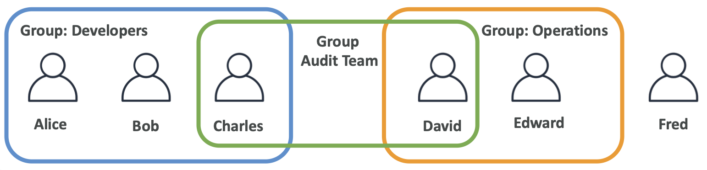
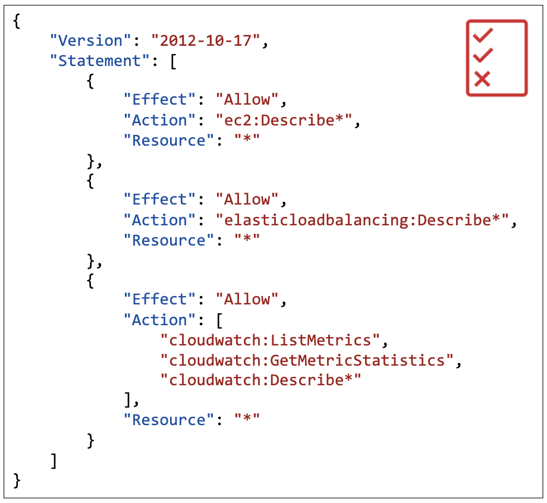
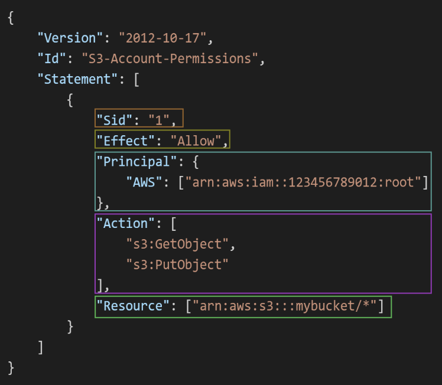

## IAM
### IAM: Users & Groups
- IAM = Identity and Access Management, **Global** service
- IAM은 전체 서비스로서 글로벌 서비스이며 선택할 리전 없음
  - IAM에서 사용자를 생성하면 어디에서나 사용할 수 있음
- Root account: 계정을 생성할 때 만들어짐 created by default
   
- User를 생성하면 하나의 user는 organization 내의 한 사람에 해당. 사용자들을 group으로 묶을 수도 있음
- 그룹에는 사용자만 배치할 수 있음   
  (다른 그룹을 포함시킬 수 없음)

### IAM: Permssions
- **Users and Groups** can be assigned JSON documents called policies   
   
- AWS에서는 **최소 권한의 원칙**을 적용함

### IAM Policies inheritance
- 만약 하나의 신분에 연결된 두 개의 정책이 서로 상반된 내용을 담고 있으면 'Deny' 기준을 따르도록 함 
    > e.g. 하나의 정책은 S3 버킷 생성을 허용하고, 다른 정책은 S3 버킷 생성을 불허하는 경우   
    > (상충이 발생하는 경우)   
    > 👉🏻 S3 버킷 생성 불허
- Inline 정책
  - 특정 IAM 사용자(User), Group, Role에 **직접 연결**되어 있는 정책을 의미
  - 정책이 개별 엔티티에 종속적이며 다른 엔티티와 공유되지 않는 정책

### IAM Policies Structure
   
- **Version**: 정책 언어 버전
- Id: 정책을 식별하는 id *(optional)*
- **Statement**: 
  - Sid: 문장 id로 문장의 식별자 *(optional)*
  - **Effect**: 문장이 특정 API에 접근하는 걸 허용할지 거부할지에 대한 내용 (Allow / Deny)
  - **Principal**: 특정 정책이 허용될 사용자/계정/역할로 구성   
    (예시에서는 AWS 계정의 루트에 적용)   
  - **Action**: effect에 기반해 허용 및 거부되는 API 호출 목록
  - **Resource**: 적용될 action의 리소스 목록
  - Condition: 문장이 언제 적용될지를 결정 *(optional)*

### IAM - Password Policy
- setup a password policy
  - 최소 비밀번호 길이 설정 
  - Require specific character types:
    - 대문자, 소문자, 특수 문자, 숫자
  - IAM 사용자들이 자신의 비밀번호를 변경하도록 허용하거나 허용하지 않을 수 있음
  - 일정 시간 후에 사용자에게 비밀번호를 변경하도록 요구하여 비밀번호가 만료되도록 할 수 있음
  - 이전에 사용했던 비밀번호 재사용 못하게 막을 수도 있음

### MFA - Multi Factor Authentication
- MAF = password *you know* + security device *you own
- 사용자가 비밀번호를 도난당하거나 해킹당하여 비밀번호를 잊어버린 경우에도 해커가 사용자의 물리적 장치도 확보해야 하므로 계정이 손상되지 않음

#### MFA divices options in AWS 
- **Virtual MFA device**
  - 한 번에 하나의 전화에서만 작동하거나 인증을 사용하는 구글 인증기를 사용할 수 있음
  - **Google Authenticator**, **Authy**; Support for multiple tokens on a single device 
- **Universal 2nd Factor (U2F) Security Key**
  - **YubiKey** by Yubico (3rd party)
- **Hardware Key Fob MFA device for AWS GobCloud (US)**