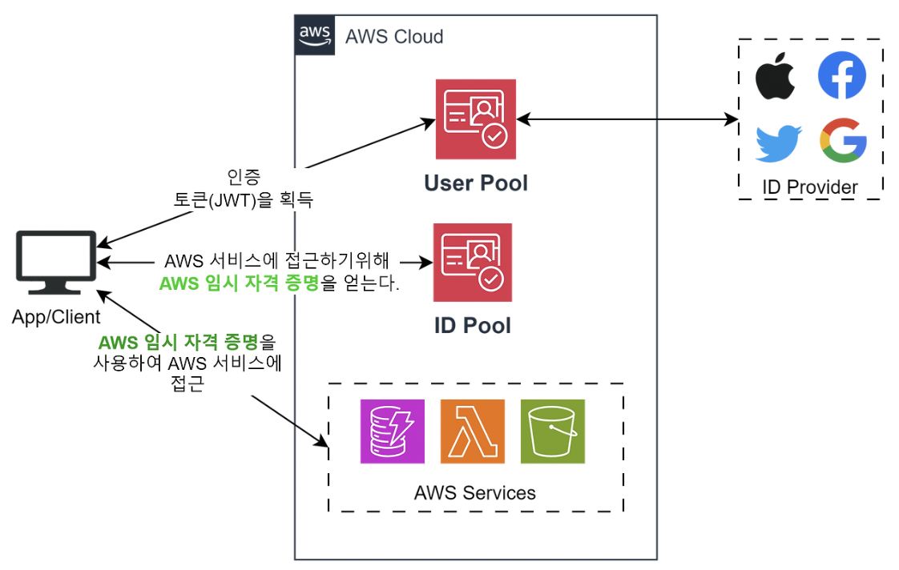
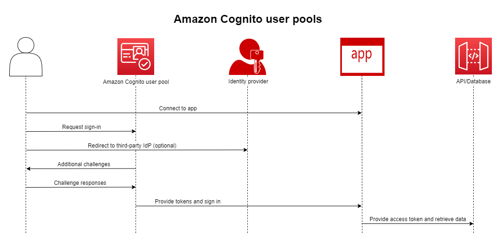
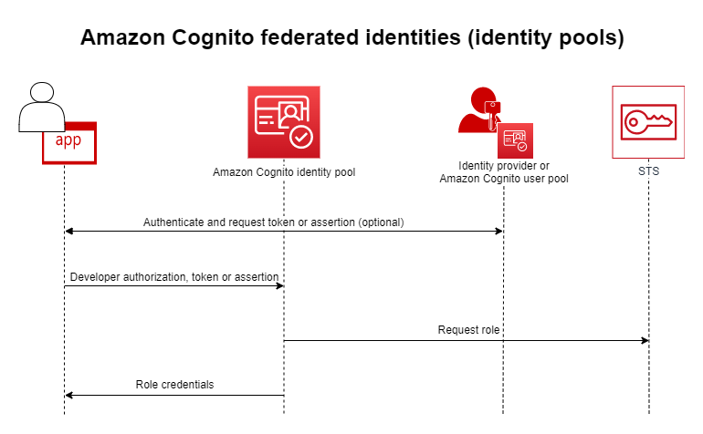

# IAM -2

# 사용자의 접근권한 관리를 위한 주요 도구

## AWS Cognito

>AWS 측에서 사용자의 **회원가입**과 **로그인**을 관리해 주는 서비스

→ 유저는 Cognito를 통해 회원가입, 로그인이 가능

→ 로그인 데이터를 Cognito를 통해 관리하게 됨

→ 소셜 로그인까지 설정할 수 있다

### 유저 풀

:완전관리형 사용자 디렉토리 서비스이며, 앱 사용자의 가입, 로그인, 비밀번호 관리, MFA(2차 인증) 등을 자동으로 처리해주는 **인증** 서비스

### 유저 인증 방식

- User Pool이 제공하는 인증 방식
- 외부 ID Provider와 연동하는 방식 (소셜 로그인)

인증이 완료되면 JWT 토큰이 발급되며, 애플리케이션 측에서 사용자 식별, API Gateway를 통한 접근 제어를 할 수 있다.

또한 ID 풀과 함께 AWS의 다양한 서비스에 접근할 수 있는 임시 인증 정보를 얻을 수 있다.

>인증서버 + 사용자 저장소

### ID 풀

:로그인 후에 AWS 서비스 접근 관리

- 로그인된 사용자에게 **임시 접근권한**을 줌
- 이 자격 증명을 통해 AWS 리소스 접근 가능

### Adaptive Authentication

:평소와 다른 로그인을 감지하면, 2차 인증을 요구

- 새로운 장치, 위치, 네트워크 정보 등 **평소와 다른 상황에서 로그인을 감지**하면 동적으로 **보안 수준을 조정**하는 기능

| **항목** | **Cognito** | **IAM** |
| --- | --- | --- |
| 대상 | 수백 명~수천 명의 앱 사용자 | AWS 리소스 운영자(관리자/개발자 등) |
| 목적 | 앱 사용자 인증 / 권한 부여 | AWS 리소스 직접 제어 권한 관리 |
| 인증 | 소셜 로그인, SAML, 사용자 Pool | AWS 콘솔 또는 SDK 자격 증명 기반 |

### 문제

어떤 기업이 Amazon Cognito를 사용하여 사용자 관리 및 인증을 수행하는 모바일 애플리케이션을 개발하고 있습니다. 이 애플리케이션은 인증이 성공하면 사용자가 Amazon DynamoDB에 저장된 개인 정보를 조회하고 업데이트할 수 있도록 설계되었습니다. 그러나 사내 테스트 결과, 로그인은 성공하지만 DynamoDB 데이터에 접근할 수 없다는 보고가 있었습니다. 사용자가 DynamoDB 데이터에 접근할 수 있도록 적절한 권한을 설정해야 합니다. 이 문제를 해결하기 위한 가장 적절한 접근법은 무엇입니까?

1. Cognito ID 풀에서 발행되는 일시적인 인증 정보의 근거가 되는 IAM Role에 DynamoDB에 대한 적절한 접근 권한이 부여되어 있는지 확인하고, 필요에 따라 접근 권한을 추가합니다.
2. DynamoDB에 대한 적절한 접근 권한이 부여된 IAM 정책을 생성하고, Cognito에서 관리하는 사용자에게 이를 연결합니다.
3. DynamoDB에 대한 적절한 접근 권한을 가진 IAM 사용자로 접근 키와 비밀 키를 생성하고, 이러한 키를 사용하여 접근하도록 애플리케이션 코드를 수정합니다.
4. 개인 정보가 저장된 기존의 DynamoDB 테이블을 글로벌 테이블로 변환합니다.

## **AWS Directory Service**

:디렉터리 서비스를 AWS 클라우드에서 완전관리형으로 제공하는 서비스

### **AD란? (Active Directory)**

- 사용자, 컴퓨터, 그룹, 리소스(프린터, 파일 등)의 정보를 저장하고,
- **이들에게 접근 권한을 통제**하는 **중앙 집중식 디렉터리 서비스**

⇒ 회사 전체의 사용자 계정과 권한을 통합 관리하는 시스템

디렉토리 유형을 고를 수가 있는데,

### AWS Managed Microsoft Active Directory

:Windows Server**에서 제공되는 디렉터리 서비스**

- 기업 내부에서 **사용자 계정, 컴퓨터, 프린터, 파일 공유 등 자원에 대한 접근 권한을 중앙에서 관리**하는 시스템
- **Windows Server**에서 운영되며, 회사 네트워크 보안과 효율적인 자원 관리를 위해 사용됨
- 온프레미스AD가 없으면 이걸 사용하면 됨
- 있으면 연동해서 사용 가능

### **AD Connector**

- **온프레미스 AD와 연동**하기 위한 프록시(Proxy) 역할
- AWS는 사용자 정보를 저장하지 않고, **온프레미스 AD로 요청을 전달**
- 사용자 관리는 온프레미스 AD에서만 수행
- 만약 온프레미스 AD가 없고, AWS Microsoft Active Directory를 사용한다면, 필요 없음

### **Simple AD**

- 소규모 환경을 위한 **AD 호환** 디렉터리
- 자체적으로 사용자, 그룹 등을 관리 가능
- 온프레미스 연결은 안됨

## AWS IAM Identity Center(AWS SSO)

:여러 AWS 계정과 애플리케이션에 대한 **중앙 집중식 사용자 접근 관리를 제공하는 서비스**

- 로그인 시스템
- **AWS Directory Service**가 관리하는 **Microsoft AD**에서 **사용자 정보를 받아옴**
- 즉, AD 사용자로 로그인하면, SSO가 그 사용자의 **신원 확인**(인증)과 **접근 권한 부여**를 **자동으로 처리**
- 여러 계정에 **공통적으로 적용**할 수 있어 **중앙 집중형 관리**가 가능

> 회사가 5개의 AWS 계정을 운영 중이고, 사내 AD에 등록된 직원이 있다면
→ 직원이 AD 계정으로 한 번 로그인
→ SSO가 모든 AWS 계정에 적절한 권한으로 로그인 처리
> 

---

# 키 암호화 및 보안 자격증명 도구

## AWS Key Management Service(AWS KMS)

: 암호화를 위한 키를 생성하고 관리하는 완전관리형 서비스

- EBS, S3, RDS 등 AWS 전반에 사용 가능
- AWS CloudTrail과 연동하여 누가 언제 어떤 키를 사용했는지 추적 가능
- AWS에서 “암호화”가 언급되면 대부분 KMS를 사용
- AWS가 키를 관리하고, IAM과 연동하여 접근 제어 가능

### **KMS 키의 종류**

1. **대칭 키 (Symmetric)** 
    - **하나의 키로 암호화/복호화**
    - 기본적이고 AWS 서비스에 널리 사용됨
    - 키 원본은 외부에서 접근 불가, KMS API로만 사용
2. **비대칭 키 (Asymmetric)**
    - **공개키로 암호화**, **비밀키로 복호화**
    - 외부에서 암호화 필요할 때 유용 (KMS API를 못 쓰는 환경 등)

### Automatic Key rotation

- **AWS 관리 키** : 자동으로 1년마다 rotation
- **고객 관리 키**: 수동 + 자동 rotation 지원
- **가져온 키**: 수동 rotation만 가능

### Key Policy

KMS 키에 대한 **접근 권한을 제어하는 정책**

### **기본 KMS 키 정책 (Default Key Policy)**

- 사용자가 직접 정책을 지정하지 않으면 자동 생성됨
- 루트 사용자에게만 **전체 권한** 부여됨

### **사용자 정의 KMS 키 정책 (Custom Key Policy)**

- 특정 **IAM 사용자, 역할, 계정**에 대해:
    - **키 사용 권한**
    - **키 관리(회전, 삭제 등) 권한**을 세분화해 부여 가능
- **계정 간 공유 키 사용**에도 필수

> **KMS 키를 사용하려면 반드시 KMS Key Policy가 필요하며, IAM 권한만으로는 접근 불가**

## **AWS Secrets Manager**

**데이터베이스 비밀번호, API 키, 인증 토큰**과 같은 비밀 정보를 안전하게 저장하고 자동으로 rotation시켜주는 **완전관리형 서비스**

1. **비밀(Secret) 안전 저장**
    - 예) DB 사용자 이름과 비밀번호
2. **자동 교체(Rotation)**
    - Lambda와 연동해 주기적으로 비밀번호를 자동 변경
3. **KMS 기반 암호화**
    - 저장된 Secret은 AWS KMS로 암호화됨
4. **IAM 기반 접근 제어**
    - 누가 어떤 비밀을 조회할 수 있는지 세밀하게 설정 가능