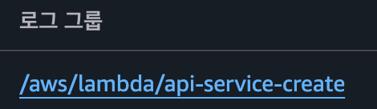
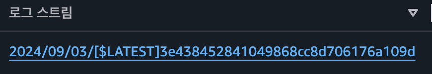
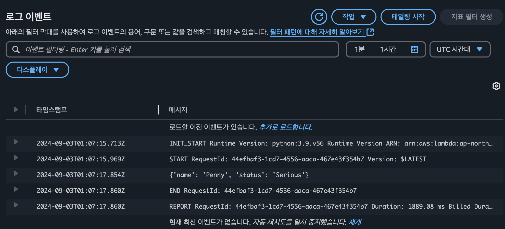
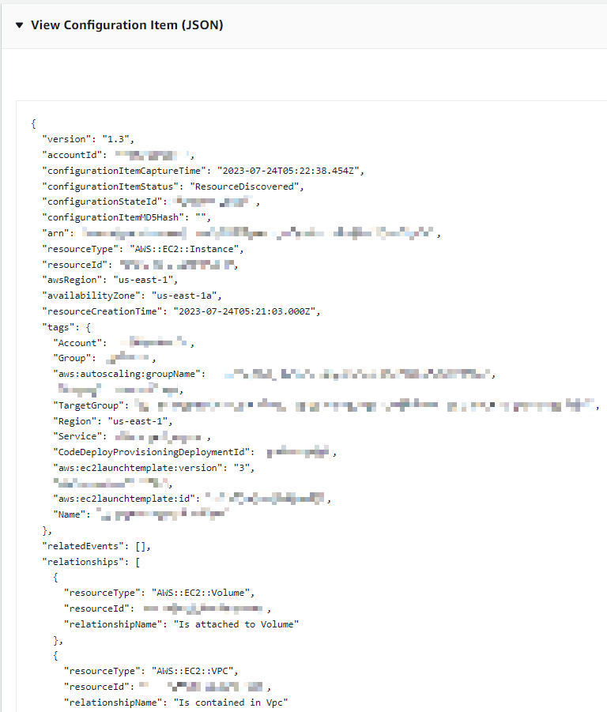

# Monitoring-2

# CloudWatch
:AWS 리소스의 상태와 성능 지표(메트릭)을 실시간으로 수집, 시각화, 경고 알림을 제공하는 모니터링 서비스

## CloudWatch Logs

:AWS 리소스, 애플리케이션, 서비스에서 발생한 로그 데이터를 실시간으로 수집, 모니터링, 저장하는 서비스

### CloudWatch Logs에 로그를 보낼 수 있는 주요 로그 소스들

| **SDK / Agent** | 앱 코드에서 직접 로그 전송하거나, EC2 등에 설치된 로그 에이전트에서 로그 수집 |
| --- | --- |
| **CloudWatch Logs Agent** | EC2 인스턴스의 로그 파일을 수집해 CloudWatch에 전송 |
| **Unified CloudWatch Agent** | 로그 + 지표 통합 수집 가능 (Metrics + Logs) |
| **Elastic Beanstalk** | 애플리케이션 로그 자동 수집 |
| **ECS (컨테이너 서비스)** | 각 컨테이너의 로그를 수집 가능 |
| **Lambda** | 함수 실행 로그가 자동으로 CloudWatch에 저장 |
| **VPC Flow Logs** | VPC 내 네트워크 트래픽 정보를 로그로 수집 |
| **API Gateway** | API 호출/응답, 에러 로그 수집 가능 |
| **CloudTrail (필터 기반)** | 관리형 이벤트 로그를 CloudWatch에 전달 가능 |
| **Route 53** | DNS 쿼리 로그 수집 가능 |

### 로그 이벤트

:AWS 리소스(Lambda, EC2, ECS 등)의 활동 기록

- 타임스탬프와 UTF-8으로 인코딩된 이벤트 메시지

### 로그 스트림

:로그 이벤트의 연속적인 스트림. 각 리소스 별로 만들어짐

- 한 웹 서버에서 엑세스 로그를 생성하는 여러 인스턴스가 존재하면, 각 로그들은 개별 로그 스트림에 저장됨

### 로그 그룹

:로그 스트림의 폴더라고 생각하면 된다. 로그 스트림은 로그 그룹의 설정값을 모두 공유

- AWS 서비스 별로 만들어진다
- 여러 로그 스트림들을 로그 그룹으로 묶어 관리할 수 있으며, 하나의 로그 스트림은 하나의 로그 그룹에만 속할 수 있다.
- 유지기간 : 1일 ~ 무기한(기본 설정)
- 장기 보관이 필요하면 S3 버킷으로 내보낼 수 있다.

예시를 한번 보자.

이 로그 그룹은 AWS Lambda 함수에서 생성된 로그를 담고 있는 CloudWatch Log Group이다.

이 로그 스트림은 Lambda 함수가 실행될 때마다 생성되는 실행 단위별 로그이다.

**Lambda가 실행되면서 발생한 메시지들을 시간순으로 기록한 것**

## 매트릭 필터

:로그 스트림에 적용해 특정 패턴을 자동으로 탐지해 사용자 정의 메트릭으로 변환하는 기능

<aside>
💡

로그만 가지고는 실시간 경고나 그래프 시각화가 어렵기 때문에, 정량적 수치(메트릭)으로 만들어 CloudWatch 대시보드, 알람에 활용하기 위함

</aside>

- 매트릭은 숫자형 데이터
    
    → 숫자형 데이터를 매트릭으로 저장할 수 있음
    
    → 문자열 데이터(IP 주소)는 저장할 수 없음. 대신 특정 문자열과 일치하는 요소를 찾는 것은 가능
    
    ex. 웹 서버 애플리케이션 로그에서 404 Not Found 에러 메시지가 몇 번 일어났는가?
    
    필터 설정 내용과 일치하는 로그 이벤트를 수신할 때마다 커스텀 매트릭스의 값을 하나씩 증가시킨다. 이 때 매트릭스 네임을 HTTP404Errors로 붙인 뒤 커스텀 네임스페이스에 저장하고, 필요할 때 그래프화해서 확인할 수 있다
    
- 로그 그룹에 적용된다
- 과거 데이터를 필터링할 순 없다
- 필터 생성 이전의 로그 이벤트도 필터링 할 수 없음

### CloudWatch Agent

:EC2 인스턴스, 온프레미스 서버의 로그를 수집하는 명령줄 기반의 프로그램

- EC2가 기본적으로 생성하지 못하는 성능 지표도 수집할 수 있음
- Agent가 생성한 지표는 커스텀 매트릭스이며 사용자 지정 커스텀 네임스페이스에 저장

### CloudTrail 로그를 CloudWatch 로그에 전송

| **항목** | **CloudTrail 로그** | **CloudWatch 로그** |
| --- | --- | --- |
| **로그 목적** | AWS 서비스의 **API 호출 이력 추적** | 애플리케이션/서비스의 **실행 상태 및 출력 내용 수집** |
| **로그 내용 예시** | {"eventName": "StartInstances", "userIdentity": "IAMUser", "sourceIPAddress": "1.2.3.4"} | INFO 2024-04-30 12:00:01 Server started on port 8080 |
| **누가 무엇을 했는가?** | O (예: 어떤 사용자가 어떤 리소스를 조작했는가) | X |
| **실시간 실행 정보** | X | O (예: 애플리케이션 로그, 에러 로그 등) |
| **로그 발생 주체** | AWS 자체 (서비스 API 호출) | 사용자가 설정한 애플리케이션, 서비스, 시스템 |
| **저장 위치** | 기본 S3 (옵션으로 CloudWatch Logs 가능) | CloudWatch Logs (Log Group / Log Stream) |

⇒ **AWS API 호출 기록을 CloudWatch를 통해 실시간으로 모니터링하고 싶을 때 사용됨**

CloudTrail → CloudWatch Logs로 전송하면

- **API 호출도 숫자로 전환**해서
- **모니터링/시각화/알람**까지 가능하게 됨

### CloudWatch Alarms

:단일 지표를 모니터링하다가 값의 변화가 발생하면 특정 동작을 수행하는 서비스

- 알람 생성 정의
    - CloudWatch 지표를 정의
    - 특정 지표를 모니터링한다기 보단, **설정한 시간 동안의 평균값이나 최대값**이 기준을 **지속적으로 초과할 때 알림을 보냄**
        
        ex. 5분 동안 CPU 평균 사용률이 80% 이상이면 알람
        
        잠깐 CPU 평균 사용률이 80%를 초과해도 바로 알람이 가지 않음.
        

---

### **1. 알람 생성 기준치**

- **정적 기준치**: 사용자가 직접 설정한 고정값 기준 (>=50, <800 등).
- **이상점 감지(Anomaly Detection)**: 정상 범위를 벗어나면 알람 발생. 표준편차 기반 예측 모델 사용.

### **2. 알람 상태**

- **ALARM**: 기준치 조건 충족 + 검증 기간 충족
- **OK**: 기준치 조건 미충족 + 검증 기간 충족
- **INSUFFICIENT_DATA**: 판단 가능한 데이터 부족

### **3. 데이터 포인트 & 검증 기간**

데이터 포인트 : 임계값을 초과해야 하는 횟수

검증 기간 :  데이터 포인트를 평가하는 **시간 구간** 

예시
- CPU 사용률이 1분마다 측정됨
- 설정 : 검증 기간 = 3, 데이터 포인트 = 2, 기준치 >= 80%
  → 최근 3분 중 2분 이상 CPU가 80% 이상이면 알람 상태(ALARM)

### **4. 알람 액션**

- **SNS 알림**: 이메일, SMS, Lambda 등
- **Auto Scaling**: 인스턴스 자동 증감
- **EC2 액션**: 재부팅, 중지, 복원 등 가능 (조건 있음)

---

## EventBridge

- AWS 서비스나 사용자 행동이 발생하면(Event)
- 미리 설정한 규칙(Rule)에 따라
- 특정 작업(Target)을 자동 실행한다

| **용어** | **설명** |
| --- | --- |
| Event | 어떤 일이 발생한 것 (예: S3에 파일 업로드됨, EC2 시작됨 등) |
| Event Bus | 이벤트가 흘러가는 통로 (기본 버스 / 사용자 정의 가능) |
| Rule | 특정 이벤트가 발생했을 때 어떤 행동을 할지 정의한 규칙 |
| Target | 이벤트 발생 시 실행할 대상 (예: Lambda, SNS, Step Functions 등) |

**예시 시나리오**

예: 누군가 IAM 사용자를 생성했을 때 이메일로 알림 보내기

- Event: IAM 사용자 생성 (CloudTrail 로그)
- EventBridge Rule: “CreateUser” 이벤트 감지
- Target: SNS → 이메일 알림 발송

이때 AWS Service에서 발생한 이벤트들은 EventBus에 보내 EventBridge로 전달한다

이 EventBus로 보내진 이벤트는 Rule을 설정한 이벤트패턴을 기반으로 필터링되고, target에 전송된다. EventBridge는 이 EventBus를 모니터링한다.

---

## AWS Config

**: AWS 리소스 구성에 대한 진단, 감사 및 평가를 진행하는 서비스**

예를 들어, 

S3의 버킷이 공개로 설정됨

EC2의 보안그룹이 바뀜

과 같은 리소스의 구성 변경 여부를 추적한다.

### AWS Config 구성요소

1. 구성 레코더
    - AWS 리소스의 구성 항목과 변경 이력을 기록
    - 기본적으로 Config가 실행된 리전에서 지원되는 모든 리소스를 추적한다. 특정 리소스에 대한 추적을 제외하거나 특정 리소스만 추적하도록 설정할 수 있음
    - 지원되는 리소스 : [AWS 공식문서](https://docs.aws.amazon.com/config/latest/developerguide/resource-config-reference.html)
2. 구성 항목(Configuration Item)

- 특정 시점의 AWS 리소스의 속성을 보여줌
- 구성 레코더는 모니터링 대상 리소스마다 구성 항목을 만듦
- 메타데이터, 속성, 관계, 현재 구성, 관련 이벤트
1. 구성 스냅샷(Configuration SnapShot)
    - 구성 항목의 모음
    - S3 버킷으로 스냅샷을 전송할 수 있음
2. 구성 기록(Configuration History)
    - 시간이 지남에 따라 리소스가 어떻게 변경되었는지를 보여줌
3. 규칙(Rules)
    - 특정 조건에 따라 리소스 구성이 규칙을 준수하는지 평가
    - “모든 S3 버킷은 퍼블릭 액세스를 차단해야 한다”
4. 변경 감지(Change Tracking)
    - 리소스의 생성, 수정, 삭제 등 이벤트 발생 시 기록
