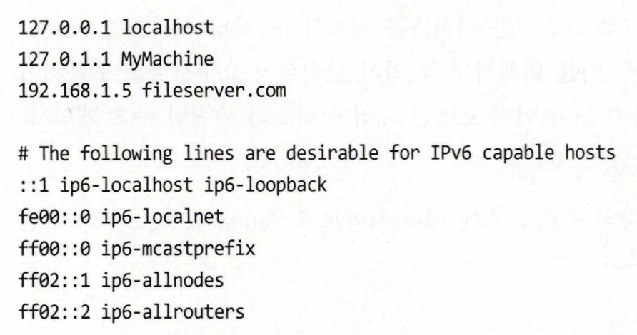
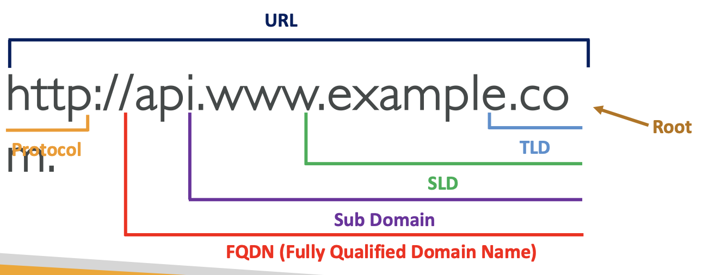
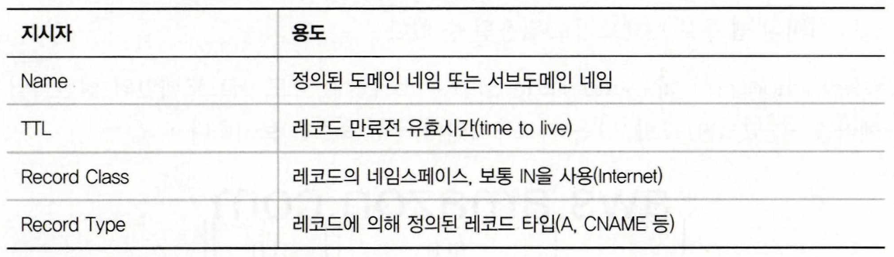

> #### 📍 DNS 관련 용어
> - Domain Registrar: 도메인 이름을 등록하는 곳 (Amazon Route 53)
> - DNS Records: A, AAAA, CNAME, NS
> - Zone File: 모든 DNS 레코드를 포함
> - Name Server: DNS 쿼리를 실제로 해결하는 서버 
> - Top Level Domain (TLD): .com, .us, .in, .org
> - Second Level Domain (SLD): .amazon.com, google.com
<br>

## DNS (Domain Name System)
- 서버명과 IP 주소를 대응시키기 위해 사용
- 사람에게 친숙한 호스트 이름을 대상 서버 IP 주소로 번역해줌
- URL과 호스트 이름을 IP로 변환
- 계층적 naming structure
  ```
                  .
               .com
        example.com
    www.example.com
    api.example.com
  ```
<br>

### 네임스페이스
- 톱다운 방식으로 인터넷의 이름 체계를 관리하는 관리 기구
    > - 제일 꼭대기 .com, .org 같은 최상위 도메인(TLD)은 ICANN 같은 기관이 관리함   
    > - 그 아래 google.com, naver.com은 회사나 개인이 등록   
    > - 그 아래 www.google.com 같은 서브도메인은 해당 소유자가 직접 설정   
    ➡️ 즉, **도메인은 위에서 아래로 단계적으로 관리되는 구조 == 톱다운**
- 인터넷 네임 시스템은 namespace라는 도메인 네임 체계로 관리됨
    > 인터넷에서 이름을 어떻게 정하고, 구별하고, 찾을지를 정해 놓은 체계를 네임스페이스라고 함
- 인터넷은 퍼블릭 또는 프라이빗 IP를 통하거나 Top-Level Domain(TLD)을 통해 접근할 수 있는 소규모의 네임스페이스로 구획이 나눠진 가상의 공간이라 할 수 있음
    > 인터넷은 실제로는 하나의 커다란 네트워크지만, 우리는 각각의 IP 주소나 도메인 이름을 통해 작은 단위로 나누어 접근할 수 있음.   
    > 그래서 인터넷 전체를 '여러 개의 네임스페이스로 나눈 가상 공간'이라고 볼 수 있는 것   

- **DNS 네임스페이스는 인터넷 주소 체계를 계층적으로 나눈 공간이며, 이를 통해 인터넷 전체가 논리적으로 관리되고 접근 가능하도록 만든 시스템**  
<br>

### 네임 서버
- amazon.com이라는 **도메인 네임과 실제 IP 주소를 연결하는 일은 네임 서버가 담당**
- 모든 컴퓨터는 로컬에서 접근할 수 있는 간단한 네임 서버 데이터베이스를 지니며, localhost와 같은 호스트네임 엔트리와 IP 주소 정보가 포함됨
    
    - 위 쿼리가 로컬 네임 서버에서 처리되지 못하면, 내 컴퓨터의 네트워크 인터페이스 환경설정에 명시된 외부 DNS 네임 서버로 전달됨   
    - 이때 환경설정은 Google의 8.8.8.8 또는 OpenDNS의 208.67.222.222 등 퍼블릭 DNS를 가리키도록 되어있음
  > ⏱️ **www.google.com을 입력했을 때의 전체 흐름**
  > 1. 내 컴퓨터는 먼저 로컬 DNS 캐시를 확인해봄
  > 2. 캐시에 없으면, 로컬 네임 서버에 요청
  > 3. 로컬 네임 서버가 답을 모르면, 외부에 등록된 DNS 서버로 요청을 넘김
  > 4. 퍼블릭 DNS가 루트 네임 서버 -> TLD 서버 -> 권한 있는 네임 서버를 거쳐 IP 주소를 찾음
  > 5. 결과(IP 주소)가 내 컴퓨터까지 돌아오고, 웹사이트 접속이 완료됨

<br>   


### 도메인 등록
- 톱레벨 네임 서버는 관련 쿼리에 응답하기 전에 새 도메인 네임의 존재를 파악하고 있어야 함
    > 누군가가 example.com을 방문하려고 하면, 인터넷은 먼저 .com을 관리하는 TLD 네임 서버에게 물어봄.   
    > .com을 관리하는 네임 서버는 'example.com'이 등록된 도메인이라는 사실을 미리 알고 있어야 제대로 응답할 수 있음을 의미   
- 새 도메인 이름을 등록하면, 이 정보(IP, 네임 서버 정보 등)를 인터넷 전체에 퍼뜨리는 일은 <u>**레지스트라(Registra; 도메인을 판매하고 등록하는 업체; 가비아,GoDaddy, Route 53)**</u>가 함
    > DNS 시스템이 새 도메인을 인식할 수 있도록 등록 정보 전파를 해야 함
- example.com을 등록하려면, <u>레지스트라</u>와 <u>**레지스트리(Registry; .com과 같은 TLD의 정보를 최종으로 관리하는 기관; VeriSign)**</u> 두 주체가 협력해서 전 세계 어디서든 인터넷에 연결되도록 처리해줘야 함   
<br>

    > ⏱️ **도메인 등록 -> 인터넷에 전파 -> 네임 서버가 인식 -> 웹사이트 접속 가능**
    > 1. 사용자가 kiwi.com 도메인을 구매 (ex. Amazon Route 53에서)
    > 2. Route 53은 이 정보를 레지스트리(VeriSign)에게 전달
    > 3. VeriSign은 .com TLD 네임 서버에 등록 정보를 업데이트
    > 4. 전 세계 DNS 서버가 이 도메인의 존재를 알게 됨 (전파되기까지 시간 걸림)
    > 5. 이제 어디서든 kiwi.com 입력하면 웹사이트에 접속 가능

<br>


### 도메인 레이어
    
<br>


### 전체 주소 도메인 네임
> 📍 용어
> - **FQDN(Fully Qualified Domain Name)**: 도메인의 전체 주소를 의미    
>   > www.example.com
> - **부분 도메인 네임**: 서버 이름이나 짧은 호스트명만 있는 것   
>   > workstation, sever1
> - **기본 도메인 네임**: 컴퓨터나 네트워크 설정에 따라 자동으로 붙여지는 도메인 이름   
>   > localhost, school.edu
> - **후속 닷(.)**: DNS에서 최상위 루트 도메인을 나타내는 마침표. FQDN에서는 이게 끝에 반드시 붙음   

- 기본 DNS 동작 방식 - 부분 도메인 이름 + 기본 도메인 네임
  - 네트워크 환경에서는 서버 이름을 짧게 입력해도 동작할 수 있게 기본 값이 설정되어 있음
    > 어떤 컴퓨터에서 workstation이라는 이름으로 서버에 요청을 보냈다고 가정할 때, 이 컴퓨터의 기본 도메인 이름이 localhost로 설정되어 있다면,   
    > <u>DNS는 요청을 자동으로 workstation.localhost로 바꿔서 처리함</u>   

- 🚨 DNS Zone 파일에서 후속 닷을 누락하면 안 됨
  - DNS zone 파일에서 도메인을 등록할 때, FQDN에 마침표를 안 붙이면 문제 생김
  - administration.school.edu. ← 정상 (FQDN)
  - administration.school.edu ← 이건 DNS가    administration.school.edu.school.edu.로 해석할 수 있음 (오류!)      
<br>


### 존과 존 파일
> 📍 용어
> - **Zone**: 특정 도메인에 대한 DNS 정보(이름과 IP의 매핑)를 관리하는 범위
> - **Hosted Zone(호스팅 영역)**: AWS Route 53에서 "zone"을 부르는 말. 도메인을 관리할 수 있는 공간
> - **Zone File**: 도메인에 대한 DNS 정보들을 담고 있는 텍스트 파일. 각 줄이 '레코드'
> - **Resource Record**: 도메인의 이름과 관련된 정보들 (ex. A, CNAME)

- 📦 **Zone이란?**
  - example.com이라는 도메인에 대해서:
    - 웹 서버 주소 (example.com -> 192.0.2.1)
    - 메일 서버 주소 (mail.example.com -> mail 서버)
    - 서브 도메인 주소 (blog.example.com -> 블로그 서버)   
    위 정보를 관리하는 공간   

    ➡️ **도메인 이름과 그 하위 도메인들에 대한 DNS 정보들의 묶음**

- 🗂️ **Zone File이란?**
  - 위의 zone을 실제로 컴퓨터가 읽을 수 있게 기록한 것
  - 존 파일은 .txt 파일처럼 생긴 **텍스트 파일**    
  ```
  example.com.   1h   IN   NS   ns-750.awsdns-30.net.
  ```   
  ➡️ 위의 한 줄이 리소스 레코드     
  - ns-750.awsdns-30.net. -> 실제 이 도메인의 DNS 서버 주소 (네임서버의 도메인 이름)   
  - ➡️ "example.com 도메인은 1시간 동안 유효한 정보이며, 이 도메인을 관리하는 네임 서버는 ns-750.awsdns-30.net 이다."  

      
<br>   


### 레코드 타입
- **A** - maps a hostname to IPv4, 호스트 이름과 IPv4 IP를 매핑
- **AAAA** - maps a hostname to IPv6, 호스트 이름과 IPv6 IP를 매핑
- **CNAME** - 호스트 이름을 다른 호스트 이름과 매핑 (별칭 역할)
  - 대상 호스트 이름은 A나 AAAA 레코드가 될 수 있음
  - Route 53에서 DNS namespace 또는 Zone Apex의 상위 노드에 대한 CNAME을 생성할 수 없음
  - e.g. example.com에 CNAME을 만들 수는 없지만 www.example.com에 대한 CNAME 레코드는 만들 수 있음
- **NS** - 호스팅 존의 이름 서버, 서버의 DNS 이름 또는 IP 주소로 호스팅 존에 대한 DNS 쿼리에 응답할 수 있음
  - 트래픽이 도메인으로 라우팅 되는 방식을 제어
