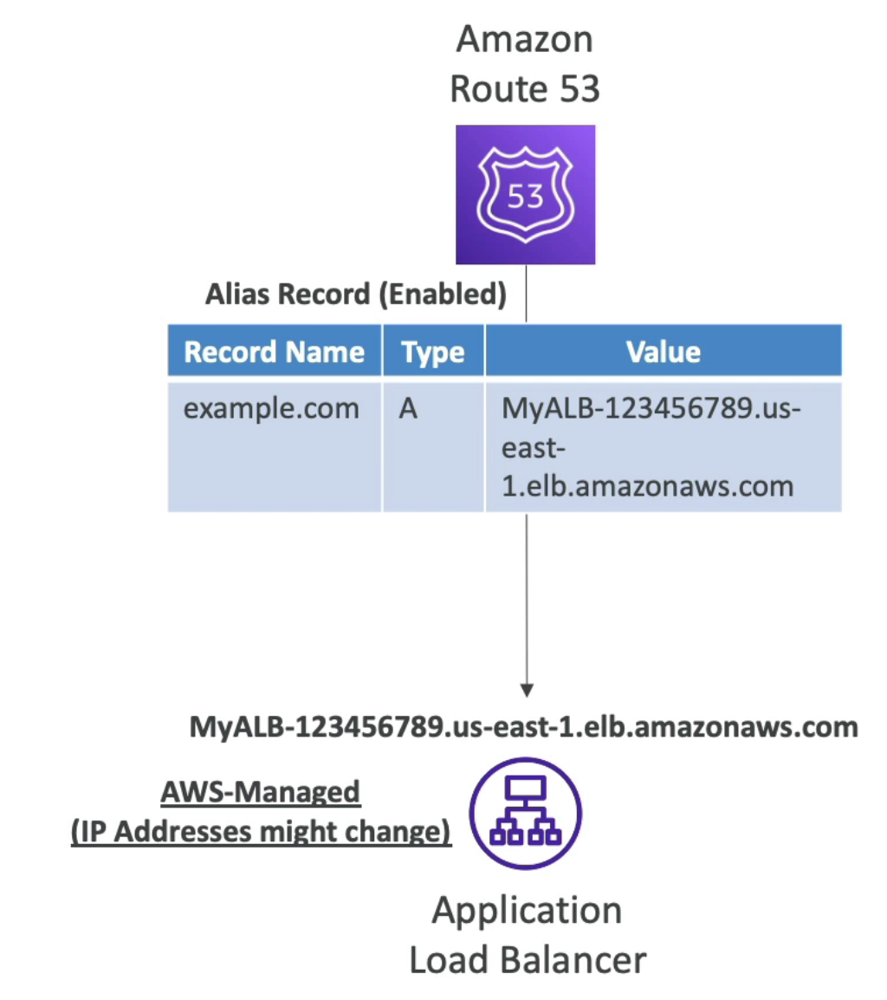
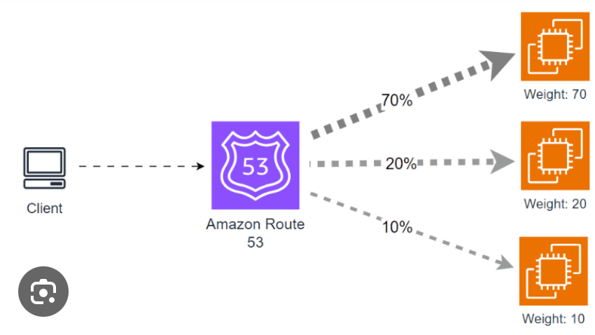
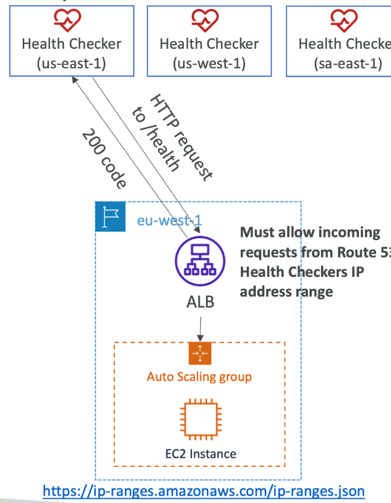
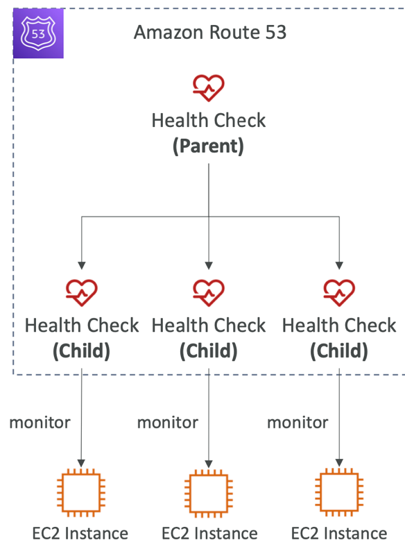
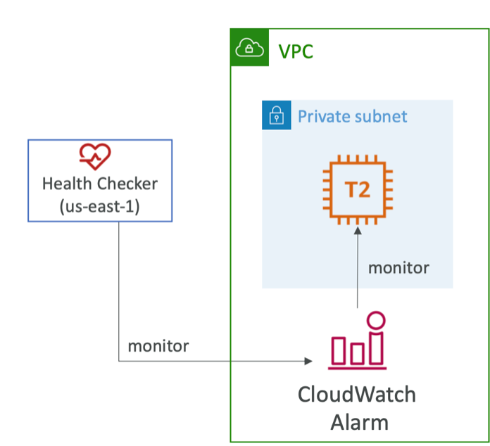
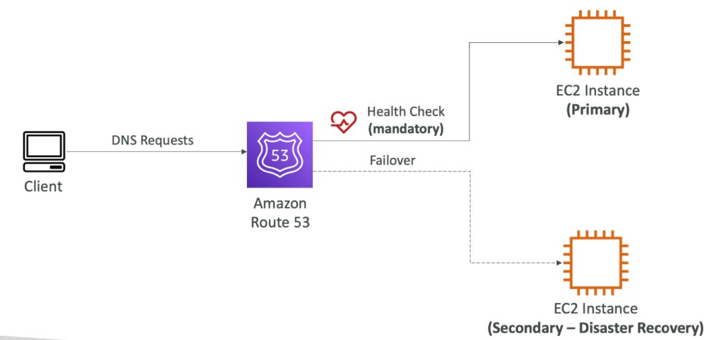
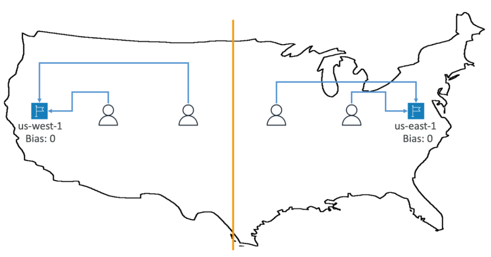
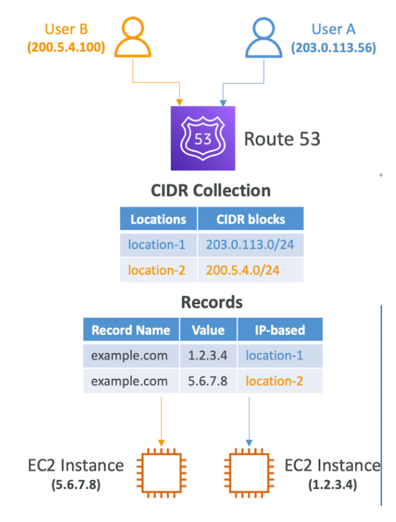

## DNS
- Domain Name System으로 사람에게 친숙한 호스트 이름을 대상 서버 IP 주소로 번역해줌
- URL과 호스트 이름을 IP로 변환
- 계층적 naming structure
  ```
               .com
        example.com
    www.example.com
    api.example.com
  ```
#### DNS 관련 용어
- Domain Registrar: 도메인 이름을 등록하는 곳 (Amazon Route 53)
- DNS Records: A, AAAA, CNAME, NS
- Zone File: 모든 DNS 레코드를 포함
- Name Server: DNS 쿼리를 실제로 해결하는 서버 
- Top Level Domain (TLD): .com, .us, .in, .org
- Second Level Domain (SLD): .amazon.com, google.com
<br>

## Amazon Route 53
- 고가용성, 확장성을 갖춘 완전히 관리되며 *Authoritative*(권한있는) DNS
  - Authoritative = the customer (you) can update the DNS records = DNS에 대해 완전히 제어할 수 있음
- Route 53은 Domain Registrar로 도메인 이름을 example.com으로 등록하는 역할을 함
- Ability to check the health of your resources
- The only AWS service which provides 100% availability SLA
- 53은 DNS 서비스, 즉 이름에서 사용되는 전통적인 DNS 포트

### Route 53 - Records
- Each record contains:
  - Domain/subdomain Name - example.com
  - Record Type - A, AAAA
  - Value - 123.456.789.123
  - Routing Policy - how Route 53 responds to queries
  - TTL (Time To Live) - amount of time the record cached at DNS Resolvers 

### ⭐️ Route 53 - Record Types
- A - maps a hostname to IPv4, 호스트 이름과 IPv4 IP를 매핑
- AAAA - maps a hostname to IPv6, 호스트 이름과 IPv6 IP를 매핑
- CNAME - 호스트 이름을 다른 호스트 이름과 매핑 (별칭 역할)
  - 대상 호스트 이름은 A나 AAAA 레코드가 될 수 있음
  - Route 53에서 DNS namespace 또는 Zone Apex의 상위 노드에 대한 CNAME을 생성할 수 없음
  - e.g. example.com에 CNAME을 만들 수는 없지만 www.example.com에 대한 CNAME 레코드는 만들 수 있음
- NS - 호스팅 존의 이름 서버, 서버의 DNS 이름 또는 IP 주소로 호스팅 존에 대한 DNS 쿼리에 응답할 수 있음
  - 트래픽이 도메인으로 라우팅 되는 방식을 제어

### Route 53 - Hosted Zones
- 레코드의 컨테이너로 도메인과 서브도메인으로 가는 트래픽의 라우팅 방식을 정의
- Public Hosted Zones 
  - public domain name
  - 퍼블릭 도메인을 사면 퍼블릭 호스팅 존을 만들 수 있음
  - e.g.) example.com
- Private Hosted Zones
  - 공개되지 않는 도메인 이름을 지원, private domain name 
  - 오직 가상 프라이빗 클라우드(VPC)만이 URL을 리졸브할 수 있음
  - e.g. 사기업에서 회사 네트워크 내에서만 접근할 수 있는 URL이 있음. internal.example.com
- have to pay $0.50 per month per hosted zone (월 50센트)
- 퍼블릭, 프라이빗 호스팅 존은 둘 다 동일하게 작동하지만, public hosting zone은 누구든 해당 레코드를 쿼리할 수 있음 (public record를 위한 public hosting zone)   
    private hosting zone은 오직 프라이빗 리소스, VPC에서만 쿼리할 수 있음   
    (쿼리 -> DNS 조회를 의미하며, 도메인 이름(호스트 이름)을 IP 주소로 변환하는 작업)

### Route 53 - Records TTL (Time To Live)
- TTL 시간 동안 캐싱함
- DNS 요청 쿼리를 계속해서 자주 보내는 상황을 원치 않는 것
- **High TTL** - TTL을 24시간으로 높게 설정한 상황
  - Route 53의 트래픽은 현저히 적어짐
  - 클라이언트가 오래된 레코드를 받을 가능성이 있음
- **Low TTL** - TTL을 60초로 짧게 설정한 상황
  - DNS에는 트래픽의 양이 많아져서 비용이 많이 들게 됨 *(Route 53에 들어오는 요청의 양에 따라 요금 책정)*
  - 오래된 레코드의 보관 시간이 짧아져 레코드 변경이 빨라짐
- **TTL은 Alias Record를 제외한 모든 레코드에 있어서 필수적**  
<br>

## CNAME vs Alias
- AWS 리소스 (Load Balancer, CloudFront)는 호스트 이름이 노출됨    
    (다음과 같이 할 수 있음 lb l-1234.us-east-2.elbamazonaws.com -> myapp.mydomain.com)

- **CNAME**
  - 호스트 이름이 다른 호스트 이름으로 향하도록 할 수 있음 (app.mydomain.com -> blabla.anything.com)
  - **⭐️ 루트 도메인 이름이 아닌 경우에만 가능해서 mydomain.com 앞에 뭔가를 붙여야 함 (aka. something.mydomain.com)**
- **Alias**
  - Route 53에 한정되지만 호스트 이름이 특정 AWS 리소스로 향하도록 할 수 있음 (app.mydomain.com -> blabla.anything.com)
  - **⭐️ 별칭 레코드는 루트 및 비루트 도메인에 모두 작동 (aka. mydomain.com)**
  - 무료
  - 자체적으로 상태 확인 가능

### Route 53 - Alias Records (별칭 레코드)
- 오직 AWS의 리소스에만 매핑
  
- An extension to DNS functionality
- Automatically recognizes changes in the resource's IP addresses
- CNAME과 달리 Alias Record는 Zone Apex라는 DNS 네임스페이스의 상위 노드로 사용될 수 있음   
    -> example.com에도 별칭 레코드를 쓸 수 있는 거
- AWS 리소스를 위한 별칭 레코드의 타입은 항상 A, AAAA (리소스는 IPv4나 IPv6 중 하나)
- **⭐️ 별칭 레코드를 사용하면 TTL을 설정할 수 없음. Route 53에 의해 자동으로 설정됨**

### Route 53 - Alias Records Targets
- Elastic Load Balancers
- CloudFront Distribution 
- API Gateway
- Elastic Beanstalk environments
- S3 Websites (XX S3 Bucket XX)
- VPC Interface Endpoint
- Global Accelerator accelerator
- Route 53 record in the same hosted zone
- **⭐️ EC2의 DNS 이름에 대해서는 별칭 레코드를 설정할 수 없음. EC2 DNS 이름은 별칭 레코드의 대상이 될 수 없음**
<br>   
<br>


## Route 53 Policies
> ## DNS(Route 53) 라우팅 vs Load Balancer 라우팅
> ### 1. DNS(Route 53) 라우팅 - "어디로 갈지 알려주는 역할":
>   - 클라이언트가 어떤 서버(IP)로 접속해야 하는지를 알려주는 역할 (IP 주소를 반환)
>   - **트래픽을 직접 처리하거나 전달하지 않음**
>   - <u>트래픽은 DNS를 통과하지 않음</u>
>   - <u>DNS는 DNS 쿼리에만 응답</u>
>   - 📍 DNS가 트래픽을 '전달'하는 것이 아니라 **클라이언트가 어디로 가야할지 알려주는 것**
> > example.com      A     123.345.6.7 (DNS가 클라이언트에게 목적지 IP를 반환)
>   
> ### 2. 로드 밸런서 라우팅 - "트래픽을 실제로 분산하는 역할":
>   - 받은 트래픽을 여러 서버로 분산하는 역할
>   - **실제로 네트워크 트래픽을 전달하고 관리함**
>   - 📍 **로드밸런서는 직접 요청을 받아서 실제 서버로 전달하고 응답도 다시 클라이언트에게 전달**
> > 클라이언트 -> 로드 밸런서 (my-load-balancer.amazonaws.com)
> > 로드 밸런서 -> 여러 서버 중 하나 (EC2-1, EC2-2 ...)
> > 서버가 응답 -> 로드밸런서 -> 클라이언트

- Route 53 Supports the following Routing Policies 
  - Simple (단순)
  - Weighted (가중치 기반)
  - Failover (장애 조치)
  - Latency based (지연 기반)
  - Geolocation (지리적)
  - Muli-Value Answer (다중 값 응답)
  - Geoproximity (using Route 53 Traffic Flow feature; 지리 근접)

### Routing Policies - Simple
- 가장 기본적인 방식
- 트래픽을 단일 리소스로 보내는 방식
- 동일한 레코드에 여러 개의 값을 지정하는 것도 가능   
    **이렇게 DNS에 의해 다중 값을 전달 받으면 <u>클라이언트 쪽에서</u> 그 중 하나를 무작위로 고르게 됨**
- 단순 라우팅 정책에 Alias record를 함께 사용하면 하나의 AWS 리소스만을 대상으로 지정할 수 있음
- **Health Checks XXX**


### Routing Policies - Weighted 
- 가중치를 활용해 요청의 일부 비율을 특정 리소스로 보내는 식의 제어가 가능함
 
- 가중치의 합이 꼭 100이 될 필요는 없음
- 각 레코드에 상대적으로 가중치를 할당하게 되는 것   
    *traffic* (%) = *Weighted for a specific record* / *Sum of all the weights for all records*
- **DNS 레코드들을 동일한 이름과 유형을 가져야 함**
- Health Check (상태 체크) 가능
- 가중치 기반 정책이 사용되는 경우
  - 서로 다른 지역들에 걸쳐 로드 밸런싱을 하는 경우
  - 적은 양의 트래픽을 보내 새 애플리케이션을 테스트하는 경우
- **가중치 0의 값을 보내게 되면 특정 리소스에 트래픽 보내기를 중단해 가중치를 바꿀 수 있음**   
    > *Assign a weight of 0 to a record to stop sending traffic to a resource*
- **만약 모든 리소스 레코드 가중치의 값이 0인 경우에는 모든 레코드가 다시 동일한 가중치를 갖게 됨**   
    > *If all records have weight of 0, then all records will be returned equally*   


### Routing Poilices - Latency-based
- 지연 시간이 가장 짧은, 즉 가장 가까운 리소스로 리다이렉팅을 하는 정책
- 지연 시간에 민감한 웹사이트나 애플리케이션이 있는 경우에 아주 유용한 정책
- 지연 시간은 유저가 레코드로 가장 가까운 식별된 AWS 리전에 연결하기까지의 걸리는 시간을 기반으로 측정됨   
    > Latency is based on traffic between users and AWS Regions
- Health Check 가능   


> ## Route 53 - Health Checks
> - 상태 확인은 주로 공용 리소스에 대한 상태를 확인하는 방법 
> - DNS의 장애 조치를 자동화하기 위한 방법:   
>   1. 공용 엔드 포인트를 모니터링   
>       (applicaiton, server, other AWS resources)
>   2. 다른 상태 확인을 모니터링   
>       (Calculated Health Checks)
>   3. CloudWatch 경보의 상태를 모니터링   
>       (full control, 개인 리소스에 유용)
> - Health Checks are integrated with CloudWatch metrics
> <br>
> 
> ### Health check - Monitor an Endpoint
> - **전 세계에서 온 15개의 상태 확인이 엔드 포인트의 상태를 확인하고 임계값을 정상(healthy) 혹은 비정상(unhealthy)으로 설정**   
> 
>   - Healty/Unhealthy Threshold - 3 (default)
>   - Interval - 30 sec (can set to 10 sec - higher cost)
>   - HTTP, HTTPS, TCP 등 많은 프로토콜을 지정함
>   - 18% 이상의 상태 확인이 엔드 포인트를 정상이라고 판단하면 Route 53도 이를 정상이라고 간주
>   - 상태 확인에 사용될 위치도 선택할 수 있음
>   - 상태 확인은 로드 밸런서로부터 2xx나 3xx의 코드를 받아야만 통과됨
>   - 텍스트 기반 응답일 경우 상태 확인은 응답의 처음 5,120 바이트를 확인    
>       (응답 자체에 해당 텍스트가 있는지 보기 위해서)
>   - 📍 (네트워크 측면) 상태 확인의 작동이 가능하려면 health check가 우리의 애플리케이션 밸런서나 엔드 포인트에 접근이 가능해야 함   
>       따라서, **Route 53의 상태 확인 IP 주소 범위에서 들어오는 모든 요청을 허용해야 함**
>
> ### Health check - Calculated Health Checks (Status of other health checks)
> - 여러 개의 상태 확인 결과를 하나로 합쳐주는 기능   
> 
> - 위의 하위 상태 확인을 기반으로 상위 상태 확인을 정의할 수 있음
> - 이 상태 확인들을 모두 합치기 위한 조건은 **OR, AND, NOT**
> - 하위 상태 확인을 256개까지 모니터링할 수 있음
> - 상위 상태 확인이 통과하기 위해 몇 개의 상태 확인을 통과해야 하는지도 지정할 수 있음
> - use case:
>   - 상태 확인이 실패하는 일 없이 상위 상태 확인이 웹사이트를 관리 유지하도록 하는 경우
>
>
> ### Health Checks - Private Hosted Zones (개인 리소스 상태 확인)
> - Route 53 health checkers are outside the VPC
> - They can't access **private** endpoints (private VPC or on-premises resource)
> > **on-premises 리소스란?**
> > - 클라우드가 아닌 자체적으로 구축한 데이터센터 또는 서버
> > - AWS와 같은 퍼블릭 클라우드가 아니라, 회사 내부에서 직접 관리하는 IT 인프라
> - You can create a **CloudWatch Metric** and associate a **CloudWatch Alarm**, then create a Health Check that checks the alarm itself
> 
> - 위와 같이 인 서브넷 안에 있는 EC2 인스턴스를 모니터


### Routing Policies - Failover (Active-Passive)
   
1. 인스턴스 생성
  - 1번 인스턴스: EC2 Instance (Primary)
  - 2번 인스턴스: EC2 Instance (Secondary - Diaster Recovery)
2. Health Check와 Primary 인스턴스를 연결 (필수)
3. 상태 확인이 비정상이면 자동으로 Route 53은 2번째의 EC2 인스턴스로 장애 조치하며 결과를 보내기 시작
- 기본 인스턴스가 정상이면 Route 53도 기본 레코드로 응답
- but, unhealty면 장애 조치에 도움되는 두번째 레코드의 응답을 자동으로 얻게 됨


### Routing Policies - Geolocation
- Latency-based 정책과는 매우 다르게 **사용자의 실제 위치를 기반으로 함**
- e.g. 사용자가 특정 대륙이나 국가, 혹은 미국의 경우 어떤 주에 있는지 지정하는 것이며 가장 정확한 위치가 선택되어 그 IP로 라우팅되는 것
- 일치하는 위치가 없는 경우는 **"Default" 레코드**를 생성해야 함
- use case:   
  - website localization
  - restrict content distribution
  - load balancing
- 상태 확인과 연결 가능   

### Routing Policies - Geoproximity (지리 근접 라우팅)

- 사용자와 리소스의 지리적 위치를 기반으로 트래픽을 리소스로 라우팅하도록 함
- bias (편향값)을 사용해 특정 위치를 기반으로 리소스를 더 많은 트래픽을 이동하는 것   
  > Ability **to shift more traffic to resources based** on the defined **bias**
- 지리적 위치를 변경하려면 **편향값을 지정**해야 함
  - 특정 리소스에 더 많은 트래픽을 보내려면, 편향값을 증가시켜서 확장하면 됨 (1 to 99)
  - 특정 리소스에 트래픽을 줄이려면, 편향값을 음수로 축소시키면 됨 (-1 to -99)
- Resouces can be:
  - AWS resouces (specify AWS region)
  - Non-AWS resources (specify Latitude and Longtitude)
- **편향 활용을 위해 고급 Route 53 트래픽 플로우를 사용**
- 특정 리전에 더 많은 트래픽을 보내야 한다고 하면, 지리 근접 라우팅을 사용해 특정 리전의 편향을 증가시키면 더 많은 사용자가 생기고 특정 리전에 더 많은 트래픽이 발생하게 됨 
- ⭐️ 지리 근접 라우팅은 편향을 증가시켜 한 리전에서 다른 리전으로 트래픽을 보낼 때 유용


### Routing Policies - IP based Routing

- 클라이언트 IP 주소를 기반으로 라우팅을 정의
1. Route 53에서 CIDR 목록을 정의 (-> 클라이언트의 IP 범위)
2. CIDR에 따라 트래픽을 어느 endpoints/locations로 보내야 하는지 정함

- ip 기반 라우팅을 사용하면 ip를 미리 알고 있으므로 성능을 최적화, 네트워크 비용을 절감할 수 있음
- e.g. 특정 인터넷 제공업체가 특정 IP 주소 셋을 사용하는 걸 안다면 특정 엔드포인트로 라우팅할 수 있음


### Routing Policies - Mulit-Value
- 트래픽을 다중 리소스로 라우팅할 때 사용
- Route 53은 다중 값과 리소스를 반환
- Health Check와 연결하면 다중 값 정책에서 반환되는 유일한 리소스는 'healthy' 상태인 리소스들
- 각각의 다중 값 쿼리에 최대 8개의 정상 레코드가 반환됨
- ELB와 유사해보이지만 ELB를 대체할 수 없음   
    -> 이건 클라이언트 측면의 로드 밸런싱인 것
- 클라이언트는 반환되는 1개에서 최대 8개의 레코드가 정상일 것을 알고 있음 ➡️ 클라이언트는 안전한 쿼리를 가질 수 있음
- ⚠️ 다중 값이 있는 Simple 라우팅의 경우에는 health check를 허용하지 않기 때문에 반환되는 레코드가 비정상일 수 있음 ➡️ 이게 Multi-Value 정책이 더 강력한 이유


## Domain Registar vs DNS Service
- Domain Registrar를 통해 도메인 네임을 구매할 수 있음
- 레지스트라를 통해 도메인을 등록하면 DNS 레코드 관리를 위한 DNS 서비스를 제공함
- GoDaddy로 도메인을 등록하고 DNS 레코드는 Amazon의 Route 53으로 관리하는 것도 가능

### GoDaddy as Registrar & Route 53 as DNS Service
1. GoDaddy에서 도메인을 등록하면 Nameservers 옵션이 생기는데, 사용자 정의 이름 서버를 지정할 수 있음
2. 먼저, Amazon Route 53에서 원하는 도메인의 공용 호스팅 영역(Public Hosted Zone)을 생성하고 Hosted zone details > Name servers를 찾음
3. 해당 내용으로 GoDaddy 웹사이트의 Nameservers를 변경해야 함   
   > 이제 GoDaddy에서 사용할 이름 서버에 관한 쿼리에 응답하면 이름 서버가 Amazon의 Route 53 이름 서버를 가리키고 그렇게 Amazon Route 53을 사용해서 해당 콘솔에서 직접 전체 DNS 레코드를 관리함

### 3rd Party Registrar with Amazon Route 53
- If you buy your domain on a 3rd party registrar, you can still use Route 53 as the DNS service provider
1. Create a Hosted Zone in Route 53
2. Update NS Records on 3rd party website to use Route 53 **Name Servers**

- Domain Registrar != DNS Service
- But every Domain Registrar usually comes with some DNS features