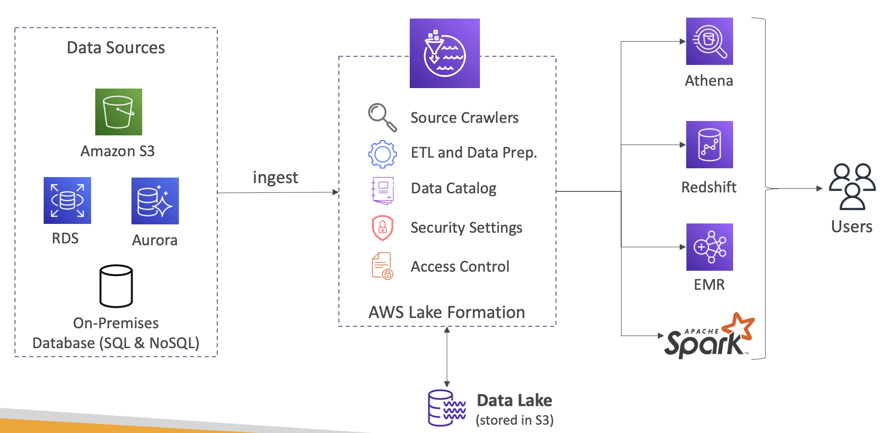
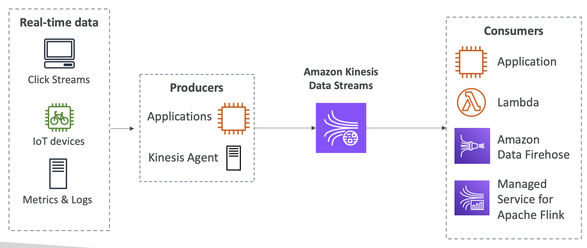

# AWS Lake Formation

### Data Lake

:온갖 데이터를 저장할 수 있는 시스템(중앙 데이터베이스)

데이터라는 것은 파편화되고 분산된 경우가 많다. 그로 인해 분석 혹은 시각화 작업이 매우 어려운데, 이런 데이터 파편화를 막는 방법 중 하나가 Data Lake다.

이 Data Lake에 데이터를 저장할 때는 어떤 작업을 해줄 필요 없이 그냥 저장하면 되고, 이 Data Lake에 있는 데이터들을 그대로 가져다가 분석 작업, 시각화를 수행하면 되는 큰 장점이 있다.

## AWS Lake Formation

:AWS나 On-Premise 에서의 데이터를 수집, 분석할 수 있는 완전관리형 데이터 레이크 서비스

- AWS Glue를 통해 ETL(Extract, Transform, Load) 작업을 수행
- 대규모 데이터세트에 대한 쿼리 작업도 수행
- 데이터를 S3에 저장

### 데이터 유입(Ingestion)

:다양한 데이터 원천으로부터 Data Lake로 데이터를 전송 및 수집 절차

- AWS Glue, AWS Lake Formation을 통해 S3, RDS, AWS CloudFront, AWS CloudTrail, AWS BilUng, ELB 등 다양한 위치에서 데이터를 받아옴
- JDBC 커넥터를 지원하는 모든 On-Premise DB로부터 데이터를 받아옴
- 데이터 라벨링 가능 → 분류가 용이해짐

### 데이터 변환

:중복 제거, 데이터 형식 설정, 변질 데이터 제거와 같은 데이터 클리닝 작업 수행

→ 다양한 원천으로부터 유입된 데이터를 바로 Lake에 넣어버리면 분석, 검색 시 문제가 발생할 수 있음

- 서로 다른 원천에서 온 데이터를 서로 다른 형식을 가질 가능성이 높음
    - 어느 DB는 Local Time Zone, 어느 DB는 UTC
    - 이렇게 타임스탬프가 일치하지 않는 경우, 분석 작업이 어려워짐
- 중복성 문제
    - 중복 정보는 불필요한 스토리지 및 컴퓨트 비용이 발생
    
    ⇒ AWS Lake Formation은 ML기반 FindMatches 변환기 제공해 중복 제거해줌
    

### 데이터 분석

데이터 조회 시점에 데이터에 일정한 스키마 또는 구조를 적용하는 일을 의미

---

# **AWS Transfer Family**

:**완전관리형 파일 전송 서비스**

- FTP
- SFTP
- FTPS

이 3가지 프로토콜로 S3 또는 EFS로 데이터를 전송하거나 받아옴

→ On-Premise에서 AWS로의 안전한 데이터 전송 지원

---

# **Kinesis**

:스트리밍 데이터를 수집, 처리, 분석할 수 있도록 해주는 서비스

→ 수천 개의 소스로부터 유입되는 다양한 스트리밍 데이터를 처리할 수 있음

## Kinesis Video Streams

:영상 데이터를 실시간으로 스트리밍, 저장, 처리, 분석할 수 있도록 해주는 AWS 서비스

## Kinesis Data Stream

:실시간 데이터를 지속적으로 수집하고 처리하는 스트리밍 데이터 처리 서비스

⇒ 프로듀서가 생성한 데이터의 수집, 처리, 저장을 위한 스트리밍 데이터 파이프라인 서비스

### 레코드

 :Kinesis 데이터 스트림에 저장되는 데이터의 단위

- 파티션 키 : 데이터를 어떤 샤드에 보낼지 결정하는 키 (분배 기준)
- 시퀀스 번호 : 해당 레코드가 스트림 안에서 갖는 고유 번호 (순서 보장용)
- 데이터 BLOB : 실제 저장되는 데이터 (변경 X)

### **Shard (샤드)**

:데이터 스트림 내에서 데이터 레코드를 저장하고 처리하는 기본 단위

- **처리 능력**
    - **쓰기**: 초당 최대 1,000개의 레코드 또는 1MB의 데이터.
    - **읽기**: 초당 최대 2MB의 데이터

### **Capacity Mode**

:데이터 스트림의 처리 용량을 관리하는 방식

- **옵션**:
    - **온디맨드(On-Demand)**: 자동으로 샤드를 관리하며, 사용한 처리량에 따라 비용이 청구됨
    - **프로비저닝(Provisioned)**: 사용자가 샤드 수를 지정하며, 샤드 수에 따라 비용이 청구됨

| **항목** | **설명** |
| --- | --- |
| 📅 **데이터 보관 기간** | 기본 24시간~최대 **365일까지 보관** 가능 |
| 🔁 **데이터 재처리** | **Replay 가능**, 소비자가 같은 데이터를 다시 읽을 수 있음 |
| ❌ **삭제 불가** | 만료 전까지는 **데이터 삭제 불가능** |
| 📦 **데이터 크기 제한** | 메시지 **1MB 이하** 권장 (작은 데이터 다수 처리에 최적) |
| 📏 **정렬 보장** | **같은 Partition Key**는 **순서 보장됨** |
| 🛠️ **생산자 라이브러리** | **KPL** : 고성능 생산자 앱 개발 도구 |
| 🧩 **소비자 라이브러리** | **KCL** : 고성능 소비자 앱 개발 도구 |

## Kinesis Data Firehose

:거의 실시간으로 데이터를 수집하고, 자동으로 지정된 대상에 전송 및 저장하는 완전관리형 서비스

### **Kinesis Data Streams vs Firehose 차이**

| **항목** | **Kinesis Data Streams** | **Kinesis Data Firehose** |
| --- | --- | --- |
| 🔧 **관리 방식** | 수동 구성 필요 (샤드, 소비자 등) | **완전관리형**, 설정만 하면 자동 처리 |
| 🕒 **처리 방식** | 실시간 (ms ~ 초 단위) | **가까운 실시간** (기본 60초 버퍼링) |
| 🔁 **데이터 처리** | 소비자 앱(KCL, Lambda 등)이 직접 읽고 처리 | 자동으로 대상(S3 등)에 **전송 및 저장** |
| 🎯 **대상** | 직접 소비자 구현 필요 | S3, Redshift, OpenSearch, Splunk 등 지정 가능 |
| 🔄 **재처리 가능 여부** | **가능** (데이터 보관 및 재처리 지원) | 불가능 (전송 후 삭제됨) |
| 🧩 **데이터 변환** | 직접 구현 | **Lambda로 간단한 변환 지원** |
| 📊 **사용 예시** | 고급 실시간 처리 필요 시 (알림, 분산 처리 등) | 간단한 수집 및 저장 (로그 수집, ETL 등) |